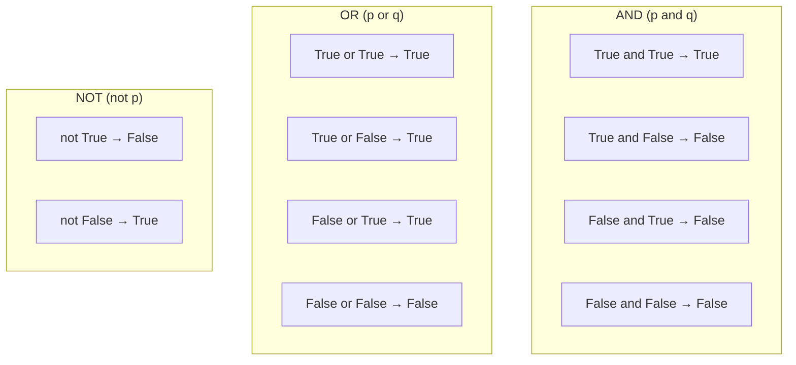

# Day 7: Boolean Logic and Comparison

## Learning Objectives

By the end of this lesson, you will be able to:

- Understand Boolean values `True` and `False`
- Use comparison operators to compare values
- Combine conditions with logical operators (`and`, `or`, `not`)
- Identify truthy and falsy values in Python
- Write compound boolean expressions
- Explain short-circuit evaluation

## Estimated Time

45 minutes

## Prerequisites

- Basic understanding of Python variables and data types
- Familiarity with `print()` and `input()` functions

---

## Theory

### Boolean Values

In Python, Boolean values represent truth — they are the foundation of decision-making in code. There are exactly two Boolean values:

| Value | Meaning |
|-------|---------|
| `True` | Represents a true condition |
| `False` | Represents a false condition |

Booleans are a subclass of integers: `True` behaves like `1` and `False` behaves like `0`.

```python
print(True)        # True
print(False)       # False
print(type(True))  # <class 'bool'>
print(True + 1)    # 2
```

### Comparison Operators

Comparison operators compare two values and return a Boolean result.

| Operator | Meaning | Example | Result |
|----------|---------|---------|--------|
| `==` | Equal to | `5 == 5` | `True` |
| `!=` | Not equal to | `5 != 3` | `True` |
| `<` | Less than | `3 < 5` | `True` |
| `>` | Greater than | `5 > 3` | `True` |
| `<=` | Less than or equal to | `5 <= 5` | `True` |
| `>=` | Greater than or equal to | `5 >= 3` | `True` |

```python
a, b = 10, 20

print(a == b)   # False
print(a != b)   # True
print(a < b)    # True
print(a > b)    # False
print(a <= 10)  # True
print(b >= 20)  # True
```

:::{warning}
Do not confuse `==` (equality comparison) with `=` (assignment). Writing `if x = 5:` will cause a syntax error.
:::

### Logical Operators

Logical operators combine multiple Boolean expressions.

| Operator | Description | Example | Result |
|----------|-------------|---------|--------|
| `and` | `True` only if **both** are true | `True and False` | `False` |
| `or` | `True` if **at least one** is true | `True or False` | `True` |
| `not` | Inverts the Boolean value | `not True` | `False` |

```python
x, y = 5, 10

# and — both conditions must be True
print(x > 0 and y > 0)   # True
print(x > 0 and y < 0)   # False

# or — at least one condition must be True
print(x > 0 or y < 0)    # True
print(x < 0 or y < 0)    # False

# not — flips the result
print(not (x > 0))       # False
print(not (x < 0))       # True
```

### Truthy and Falsy Values

In Python, every value can be evaluated as either truthy or falsy in a Boolean context.

**Falsy values** (evaluate to `False`):

- `None`
- `False`
- Zero numeric values: `0`, `0.0`, `0j`
- Empty sequences: `""`, `[]`, `()`, `{}`, `set()`, `range(0)`

**Truthy values** — everything else:

```python
print(bool(0))       # False
print(bool(1))       # True
print(bool(""))      # False
print(bool("abc"))   # True
print(bool([]))      # False
print(bool([1, 2]))  # True
print(bool(None))    # False
```

:::{tip}
Use truthiness to write concise checks: `if name:` is cleaner than `if name != "":`.
:::

### Combining Conditions

You can chain comparisons and mix logical operators freely:

```python
age = 25
has_license = True

# Compound condition
can_drive = age >= 18 and has_license
print(can_drive)  # True

# Chained comparison
score = 85
grade = "B" if 80 <= score <= 89 else "Other"
print(grade)  # B

# Mixed logical operators
a, b, c = 10, 20, 30
result = (a < b) and (b < c) or (a > c)
print(result)  # True (because both a<b and b<c are True)
```

### Short-Circuit Evaluation

Python uses short-circuit evaluation for logical operators:

- For `and`: if the left operand is `False`, the right operand is **never evaluated**.
- For `or`: if the left operand is `True`, the right operand is **never evaluated**.

```python
# Short-circuit with 'and'
def get_true():
    print("get_true() called")
    return True

def get_false():
    print("get_false() called")
    return False

print(get_false() and get_true())  # get_true() is NEVER called
print(get_true() or get_false())   # get_false() is NEVER called
```

```text
get_false() called
False
get_true() called
True
```

:::{important}
Short-circuit evaluation is useful for guarding against errors. For example, `if divisor != 0 and value / divisor > 1:` safely prevents division by zero.
:::

### Truth Table



---

## Try It Yourself

1. Write a program that checks if a number entered by the user is between 1 and 100 (inclusive) and prints `"Valid"` or `"Invalid"`.

2. Create a variable `password = "secret123"`. Ask the user for a password and print `"Access granted"` if it matches, otherwise `"Access denied"`.

3. Ask the user for their age. Print `"Child"` if under 13, `"Teen"` if 13–19, and `"Adult"` if 20 or older (using Boolean logic).

---

## Common Mistakes

| Mistake | Incorrect | Correct |
|---------|-----------|---------|
| Using `=` instead of `==` | `if x = 5:` | `if x == 5:` |
| Confusing `and`/`or` logic | `if x > 0 and < 10:` | `if x > 0 and x < 10:` |
| Forgetting parentheses with `not` | `not x > 0 and y > 0` | `not (x > 0 and y > 0)` |

---

## Summary

- Booleans (`True`/`False`) are the basis of all conditional logic in Python.
- Comparison operators (`==`, `!=`, `<`, `>`, `<=`, `>=`) return Boolean results.
- Logical operators (`and`, `or`, `not`) combine Boolean expressions.
- Python considers certain values falsy (`0`, `""`, `[]`, `None`, etc.) and everything else truthy.
- Short-circuit evaluation stops evaluating as soon as the result is determined.

## Key Takeaways

- `==` compares; `=` assigns — never mix them up.
- Use `and` when all conditions must be true; use `or` when at least one must be true.
- Truthy/falsy values let you write cleaner conditional checks.
- Rely on short-circuit evaluation to prevent errors like division by zero.

---

## Quiz

### Q1: What is the result of `not (10 > 5) and (3 == 3)`?

1. `True`
2. `False`
3. `SyntaxError`

:::{note}
**Solution: 2. `False`** — `not (10 > 5)` is `False`, and `False and True` short-circuits to `False`.
:::

### Q2: Which of the following values is **falsy** in Python?

1. `"False"`
2. `[0]`
3. `0`
4. `-1`

:::{note}
**Solution: 3. `0`** — only zero, empty sequences, `None`, and `False` itself are falsy. `"False"` is a non-empty string (truthy).
:::

### Q3: What does `print(3 <= 5 and 5 <= 10)` output?

1. `True`
2. `False`
3. `5`

:::{note}
**Solution: 1. `True`** — both `3 <= 5` (`True`) and `5 <= 10` (`True`) are true, so `True and True` is `True`.
:::
