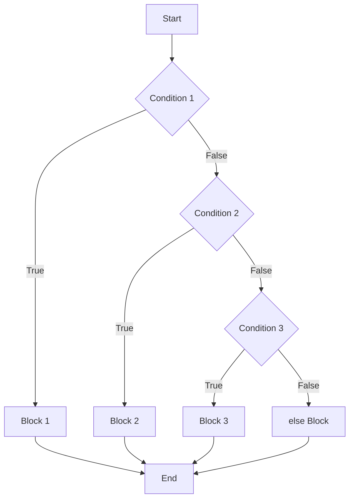

# Day 8: if, elif, else

## Learning Objectives

By the end of this lesson, you will be able to:

- Write `if` statements to make decisions in code
- Use `elif` to handle multiple conditions
- Add `else` as a fallback case
- Nest conditional statements inside each other
- Use the ternary operator for simple conditional expressions
- Use `match`/`case` (Python 3.10+) for pattern matching

## Estimated Time

50 minutes

## Prerequisites

- Day 7: Boolean Logic and Comparison

---

## Theory

### The `if` Statement

The `if` statement is the most fundamental control structure. It executes a block of code only if a condition is `True`.

```python
if condition:
    # indented block runs when condition is True
```

```python
age = 18
if age >= 18:
    print("You are an adult.")
```

```text
You are an adult.
```

:::{important}
Python uses **indentation** (4 spaces by convention) to define code blocks. Do not mix tabs and spaces.
:::

### The `else` Clause

The `else` clause provides a block that runs when the condition is `False`.

```python
age = 16
if age >= 18:
    print("You are an adult.")
else:
    print("You are a minor.")
```

```text
You are a minor.
```

### The `elif` Clause

Use `elif` (short for "else if") to check multiple conditions in sequence.

```python
score = 85

if score >= 90:
    grade = "A"
elif score >= 80:
    grade = "B"
elif score >= 70:
    grade = "C"
elif score >= 60:
    grade = "D"
else:
    grade = "F"

print(f"Grade: {grade}")
```

```text
Grade: B
```

:::{tip}
Conditions are evaluated top-down. Once one condition matches, the rest are skipped. Order matters — put the most specific conditions first.
:::

### Grade Calculator

```python
def grade_calculator(percentage):
    if percentage < 0 or percentage > 100:
        return "Invalid score"
    elif percentage >= 90:
        return "A"
    elif percentage >= 80:
        return "B"
    elif percentage >= 70:
        return "C"
    elif percentage >= 60:
        return "D"
    else:
        return "F"

print(grade_calculator(95))   # A
print(grade_calculator(82))   # B
print(grade_calculator(105))  # Invalid score
```

```text
A
B
Invalid score
```

### Even / Odd Checker

```python
number = int(input("Enter a number: "))

if number % 2 == 0:
    print(f"{number} is even.")
else:
    print(f"{number} is odd.")
```

```text
Enter a number: 7
7 is odd.
```

### Leap Year Checker

A year is a leap year if:
- Divisible by 400, OR
- Divisible by 4 but NOT by 100

```python
year = int(input("Enter a year: "))

if year % 400 == 0:
    print(f"{year} is a leap year.")
elif year % 100 == 0:
    print(f"{year} is not a leap year.")
elif year % 4 == 0:
    print(f"{year} is a leap year.")
else:
    print(f"{year} is not a leap year.")
```

```text
Enter a year: 1900
1900 is not a leap year.
```

### Nested Conditionals

You can place `if` statements inside other `if` statements. Use nesting when you need to check a condition only after another condition is met.

```python
age = 20
has_id = True

if age >= 18:
    if has_id:
        print("Entry allowed.")
    else:
        print("ID required.")
else:
    print("Too young.")
```

```text
Entry allowed.
```

:::{warning}
Deep nesting (3+ levels) makes code hard to read. Consider refactoring nested conditionals into separate functions or combining conditions with `and`.
:::

### Ternary Operator (Conditional Expression)

Python's ternary operator lets you write simple if-else logic in one line.

```python
value_if_true if condition else value_if_false
```

```python
age = 20
status = "Adult" if age >= 18 else "Minor"
print(status)  # Adult

# Practical example: absolute value
number = -5
abs_value = number if number >= 0 else -number
print(abs_value)  # 5
```

:::{tip}
Use the ternary operator for simple, single-condition assignments. For complex logic, prefer a full `if`/`elif`/`else` block for readability.
:::

### Match / Case (Python 3.10+)

The `match`/`case` statement provides pattern matching, similar to `switch` in other languages.

```python
def http_status(code):
    match code:
        case 200:
            return "OK"
        case 301 | 302:
            return "Redirect"
        case 400:
            return "Bad Request"
        case 401 | 403:
            return "Access Denied"
        case 404:
            return "Not Found"
        case 500 | 502 | 503:
            return "Server Error"
        case _:
            return "Unknown Status"

print(http_status(200))  # OK
print(http_status(404))  # Not Found
print(http_status(999))  # Unknown Status
```

```text
OK
Not Found
Unknown Status
```

You can also match on types and structures:

```python
def process_value(value):
    match value:
        case 0:
            print("Zero")
        case int(n):
            print(f"Integer: {n}")
        case str(s):
            print(f"String: {s}")
        case [a, b]:
            print(f"List of two: {a}, {b}")
        case _:
            print("Something else")

process_value(42)        # Integer: 42
process_value("hello")   # String: hello
process_value([1, 2])    # List of two: 1, 2
```

```text
Integer: 42
String: hello
List of two: 1, 2
```



---

## Try It Yourself

1. Write a program that asks for a number and prints whether it is positive, negative, or zero.

2. Create a simple login system: ask for username and password. If both are correct ("admin" and "secret123"), print "Welcome". Otherwise, print "Invalid credentials".

3. Write a program that asks for a temperature in Celsius and classifies it: "Freezing" (&lt;= 0), "Cold" (1–15), "Warm" (16–30), or "Hot" (&gt; 30).

---

## Common Mistakes

| Mistake | Incorrect | Correct |
|---------|-----------|---------|
| Colon missing | `if x > 5` | `if x > 5:` |
| Wrong indentation | `if x > 5:\nprint("ok")` | `if x > 5:\n    print("ok")` |
| Using `else if` instead of `elif` | `else if x > 10:` | `elif x > 10:` |
| Empty if block | `if x > 5:` (nothing) | Use `pass`: `if x > 5: pass` |

---

## Summary

- `if` executes a block when a condition is true.
- `elif` checks additional conditions after the first false one.
- `else` provides a default block when no condition matches.
- Nesting places conditionals inside conditionals (use sparingly).
- The ternary operator `x if cond else y` is a one-line conditional expression.
- `match`/`case` (Python 3.10+) offers powerful pattern matching.

## Key Takeaways

- Indentation defines blocks — keep it consistent (4 spaces).
- Check the most specific conditions first in `elif` chains.
- Avoid deep nesting; use logical operators or early returns instead.
- Use `match`/`case` when you have many discrete values to compare against.

---

## Quiz

### Q1: What does this code print?

```python
x = 5
if x > 10:
    print("A")
elif x > 3:
    print("B")
elif x > 1:
    print("C")
else:
    print("D")
```

1. `A`
2. `B`
3. `C`
4. `D`

:::{note}
**Solution: 2. `B`** — `x > 3` is the first true condition. The `elif` chain stops once a match is found.
:::

### Q2: Which of these correctly checks if `num` is between 10 and 20 (inclusive)?

1. `if 10 < num < 20:`
2. `if num >= 10 and num <= 20:`
3. `if num == 10-20:`
4. Both 1 and 2

:::{note}
**Solution: 2. `if num >= 10 and num <= 20:`** — Option 1 uses `<` which is exclusive. Option 3 is not valid syntax. Option 2 is the correct inclusive range check.
:::

### Q3: What is the value of `result` after this code?

```python
x = 7
result = "Even" if x % 2 == 0 else "Odd"
```

1. `"Even"`
2. `"Odd"`
3. `True`

:::{note}
**Solution: 2. `"Odd"`** — `7 % 2` is `1`, which is not equal to `0`, so the else branch runs.
:::
