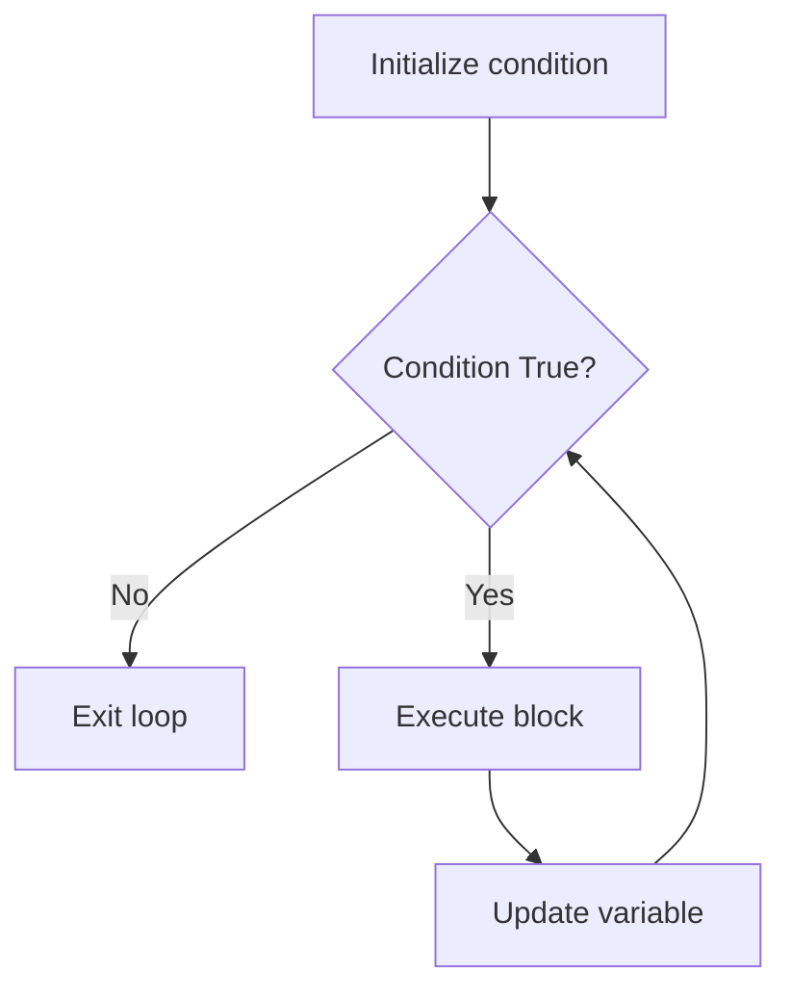

# Day 9: while Loops

## Learning Objectives

By the end of this lesson, you will be able to:

- Write `while` loops to repeat code
- Avoid and handle infinite loops
- Use `break` to exit a loop early
- Use `continue` to skip to the next iteration
- Use the `else` clause with `while`
- Implement sentinel-controlled loops

## Estimated Time

50 minutes

## Prerequisites

- Day 7: Boolean Logic and Comparison
- Day 8: if, elif, else

---

## Theory

### The `while` Loop

A `while` loop repeats a block of code as long as a condition remains `True`.

```python
while condition:
    # indented block runs repeatedly while condition is True
```

```python
count = 1
while count <= 5:
    print(f"Count: {count}")
    count += 1  # increment to avoid infinite loop
```

```text
Count: 1
Count: 2
Count: 3
Count: 4
Count: 5
```

### Infinite Loops (and How to Avoid)

If the condition never becomes `False`, the loop runs forever — this is an **infinite loop**.

```python
# DANGER: infinite loop
# while True:
#     print("This never stops!")
```

**How to avoid infinite loops:**

1. Ensure the loop variable changes each iteration.
2. Include a `break` statement.
3. Use a counter or sentinel value.

:::{warning}
Always double-check that your loop condition will eventually become `False`. If your program hangs, press **Ctrl+C** (or **Cmd+C** on macOS) to stop it.
:::

### Countdown Timer

```python
import time

countdown = 5
while countdown > 0:
    print(f"{countdown}...")
    time.sleep(1)  # pause for 1 second
    countdown -= 1

print("Liftoff! 🚀")
```

```text
5...
4...
3...
2...
1...
Liftoff! 🚀
```

### The `break` Statement

`break` immediately exits the loop, regardless of the condition.

```python
secret_number = 7
guess = 0

while True:
    guess = int(input("Guess a number (1-10): "))
    if guess == secret_number:
        print("Correct!")
        break
    print("Wrong, try again.")
```

```text
Guess a number (1-10): 3
Wrong, try again.
Guess a number (1-10): 7
Correct!
```

### The `continue` Statement

`continue` skips the rest of the current iteration and jumps to the next condition check.

```python
number = 0
while number < 10:
    number += 1
    if number % 2 == 0:
        continue  # skip even numbers
    print(number)
```

```text
1
3
5
7
9
```

### Number Guessing Game

```python
import random

target = random.randint(1, 100)
attempts = 0
guessed = False

while not guessed:
    guess = int(input("Guess a number (1-100): "))
    attempts += 1

    if guess < target:
        print("Too low!")
    elif guess > target:
        print("Too high!")
    else:
        print(f"Correct! You got it in {attempts} attempts.")
        guessed = True
```

```text
Guess a number (1-100): 50
Too low!
Guess a number (1-100): 75
Too high!
Guess a number (1-100): 62
Correct! You got it in 3 attempts.
```

### The `else` Clause with `while`

The `else` block runs **only if** the loop completes normally (i.e., was not terminated by `break`).

```python
attempts = 0
max_attempts = 3
password = "python123"

while attempts < max_attempts:
    guess = input("Enter password: ")
    if guess == password:
        print("Access granted!")
        break
    attempts += 1
    print(f"Incorrect. {max_attempts - attempts} attempts left.")
else:
    # runs only if loop didn't break
    print("Account locked. Too many failed attempts.")
```

```text
Enter password: wrong
Incorrect. 2 attempts left.
Enter password: wrong2
Incorrect. 1 attempts left.
Enter password: wrong3
Incorrect. 0 attempts left.
Account locked. Too many failed attempts.
```

:::{tip}
Use `while...else` when you need to distinguish between "loop finished naturally" and "loop exited early via `break`".
:::

### Sentinel-Controlled Loops

A **sentinel** is a special value that signals the end of input. The loop continues until the sentinel is entered.

```python
total = 0
count = 0

print("Enter test scores (-1 to quit):")

while True:
    score = int(input("Score: "))
    if score == -1:  # sentinel value
        break
    total += score
    count += 1

if count > 0:
    print(f"Average: {total / count:.2f}")
else:
    print("No scores entered.")
```

```text
Enter test scores (-1 to quit):
Score: 85
Score: 92
Score: 78
Score: -1
Average: 85.00
```

### Input Validation Loop

Use `while` to repeatedly ask for input until the user provides valid data.

```python
age = -1
while age <= 0 or age >= 150:
    age = int(input("Enter your age: "))
    if age <= 0 or age >= 150:
        print("Invalid age. Please enter a realistic value.")

print(f"Age recorded: {age}")
```

```text
Enter your age: -5
Invalid age. Please enter a realistic value.
Enter your age: 200
Invalid age. Please enter a realistic value.
Enter your age: 25
Age recorded: 25
```



---

## Try It Yourself

1. Write a `while` loop that prints all even numbers from 2 to 20.

2. Create a program that asks the user to enter numbers and sums them. Stop when the user enters `0` and print the total.

3. Write a password prompt that gives the user up to 3 attempts. Print "Welcome" on success, "Locked out" on failure. Use a sentinel or flag variable.

---

## Common Mistakes

| Mistake | Incorrect | Correct |
|---------|-----------|---------|
| Forgetting to update loop variable | `while x < 10: print(x)` | Add `x += 1` inside loop |
| Infinite loop with no `break` | `while True: print("hi")` | Include a `break` condition |
| Misplacing `break` | Breaking before processing | Break only after logic |

---

## Summary

- `while` loops repeat code while a condition is `True`.
- Ensure loop variables change to avoid infinite loops.
- `break` exits the loop immediately; `continue` skips to the next iteration.
- The `else` clause runs only if the loop ends normally (no `break`).
- Sentinel values mark the end of input in data-entry loops.

## Key Takeaways

- Always update the loop variable or provide an exit path.
- Use `while True` with `break` for indefinite loops where the exit condition is in the middle.
- Use `while...else` sparingly — it's powerful but uncommon.
- Sentinel-controlled loops are the most robust way to collect unpredictable amounts of data.

---

## Quiz

### Q1: How many times does this loop print "Hello"?

```python
x = 1
while x < 5:
    print("Hello")
    x += 1
```

1. 4
2. 5
3. Infinite

:::{note}
**Solution: 1. 4 times** — x starts at 1 and stops when x is no longer less than 5, so it runs for x = 1, 2, 3, 4.
:::

### Q2: What does the `break` statement do in a loop?

1. Restarts the loop from the beginning
2. Exits the loop immediately
3. Skips the current iteration

:::{note}
**Solution: 2. Exits the loop immediately** — `break` terminates the loop. `continue` (option 3) skips to the next iteration.
:::

### Q3: The `else` clause on a `while` loop executes when:

1. The loop condition is `False` after a `break`
2. The loop condition is `False` normally (no `break`)
3. Every time the loop iterates

:::{note}
**Solution: 2. When the loop ends normally without `break`** — if `break` is hit, `else` is skipped.
:::
