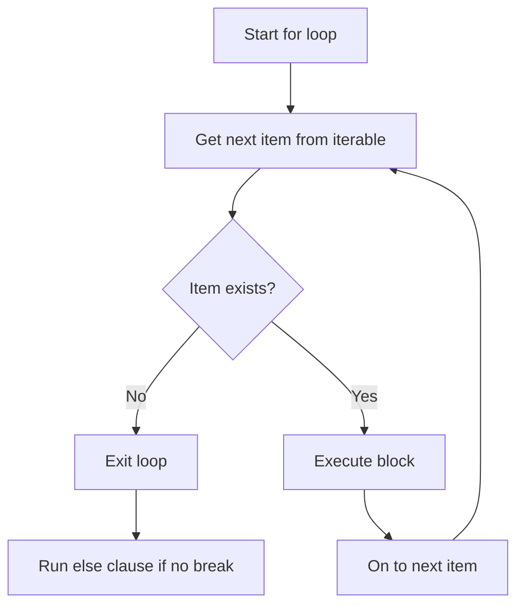

# Day 10: for Loops and range()

## Learning Objectives

By the end of this lesson, you will be able to:

- Write `for` loops to iterate over sequences
- Use the `range()` function with start, stop, and step
- Enumerate items with `enumerate()` for index and value
- Write nested `for` loops
- Use the `else` clause with `for` loops
- Iterate through strings, lists, and other iterables

## Estimated Time

50 minutes

## Prerequisites

- Day 9: while Loops

---

## Theory

### The `for` Loop

The `for` loop in Python iterates over a sequence (string, list, tuple, etc.) or any iterable object.

```python
for variable in iterable:
    # block runs for each item
```

```python
fruits = ["apple", "banana", "cherry"]
for fruit in fruits:
    print(f"I like {fruit}s")
```

```text
I like apples
I like bananas
I like cherries
```

### Iterating Over Strings

A string is a sequence of characters, so `for` loops iterate character by character.

```python
word = "Python"
for char in word:
    print(char, end=" ")
```

```text
P y t h o n
```

### Iterating Over Lists

```python
numbers = [10, 20, 30, 40, 50]
total = 0

for num in numbers:
    total += num

print(f"Sum: {total}")  # 150
```

```text
Sum: 150
```

### The `range()` Function

`range()` generates a sequence of numbers. It has three forms:

| Call | Meaning | Example | Output |
|------|---------|---------|--------|
| `range(stop)` | 0 to stop-1 | `range(5)` | 0, 1, 2, 3, 4 |
| `range(start, stop)` | start to stop-1 | `range(2, 6)` | 2, 3, 4, 5 |
| `range(start, stop, step)` | start to stop-1, stepping by step | `range(1, 10, 2)` | 1, 3, 5, 7, 9 |

```python
# range(stop)
for i in range(5):
    print(i, end=" ")  # 0 1 2 3 4
print()

# range(start, stop)
for i in range(3, 7):
    print(i, end=" ")  # 3 4 5 6
print()

# range(start, stop, step)
for i in range(0, 11, 2):
    print(i, end=" ")  # 0 2 4 6 8 10
print()

# backwards
for i in range(10, 0, -2):
    print(i, end=" ")  # 10 8 6 4 2
```

```text
0 1 2 3 4
3 4 5 6
0 2 4 6 8 10
10 8 6 4 2
```

:::{tip}
`range()` is memory-efficient — it generates numbers on demand rather than storing them all in memory.
:::

### Multiplication Table

```python
number = int(input("Enter a number: "))

for i in range(1, 11):
    print(f"{number} × {i} = {number * i}")
```

```text
Enter a number: 7
7 × 1 = 7
7 × 2 = 14
7 × 3 = 21
7 × 4 = 28
7 × 5 = 35
7 × 6 = 42
7 × 7 = 49
7 × 8 = 56
7 × 9 = 63
7 × 10 = 70
```

### `enumerate()` for Index and Value

`enumerate()` returns both the index and the value of each item in a sequence.

```python
fruits = ["apple", "banana", "cherry"]
for index, fruit in enumerate(fruits):
    print(f"{index + 1}. {fruit}")
```

```text
1. apple
2. banana
3. cherry
```

You can specify a custom start index:

```python
for index, fruit in enumerate(fruits, start=1):
    print(f"{index}. {fruit}")
```

```text
1. apple
2. banana
3. cherry
```

### Nested Loops

A nested loop is a loop inside another loop. The inner loop completes all iterations for each iteration of the outer loop.

```python
for row in range(1, 4):
    for col in range(1, 4):
        print(f"({row},{col})", end=" ")
    print()  # newline after each row
```

```text
(1,1) (1,2) (1,3)
(2,1) (2,2) (2,3)
(3,1) (3,2) (3,3)
```

### Pattern Printing

```python
# Right triangle pattern
for i in range(1, 6):
    for j in range(i):
        print("*", end="")
    print()
```

```text
*
**
***
****
*****
```

### Loop `else` Clause

Like `while`, a `for` loop can have an `else` clause that runs only if the loop completed without hitting `break`.

```python
def find_number(numbers, target):
    for n in numbers:
        if n == target:
            print(f"Found {target}!")
            break
    else:
        print(f"{target} not found.")

find_number([1, 3, 5, 7, 9], 5)  # Found!
find_number([1, 3, 5, 7, 9], 4)  # Not found.
```

```text
Found 5!
4 not found.
```



---

## Try It Yourself

1. Use a `for` loop with `range()` to print the square of each number from 1 to 10.

2. Write a program that takes a string and prints each character on a separate line, along with its index (use `enumerate()`).

3. Print a 5×5 multiplication table using nested `for` loops.

---

## Common Mistakes

| Mistake | Incorrect | Correct |
|---------|-----------|---------|
| Off-by-one with `range` | `range(5)` expecting 1–5 | `range(1, 6)` |
| Modifying list while iterating | `for x in lst: lst.remove(x)` | Iterate over a copy: `for x in lst[:]:` |
| Confusing `for` with `while` | Using `for` when iteration count is unknown | `while` for unknown counts, `for` for known |

---

## Summary

- `for` loops iterate over sequences and iterables.
- `range(start, stop, step)` generates number sequences efficiently.
- `enumerate()` provides both index and value during iteration.
- Nested loops execute the inner loop fully for each outer iteration.
- The `else` clause runs if the loop completes without `break`.

## Key Takeaways

- Use `for` when you know the number of iterations; use `while` when you don't.
- `range(1, n+1)` gives numbers 1 through n.
- Nested loops multiply complexity — the inner body runs `outer × inner` times.
- Prefer `for` over `while` for iterating over collections — it's cleaner and safer.

---

## Quiz

### Q1: What does `range(3, 8)` produce?

1. 3, 4, 5, 6, 7, 8
2. 3, 4, 5, 6, 7
3. 3, 4, 5, 6, 7, 8, 9

:::{note}
**Solution: 2. 3, 4, 5, 6, 7** — `range(start, stop)` goes up to but does not include `stop`.
:::

### Q2: How many times does the inner `print` execute?

```python
count = 0
for i in range(3):
    for j in range(4):
        count += 1
print(count)
```

1. 7
2. 12
3. 4

:::{note}
**Solution: 2. 12** — outer runs 3 times, inner runs 4 times each: `3 × 4 = 12`.
:::

### Q3: What does `enumerate()` return?

1. Just the index of each item
2. Just the value of each item
3. Pairs of (index, value)

:::{note}
**Solution: 3. Pairs of (index, value)** — `enumerate()` yields tuples of `(index, element)`.
:::
