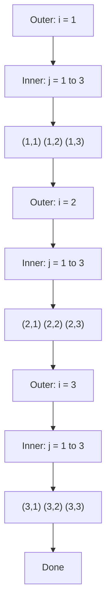

# Day 11: Nested Loops and Patterns

## Learning Objectives

By the end of this lesson, you will be able to:

- Understand how nested loops execute step by step
- Print rectangular, triangular, pyramid, and diamond patterns
- Combine loops with conditional logic inside
- Use `range()` creatively for pattern generation
- Build a checkerboard pattern

## Estimated Time

50 minutes

## Prerequisites

- Day 10: for Loops and range()

---

## Theory

### Nested Loop Mechanics

A nested loop is a loop inside another loop. For each iteration of the **outer loop**, the **inner loop** runs completely from start to finish.

```python
for outer in range(1, 4):
    print(f"Outer loop iteration #{outer}")
    for inner in range(1, 4):
        print(f"  Inner loop iteration #{inner}")
    print()  # blank line between outer iterations
```

```text
Outer loop iteration #1
  Inner loop iteration #1
  Inner loop iteration #2
  Inner loop iteration #3

Outer loop iteration #2
  Inner loop iteration #1
  Inner loop iteration #2
  Inner loop iteration #3

Outer loop iteration #3
  Inner loop iteration #1
  Inner loop iteration #2
  Inner loop iteration #3
```

:::{important}
The total number of inner executions is `outer_count × inner_count`. A 10×10 nested loop runs 100 inner iterations.
:::

### Rectangular Patterns

```python
# 4 rows × 8 columns rectangle of asterisks
rows, cols = 4, 8

for row in range(rows):
    for col in range(cols):
        print("*", end="")
    print()
```

```text
********
********
********
********
```

**Hollow rectangle:**

```python
rows, cols = 5, 10

for row in range(rows):
    for col in range(cols):
        if row == 0 or row == rows - 1 or col == 0 or col == cols - 1:
            print("*", end="")
        else:
            print(" ", end="")
    print()
```

```text
**********
*        *
*        *
*        *
**********
```

### Triangular Patterns

**Right triangle (bottom-left):**

```python
n = 5
for i in range(1, n + 1):
    for j in range(i):
        print("*", end="")
    print()
```

```text
*
**
***
****
*****
```

**Right triangle (top-left):**

```python
n = 5
for i in range(n, 0, -1):
    for j in range(i):
        print("*", end="")
    print()
```

```text
*****
****
***
**
*
```

**Right triangle (bottom-right, with spaces):**

```python
n = 5
for i in range(1, n + 1):
    for space in range(n - i):
        print(" ", end="")
    for star in range(i):
        print("*", end="")
    print()
```

```text
    *
   **
  ***
 ****
*****
```

### Pyramid Patterns

**Full pyramid:**

```python
n = 5
for i in range(1, n + 1):
    # spaces
    for sp in range(n - i):
        print(" ", end="")
    # stars (odd count: 2*i - 1)
    for st in range(2 * i - 1):
        print("*", end="")
    print()
```

```text
    *
   ***
  *****
 *******
*********
```

**Hollow pyramid:**

```python
n = 5
for i in range(1, n + 1):
    for sp in range(n - i):
        print(" ", end="")
    for st in range(2 * i - 1):
        if st == 0 or st == 2 * i - 2 or i == n:
            print("*", end="")
        else:
            print(" ", end="")
    print()
```

```text
    *
   * *
  *   *
 *     *
*********
```

### Diamond Pattern

```python
n = 5

# Upper half
for i in range(1, n + 1):
    for sp in range(n - i):
        print(" ", end="")
    for st in range(2 * i - 1):
        print("*", end="")
    print()

# Lower half
for i in range(n - 1, 0, -1):
    for sp in range(n - i):
        print(" ", end="")
    for st in range(2 * i - 1):
        print("*", end="")
    print()
```

```text
    *
   ***
  *****
 *******
*********
 *******
  *****
   ***
    *
```

### Checkerboard

```python
size = 8

for row in range(size):
    for col in range(size):
        if (row + col) % 2 == 0:
            print("■", end=" ")
        else:
            print("□", end=" ")
    print()
```

```text
■ □ ■ □ ■ □ ■ □
□ ■ □ ■ □ ■ □ ■
■ □ ■ □ ■ □ ■ □
□ ■ □ ■ □ ■ □ ■
■ □ ■ □ ■ □ ■ □
□ ■ □ ■ □ ■ □ ■
■ □ ■ □ ■ □ ■ □
□ ■ □ ■ □ ■ □ ■
```

### Loops with Conditionals Inside

You can place `if`/`else` logic inside nested loops for complex patterns:

```python
# Number pattern: each row has increasing numbers
n = 5
for i in range(1, n + 1):
    for j in range(1, i + 1):
        print(j, end=" ")
    print()
```

```text
1
1 2
1 2 3
1 2 3 4
1 2 3 4 5
```

```python
# Floyd's Triangle
num = 1
n = 5
for i in range(1, n + 1):
    for j in range(i):
        print(num, end=" ")
        num += 1
    print()
```

```text
1
2 3
4 5 6
7 8 9 10
11 12 13 14 15
```

### Nested Loop Execution Visualization



---

## Try It Yourself

1. Print an **inverted full pyramid** (upside-down) with `n = 5`.

2. Print a **number diamond** where the numbers increase from 1 at the top to `n` at the center and back down.

3. Create a **zigzag pattern** using nested loops: for `n = 4`, print:
   ```
   *
   **
   ***
   ****
   ***
   **
   *
   ```

---

## Common Mistakes

| Mistake | Incorrect | Correct |
|---------|-----------|---------|
| Wrong loop bounds | `range(n)` for `n` rows but off-by-one in stars | Test with small `n` (e.g., 3) first |
| Confusing row/col variables | Using `i` for both without clear naming | Use `row`/`col` or `i`/`j` clearly |
| Forgetting `end=""` | Pattern prints each char on a new line | `print("*", end="")` keeps same line |
| Wrong position logic | Triangle leaning wrong direction | Adjust spaces vs. stars counts |

---

## Summary

- Nested loops: the inner loop runs fully for each outer loop iteration.
- Rectangles use fixed bounds; triangles and pyramids use variable bounds tied to the outer variable.
- Pyramids combine leading spaces (decreasing) with stars (increasing by 2).
- Diamonds are a top pyramid + a bottom inverted pyramid.
- Combine loops with conditionals for patterns like checkerboards and hollow shapes.

## Key Takeaways

- Total operations = `outer_count × inner_count` — be mindful of performance.
- Patterns are about finding the math relationship between row and column.
- Always test with small values first to debug your pattern logic.
- Decompose complex patterns into simpler sub-patterns.

---

## Quiz

### Q1: How many stars does `print("*", end="")` place on one line?

1. One
2. Unlimited until `print()` is called
3. Zero

:::{note}
**Solution: 2. Unlimited** — `end=""` suppresses the newline, so subsequent prints append to the same line.
:::

### Q2: What does this code print?

```python
for i in range(3, 0, -1):
    for j in range(i):
        print(i, end="")
    print()
```

1. ```
   333
   22
   1
   ```
2. ```
   3
   33
   333
   ```
3. ```
   111
   22
   3
   ```

:::{note}
**Solution: 1.** — `i` goes 3, 2, 1 and each row prints `i` repeated `i` times.
:::

### Q3: In a checkerboard pattern `(row + col) % 2 == 0`, what determines the color?

1. The row number only
2. The column number only
3. The parity of the sum of row and col

:::{note}
**Solution: 3. The parity of the sum** — alternating colors come from whether `row + col` is even or odd.
:::
