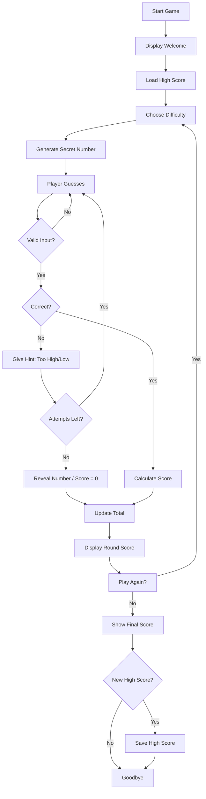

# Day 12: Week 2 Project — Number Guessing Game

## Learning Objectives

By the end of this lesson, you will be able to:

- Combine all Week 2 concepts (conditionals, loops, logical operators) in one program
- Implement game difficulty levels
- Build a hint system
- Track and display scores
- Support replay functionality
- Extend the game with high score tracking and multiplayer

## Estimated Time

60 minutes

## Prerequisites

- Days 7–11 (all of Week 2)

---

## Theory — Review of Week 2

Before diving into the project, let's recap the key tools from this week:

| Concept | Day | Used For |
|---------|-----|----------|
| Boolean logic | 7 | Checking guesses, comparing values |
| Comparison operators | 7 | `==`, `<`, `>`, `<=`, `>=` in conditions |
| Logical operators | 7 | `and`, `or`, `not` for compound conditions |
| `if`/`elif`/`else` | 8 | Choosing difficulty, evaluating guesses |
| `match`/`case` | 8 | Dispatching game modes |
| `while` loops | 9 | Game loop, input validation, replay |
| `break` / `continue` | 9 | Exiting on correct guess, skipping turns |
| `for` loops / `range()` | 10 | Iterating through attempts, generating ranges |
| Nested loops | 11 | (Not used directly, but the thinking pattern applies) |

---

## Project: Number Guessing Game

We will build a complete Number Guessing Game with:

- Multiple difficulty levels
- A hint system (too high / too low)
- Score tracking (fewer attempts = better score)
- Replay option

### Game Requirements

1. The computer picks a random number in a range determined by difficulty.
2. The player guesses until they find it or run out of attempts.
3. Hints tell the player if their guess is too high or too low.
4. Score is calculated based on difficulty and attempts used.
5. After each game, ask the player if they want to play again.

### Step-by-Step Walkthrough

**Step 1: Import modules and set up difficulty levels**

```python
import random

DIFFICULTIES = {
    "easy": {"range": 10, "attempts": 5},
    "medium": {"range": 50, "attempts": 7},
    "hard": {"range": 100, "attempts": 10},
    "extreme": {"range": 500, "attempts": 15},
}
```

**Step 2: Choose difficulty**

```python
def choose_difficulty():
    print("\n=== DIFFICULTY LEVELS ===")
    for level, info in DIFFICULTIES.items():
        print(f"  {level}: 1-{info['range']} ({info['attempts']} attempts)")

    while True:
        choice = input("Choose difficulty: ").strip().lower()
        if choice in DIFFICULTIES:
            return choice
        print("Invalid choice. Try again.")
```

**Step 3: Play a single round**

```python
def play_round(difficulty):
    config = DIFFICULTIES[difficulty]
    secret = random.randint(1, config["range"])
    max_attempts = config["attempts"]
    attempts_used = 0

    print(f"\nI'm thinking of a number between 1 and {config['range']}.")
    print(f"You have {max_attempts} attempts.")

    while attempts_used < max_attempts:
        remaining = max_attempts - attempts_used
        try:
            guess = int(input(f"\nAttempt {attempts_used + 1} ({remaining} left): "))
        except ValueError:
            print("Please enter a valid number.")
            continue

        if guess < 1 or guess > config["range"]:
            print(f"Out of range! Guess between 1 and {config['range']}.")
            continue

        attempts_used += 1

        if guess < secret:
            print("Too low! 📉")
        elif guess > secret:
            print("Too high! 📈")
        else:
            print(f"\n🎉 Correct! You got it in {attempts_used} attempts!")
            return calculate_score(difficulty, attempts_used)
    else:
        print(f"\n😢 Out of attempts! The number was {secret}.")
        return 0
```

**Step 4: Calculate score**

```python
def calculate_score(difficulty, attempts):
    max_attempts = DIFFICULTIES[difficulty]["attempts"]
    base_scores = {"easy": 10, "medium": 25, "hard": 50, "extreme": 100}
    base = base_scores[difficulty]
    # fewer attempts = higher score multiplier
    multiplier = (max_attempts - attempts + 1) / max_attempts
    return int(base * multiplier)
```

**Step 5: Main game loop with replay**

```python
def main():
    print("=" * 40)
    print("   WELCOME TO THE NUMBER GUESSING GAME")
    print("=" * 40)

    total_score = 0
    play_again = True

    while play_again:
        difficulty = choose_difficulty()
        round_score = play_round(difficulty)
        total_score += round_score
        print(f"\nRound score: {round_score}")
        print(f"Total score: {total_score}")

        # Replay?
        while True:
            again = input("\nPlay again? (y/n): ").strip().lower()
            if again in ("y", "yes"):
                break
            elif again in ("n", "no"):
                play_again = False
                break
            print("Please enter 'y' or 'n'.")

    print(f"\nFinal score: {total_score}")
    print("Thanks for playing! 👋")
```

**Full solution:**

```python
import random

DIFFICULTIES = {
    "easy": {"range": 10, "attempts": 5},
    "medium": {"range": 50, "attempts": 7},
    "hard": {"range": 100, "attempts": 10},
    "extreme": {"range": 500, "attempts": 15},
}

def choose_difficulty():
    print("\n=== DIFFICULTY LEVELS ===")
    for level, info in DIFFICULTIES.items():
        print(f"  {level}: 1-{info['range']} ({info['attempts']} attempts)")
    while True:
        choice = input("Choose difficulty: ").strip().lower()
        if choice in DIFFICULTIES:
            return choice
        print("Invalid choice. Try again.")

def calculate_score(difficulty, attempts):
    max_attempts = DIFFICULTIES[difficulty]["attempts"]
    base_scores = {"easy": 10, "medium": 25, "hard": 50, "extreme": 100}
    base = base_scores[difficulty]
    multiplier = (max_attempts - attempts + 1) / max_attempts
    return int(base * multiplier)

def play_round(difficulty):
    config = DIFFICULTIES[difficulty]
    secret = random.randint(1, config["range"])
    max_attempts = config["attempts"]
    attempts_used = 0
    print(f"\nI'm thinking of a number between 1 and {config['range']}.")
    print(f"You have {max_attempts} attempts.")
    while attempts_used < max_attempts:
        remaining = max_attempts - attempts_used
        try:
            guess = int(input(f"\nAttempt {attempts_used + 1} ({remaining} left): "))
        except ValueError:
            print("Please enter a valid number.")
            continue
        if guess < 1 or guess > config["range"]:
            print(f"Out of range! Guess between 1 and {config['range']}.")
            continue
        attempts_used += 1
        if guess < secret:
            print("Too low! 📉")
        elif guess > secret:
            print("Too high! 📈")
        else:
            print(f"\n🎉 Correct! You got it in {attempts_used} attempts!")
            return calculate_score(difficulty, attempts_used)
    else:
        print(f"\n😢 Out of attempts! The number was {secret}.")
        return 0

def main():
    print("=" * 40)
    print("   WELCOME TO THE NUMBER GUESSING GAME")
    print("=" * 40)
    total_score = 0
    play_again = True
    while play_again:
        difficulty = choose_difficulty()
        round_score = play_round(difficulty)
        total_score += round_score
        print(f"\nRound score: {round_score}")
        print(f"Total score: {total_score}")
        while True:
            again = input("\nPlay again? (y/n): ").strip().lower()
            if again in ("y", "yes"):
                break
            elif again in ("n", "no"):
                play_again = False
                break
            print("Please enter 'y' or 'n'.")
    print(f"\nFinal score: {total_score}")
    print("Thanks for playing! 👋")

if __name__ == "__main__":
    main()
```

```text
========================================
   WELCOME TO THE NUMBER GUESSING GAME
========================================

=== DIFFICULTY LEVELS ===
  easy: 1-10 (5 attempts)
  medium: 1-50 (7 attempts)
  hard: 1-100 (10 attempts)
  extreme: 1-500 (15 attempts)
Choose difficulty: medium

I'm thinking of a number between 1 and 50.
You have 7 attempts.

Attempt 1 (7 left): 25
Too high! 📈

Attempt 2 (6 left): 12
Too low! 📉

Attempt 3 (5 left): 18
Too low! 📉

Attempt 4 (4 left): 22
Too high! 📈

Attempt 5 (3 left): 20

🎉 Correct! You got it in 5 attempts!
Round score: 10
Total score: 10

Play again? (y/n): n

Final score: 10
Thanks for playing! 👋
```

:::{tip}
Always test your game with edge cases: guessing the exact bounds, entering non-numeric input, and exhausting all attempts.
:::

---

## Extensions

### High Score Tracking

Store the best score across sessions using a simple file:

```python
def load_high_score():
    try:
        with open("highscore.txt", "r") as f:
            return int(f.read())
    except (FileNotFoundError, ValueError):
        return 0

def save_high_score(score):
    with open("highscore.txt", "w") as f:
        f.write(str(score))
```

Add this to `main()`:

```python
high_score = load_high_score()
print(f"Current high score: {high_score}")
# after game ends:
if total_score > high_score:
    print("New high score!")
    save_high_score(total_score)
```

### Multiplayer Mode

```python
def multiplayer_mode():
    num_players = int(input("Number of players: "))
    scores = [0] * num_players

    for round_num in range(3):  # 3 rounds
        for player in range(num_players):
            print(f"\n--- Player {player + 1}'s turn (Round {round_num + 1}) ---")
            difficulty = choose_difficulty()
            scores[player] += play_round(difficulty)

    print("\n=== FINAL SCORES ===")
    for i, score in enumerate(scores):
        print(f"Player {i + 1}: {score}")
    print(f"Winner: Player {scores.index(max(scores)) + 1} 🏆")
```

---

## Game Flow Diagram



---

## Week 2 Summary

| Day | Topic | Key Skills |
|-----|-------|------------|
| 7 | Boolean Logic and Comparison | `True`/`False`, `==`, `!=`, `<`, `>`, `and`, `or`, `not`, truthiness |
| 8 | `if`, `elif`, `else` | Conditionals, nesting, ternary, `match`/`case` |
| 9 | `while` Loops | Loops, `break`, `continue`, sentinel control |
| 10 | `for` Loops and `range()` | Iteration, `range()`, `enumerate()`, nested loops |
| 11 | Nested Loops and Patterns | Shapes, patterns, loop-within-loop logic |
| 12 | Week 2 Project | Full game combining all concepts |

:::{important}
You have now mastered **control flow** — the ability to make decisions and repeat actions. This is the backbone of every program you will ever write. Everything from here is built on this foundation.
:::

---

## Preview: Week 3 — Data Structures

Next week, you will dive into Python's built-in data structures:

- **Day 13:** Lists — creation, indexing, slicing, methods
- **Day 14:** Tuples and Sets — immutable sequences and unordered collections
- **Day 15:** Dictionaries — key-value pairs
- **Day 16:** List Comprehensions — concise, powerful list creation
- **Day 17:** Strings Deep Dive — methods, formatting, and manipulation
- **Day 18:** Week 3 Project — Data structure challenge

---

## Quiz

### Q1: What happens if the user enters a non-numeric value in the guessing game as implemented above?

1. The program crashes with an error
2. The `try`/`except` catches it and prompts again
3. The program skips that attempt automatically

:::{note}
**Solution: 2. The `try`/`except` catches it and the `continue` statement restarts the loop iteration.** This is a standard pattern for input validation.
:::

### Q2: In the scoring formula `int(base * (max_attempts - attempts + 1) / max_attempts)`, what score does solving in exactly `max_attempts` yield?

1. `base`
2. `base / max_attempts`
3. `1`

:::{note}
**Solution: 2. `base / max_attempts`** — When `attempts == max_attempts`, the multiplier is `(max - max + 1) / max = 1 / max_attempts`.
:::

### Q3: Which loop structure best describes the game's main flow (choose difficulty → play → ask replay)?

1. Nested `for` loop
2. `while` loop with a flag variable
3. `for` loop over a fixed range

:::{note}
**Solution: 2. `while` loop with a flag variable** — The `play_again` boolean flag controls the outer game loop, allowing an indefinite number of rounds.
:::
