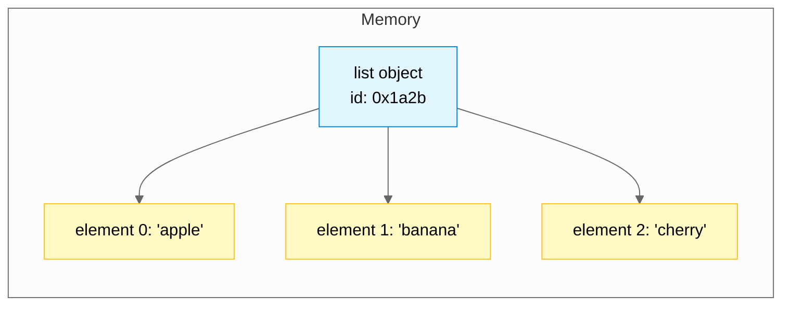
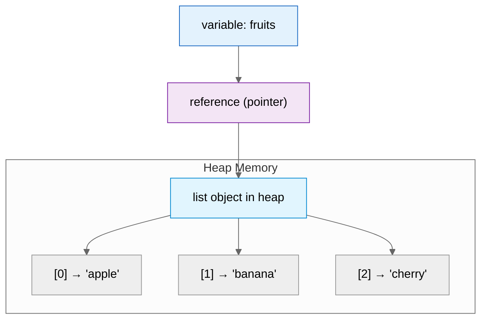

## Learning Objectives

By the end of this chapter, you will be able to:
- Create and manipulate Python lists
- Access elements using indexing and slicing
- Use common list methods to modify lists
- Work with nested lists
- Copy lists correctly (shallow vs deep)
- Use built-in functions like `len()`, `min()`, `max()`, `sum()`

## Estimated Time

45–60 minutes

## Prerequisites

- Variables and data types
- Basic understanding of sequences (strings)

---

## Theory

### Creating Lists

A **list** is an ordered, mutable collection of items. Lists can hold elements of any data type — even mixed types.

```python
empty_list = []
numbers = [1, 2, 3, 4, 5]
mixed = [1, "hello", 3.14, True]
nested = [[1, 2], [3, 4]]
```

Lists are created with square brackets `[]` and elements are separated by commas.

### Indexing and Slicing

Lists support zero-based indexing, just like strings. Negative indices count from the end.

```python
fruits = ["apple", "banana", "cherry", "date", "elderberry"]

# Positive indexing
print(fruits[0])   # apple
print(fruits[2])   # cherry

# Negative indexing
print(fruits[-1])  # elderberry
print(fruits[-3])  # cherry

# Slicing [start:stop:step]
print(fruits[1:4])     # ['banana', 'cherry', 'date']
print(fruits[::2])     # ['apple', 'cherry', 'elderberry']
print(fruits[::-1])    # ['elderberry', 'date', 'cherry', 'banana', 'apple']
```

Slicing returns a **new list** — the original is unchanged.

### List Methods

| Method       | Description                                | Mutates? |
| ------------ | ------------------------------------------ | -------- |
| `append(x)`  | Adds `x` to the end                       | Yes      |
| `extend(iter)`| Adds all elements from `iter`             | Yes      |
| `insert(i, x)`| Inserts `x` at index `i`                 | Yes      |
| `remove(x)`  | Removes the first occurrence of `x`       | Yes      |
| `pop(i)`     | Removes and returns item at index `i`     | Yes      |
| `clear()`    | Removes all items                         | Yes      |
| `index(x)`   | Returns index of first `x`                | No       |
| `count(x)`   | Returns number of occurrences of `x`      | No       |
| `sort()`     | Sorts in place                            | Yes      |
| `reverse()`  | Reverses in place                         | Yes      |

```python
nums = [3, 1, 4, 1, 5, 9]

nums.append(2)
print(nums)  # [3, 1, 4, 1, 5, 9, 2]

nums.extend([6, 5])
print(nums)  # [3, 1, 4, 1, 5, 9, 2, 6, 5]

nums.insert(0, 0)
print(nums)  # [0, 3, 1, 4, 1, 5, 9, 2, 6, 5]

nums.remove(1)
print(nums)  # [0, 3, 4, 1, 5, 9, 2, 6, 5]

last = nums.pop()
print(last, nums)  # 5 [0, 3, 4, 1, 5, 9, 2, 6]

idx = nums.index(4)
print(idx)  # 2

cnt = nums.count(5)
print(cnt)  # 1

nums.sort()
print(nums)  # [0, 1, 2, 3, 4, 6, 9]

nums.reverse()
print(nums)  # [9, 6, 4, 3, 2, 1, 0]

nums.clear()
print(nums)  # []
```

### Nested Lists

Lists can contain other lists, creating a matrix-like structure.

```python
matrix = [
    [1, 2, 3],
    [4, 5, 6],
    [7, 8, 9]
]

print(matrix[0])      # [1, 2, 3]
print(matrix[1][2])   # 6
print(matrix[2][0])   # 7
```

### List Copying (Shallow vs Deep)

Assigning a list does **not** copy it — it creates a new reference to the same object.

```python
original = [1, 2, 3]
copy_ref = original        # same object
shallow = original.copy()  # new list, but inner objects are shared
```

For nested lists, `copy()` only copies the outer list. Inner lists are still shared.

```python
original = [[1, 2], [3, 4]]
shallow = original.copy()
deep = [[1, 2], [3, 4]]  # manual deep copy

original[0][0] = 99
print(shallow[0][0])  # 99 (changed because inner list is shared)

# For true deep copies, use the copy module
import copy
deep_copy = copy.deepcopy(original)
original[0][0] = 0
print(deep_copy[0][0])  # still 99
```

:::{warning}
Using `list2 = list1` does **not** create a copy. Both names refer to the same list object. Mutating one will affect the other.
:::

### Built-in Functions

```python
nums = [4, 7, 2, 9, 1]

print(len(nums))   # 5
print(min(nums))   # 1
print(max(nums))   # 9
print(sum(nums))   # 23
```





---

## Code Examples

```python
# Shopping list manager
shopping = ["eggs", "milk", "bread"]
shopping.append("butter")
shopping.insert(0, "coffee")
shopping.remove("milk")
shopping.sort()
print(shopping)
# Output: ['bread', 'butter', 'coffee', 'eggs']

# Grade statistics
grades = [85, 92, 78, 90, 88]
print(f"Average: {sum(grades) / len(grades):.1f}")
print(f"Highest: {max(grades)}, Lowest: {min(grades)}")
# Output:
# Average: 86.6
# Highest: 92, Lowest: 78

# Tic-Tac-Toe board
board = [
    ["X", "O", "X"],
    ["O", "X", "O"],
    ["O", "X", "X"]
]
print(board[1][1])  # X (center piece)
```

## Try It Yourself

1. Create a list of 5 of your favorite movies. Add one more at the end, then insert one at the beginning. Print the list.

2. Given `nums = [10, 20, 30, 40, 50]`, extract the middle three elements using slicing.

3. Create a 3×3 multiplication table as a nested list: `[[1,2,3],[2,4,6],[3,6,9]]`. Access the element at row 2, column 3.

4. Write a function that takes a list of numbers and returns a new list with duplicates removed (preserving order).

5. Create two lists `a = [1, 2]` and `b = a`. Then modify `a[0] = 99`. What happens to `b`? Now try with `a = [1, 2]` and `b = a.copy()`. What's different?

---

## Common Mistakes

:::{warning}
- **Using `=` to copy a list** — This creates an alias, not a copy. Use `.copy()` or `list[:]` for a shallow copy.
- **Modifying a list while iterating** — Removing elements during a `for` loop can skip items. Iterate over a copy instead.
- **Forgetting that list methods like `sort()` return `None`** — They modify in place. `sorted()` returns a new list.
- **Index out of range** — Accessing an index that doesn't exist raises `IndexError`.
:::

---

## Summary

- Lists are ordered, mutable collections enclosed in `[]`.
- Indexing starts at `0`; negative indices count from the end.
- Slicing creates a new list: `list[start:stop:step]`.
- Common methods: `append()`, `extend()`, `insert()`, `remove()`, `pop()`, `sort()`, `reverse()`.
- Lists can be nested to represent multi-dimensional data.
- Use `.copy()` for shallow copies and `copy.deepcopy()` for nested structures.
- `len()`, `min()`, `max()`, `sum()` work on lists.

## Key Takeaways

- Lists are the most versatile sequence type in Python.
- Most list methods mutate the list in place and return `None`.
- Understand reference semantics — assignment does not copy.
- Slicing is your tool for creating sublists with minimal code.

---

## Quiz

**Q1.** What does `fruits = ["apple", "banana", "cherry"]; print(fruits[-2])` output?

A. `"apple"`
B. `"banana"`
C. `"cherry"`
D. `IndexError`

:::{important}
**Answer: B.** Negative index `-2` refers to the second-to-last element, which is `"banana"`.
:::

---

**Q2.** Which list method adds all elements of an iterable to the end of a list?

A. `append()`
B. `insert()`
C. `extend()`
D. `add()`

:::{important}
**Answer: C.** `extend()` takes an iterable and adds each element. `append()` adds the iterable itself as a single element.
:::

---

**Q3.** After `a = [1, 2, 3]; b = a; a.append(4)`, what is `b`?

A. `[1, 2, 3]`
B. `[1, 2, 3, 4]`
C. `[4]`
D. `None`

:::{important}
**Answer: B.** `b` is a reference to the same list. Mutating `a` also affects `b`.
:::
