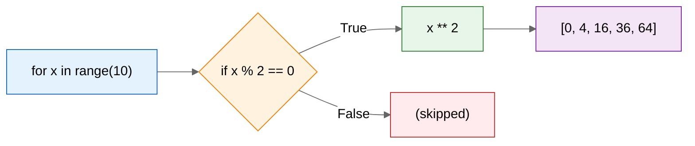
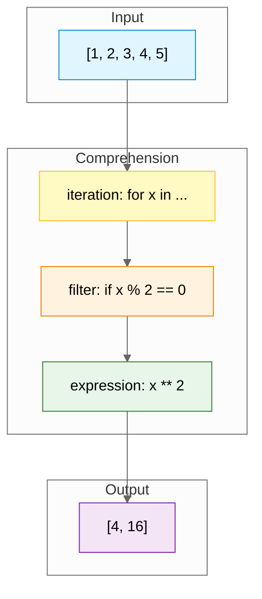

## Learning Objectives

By the end of this chapter, you will be able to:
- Write list comprehensions to create lists concisely
- Use conditional logic within comprehensions
- Create nested list comprehensions
- Iterate over lists effectively with `for` loops
- Use `enumerate()` and `zip()` to work with multiple sequences
- Unpack lists into individual variables

## Estimated Time

45–60 minutes

## Prerequisites

- Day 19: Lists (indexing, slicing, methods)
- `for` loop basics

---

## Theory

### List Comprehensions

A **list comprehension** provides a concise way to create lists. The general syntax:

```python
[expression for item in iterable]
```

```python
# Traditional loop
squares = []
for x in range(10):
    squares.append(x ** 2)
print(squares)
# [0, 1, 4, 9, 16, 25, 36, 49, 64, 81]

# List comprehension (equivalent)
squares = [x ** 2 for x in range(10)]
print(squares)
# [0, 1, 4, 9, 16, 25, 36, 49, 64, 81]
```

:::{tip}
List comprehensions are often faster than manual `for` loops because the iteration is performed at C speed inside the Python interpreter.
:::

### Conditional Comprehensions

You can filter elements by adding an `if` clause at the end.

```python
# Even numbers only
evens = [x for x in range(20) if x % 2 == 0]
print(evens)
# [0, 2, 4, 6, 8, 10, 12, 14, 16, 18]

# Numbers divisible by 3 and 5
special = [x for x in range(50) if x % 3 == 0 and x % 5 == 0]
print(special)
# [0, 15, 30, 45]

# Transform with condition (ternary)
labels = ["even" if x % 2 == 0 else "odd" for x in range(5)]
print(labels)
# ['even', 'odd', 'even', 'odd', 'even']
```

### Nested Comprehensions

Comprehensions can be nested to flatten or transform multi-dimensional data.

```python
matrix = [[1, 2, 3], [4, 5, 6], [7, 8, 9]]

# Flatten a matrix
flat = [num for row in matrix for num in row]
print(flat)
# [1, 2, 3, 4, 5, 6, 7, 8, 9]

# Cartesian product
colors = ["red", "blue"]
sizes = ["S", "M", "L"]
pairs = [(c, s) for c in colors for s in sizes]
print(pairs)
# [('red', 'S'), ('red', 'M'), ('red', 'L'), ('blue', 'S'), ('blue', 'M'), ('blue', 'L')]
```





### Iterating Over Lists with `for` Loops

The most straightforward way to work with list elements.

```python
fruits = ["apple", "banana", "cherry"]

# Direct iteration
for fruit in fruits:
    print(fruit.upper())
# APPLE
# BANANA
# CHERRY
```

### `enumerate()` — Access Both Index and Value

```python
fruits = ["apple", "banana", "cherry"]

for i, fruit in enumerate(fruits):
    print(f"{i}: {fruit}")
# 0: apple
# 1: banana
# 2: cherry

# Start at a different number
for i, fruit in enumerate(fruits, start=1):
    print(f"{i}. {fruit}")
# 1. apple
# 2. banana
# 3. cherry
```

### `zip()` — Iterate Over Multiple Lists in Parallel

```python
names = ["Alice", "Bob", "Charlie"]
scores = [85, 92, 78]

for name, score in zip(names, scores):
    print(f"{name}: {score}")
# Alice: 85
# Bob: 92
# Charlie: 78

# With three lists
subjects = ["Math", "Science", "English"]
grades = [90, 85, 88]
teachers = ["Mr. A", "Ms. B", "Dr. C"]
for subject, grade, teacher in zip(subjects, grades, teachers):
    print(f"{subject}: {grade} ({teacher})")
# Math: 90 (Mr. A)
# Science: 85 (Ms. B)
# English: 88 (Dr. C)
```

`zip()` stops at the shortest iterable. Use `zip_longest()` from `itertools` to continue to the longest.

### List Unpacking

Assign elements of a list to individual variables.

```python
numbers = [1, 2, 3]
a, b, c = numbers
print(a, b, c)  # 1 2 3

# Extended unpacking with *
first, *middle, last = [1, 2, 3, 4, 5]
print(first)   # 1
print(middle)  # [2, 3, 4]
print(last)    # 5

# Ignoring values with _
x, _, z = [10, 20, 30]
print(x, z)  # 10 30

# Swapping variables elegantly
a, b = 1, 2
a, b = b, a
print(a, b)  # 2 1
```

---

## Code Examples

```python
# Convert Celsius to Fahrenheit with a comprehension
celsius = [0, 10, 20, 30, 40]
fahrenheit = [(c * 9/5) + 32 for c in celsius]
print(fahrenheit)
# [32.0, 50.0, 68.0, 86.0, 104.0]

# Filter words by length
words = ["hello", "world", "python", "is", "great", "fun"]
long_words = [w.upper() for w in words if len(w) > 4]
print(long_words)
# ['HELLO', 'WORLD', 'PYTHON', 'GREAT']

# Build a dictionary from paired lists with zip
keys = ["name", "age", "city"]
values = ["Alice", 25, "New York"]
user = {k: v for k, v in zip(keys, values)}
print(user)
# {'name': 'Alice', 'age': 25, 'city': 'New York'}

# Matrix transposition
matrix = [[1, 2, 3], [4, 5, 6]]
transposed = [[row[i] for row in matrix] for i in range(3)]
print(transposed)
# [[1, 4], [2, 5], [3, 6]]
```

## Try It Yourself

1. Use a list comprehension to create a list of squares for numbers 1–20 that are divisible by 3.

2. Given `words = ["apple", "banana", "avocado", "cherry", "apricot"]`, use a comprehension to collect words that start with `"a"` and have more than 5 letters.

3. Write a nested comprehension to flatten `[[1,2],[3,4,5],[6]]` into `[1,2,3,4,5,6]`.

4. Use `enumerate()` to print a numbered list of your top 5 songs (hard-coded or from a list).

5. Use `zip()` to combine `names = ["Alice", "Bob", "Charlie"]` and `ages = [25, 30, 35]` into a list of tuples, then sort by age.

---

## Common Mistakes

:::{warning}
- **Forgetting the bracket `[]`** — Without it, you get a generator expression, not a list.
- **Putting the condition in the wrong place** — Filter goes after the loop; ternary goes in the expression.
- **Overusing comprehensions** — If the logic is complex, a regular `for` loop is more readable.
- **`zip()` with unequal lengths** — `zip()` silently truncates. Use `zip_longest()` from `itertools` if you need all data.
:::

---

## Summary

- List comprehensions: `[expr for item in iterable if condition]`.
- Conditional comprehensions filter with `if` at the end.
- Nested comprehensions flatten or produce Cartesian products.
- `enumerate()` yields `(index, value)` pairs.
- `zip()` iterates multiple sequences in parallel.
- Unpacking assigns list elements to variables in one line.

## Key Takeaways

- Comprehensions replace many `for`-`append` patterns with cleaner code.
- `enumerate` and `zip` are essential for structured iteration.
- Extended unpacking with `*` handles variable-length sequences.
- Prefer readability — if a comprehension spans more than one line, consider a loop.

---

## Quiz

**Q1.** What does `[x ** 2 for x in range(5)]` produce?

A. `[0, 1, 4, 9, 16, 25]`
B. `[0, 1, 4, 9, 16]`
C. `[1, 4, 9, 16, 25]`
D. `[0, 2, 4, 6, 8]`

:::{important}
**Answer: B.** `range(5)` produces `0, 1, 2, 3, 4`. Squaring each gives `[0, 1, 4, 9, 16]`.
:::

---

**Q2.** What does `list(zip([1, 2], ["a", "b", "c"]))` return?

A. `[(1, 'a'), (2, 'b'), (None, 'c')]`
B. `[(1, 'a'), (2, 'b')]`
C. `Error`
D. `[[1, 'a'], [2, 'b']]`

:::{important}
**Answer: B.** `zip()` stops at the shortest iterable. The third element `"c"` is ignored.
:::

---

**Q3.** After `first, *rest = [10, 20, 30, 40]`, what are `first` and `rest`?

A. `first = 10`, `rest = [20, 30, 40]`
B. `first = 10`, `rest = [20, 30]`
C. `first = [10]`, `rest = [20, 30, 40]`
D. `Error`

:::{important}
**Answer: A.** The `*` collects the remaining elements into a list. `first` gets the first element.
:::
