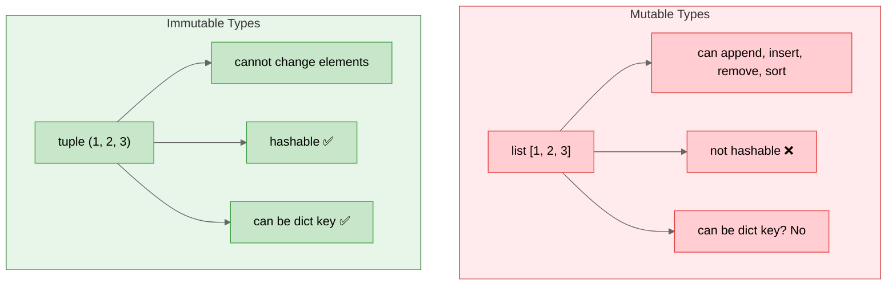
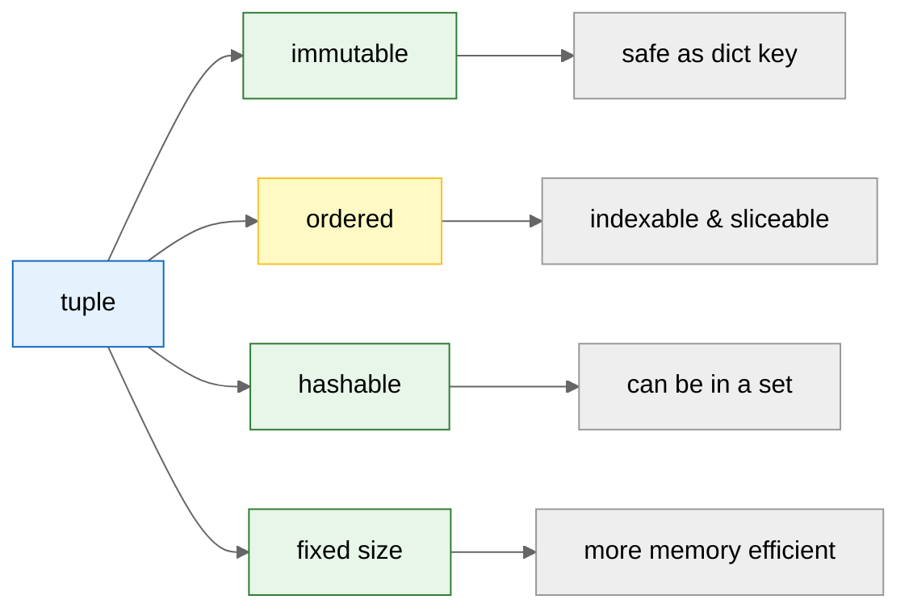

## Learning Objectives

By the end of this chapter, you will be able to:
- Create and work with tuples
- Understand immutability and its benefits
- Pack and unpack tuples
- Use named tuples for self-documenting code
- Decide when to use tuples versus lists
- Use tuple methods `count()` and `index()`

## Estimated Time

45–60 minutes

## Prerequisites

- Day 19: Lists
- Day 20: List operations and unpacking

---

## Theory

### Creating Tuples

A **tuple** is an ordered, **immutable** collection of items. Tuples are created with parentheses `()`.

```python
empty_tuple = ()
single = (1,)          # trailing comma required for single-element tuple
numbers = (1, 2, 3, 4, 5)
mixed = (1, "hello", 3.14)
nested = ((1, 2), (3, 4))

# Tuple without parentheses (tuple packing)
packed = 1, 2, 3
print(type(packed))  # <class 'tuple'>
print(packed)        # (1, 2, 3)
```

:::{note}
The comma **creates** the tuple, not the parentheses. Parentheses are only required for empty tuples or to avoid ambiguity.
:::

### Immutability

Once created, a tuple's elements cannot be changed, added, or removed.

```python
t = (1, 2, 3)
# t[0] = 99  # TypeError: 'tuple' object does not support item assignment
# t.append(4) # AttributeError: 'tuple' object has no attribute 'append'
```

**Why use tuples?**

| Feature                | Reason                                                |
| ---------------------- | ----------------------------------------------------- |
| **Immutability**       | Safe to use as dictionary keys or set elements        |
| **Performance**        | Faster than lists for fixed data                      |
| **Data integrity**     | Prevents accidental modification                      |
| **Hashability**        | Tuples can be used where hashable objects are required |
| **Unpacking**          | Natural fit for multiple return values                |





### Tuple Packing / Unpacking

**Packing** assigns multiple values into a single tuple. **Unpacking** extracts them back.

```python
# Packing
point = 3, 7
print(point)  # (3, 7)

# Unpacking
x, y = point
print(x, y)  # 3 7

# Multiple return values (common pattern)
def min_max(nums):
    return min(nums), max(nums)

low, high = min_max([4, 7, 2, 9, 1])
print(low, high)  # 1 9

# Swapping with tuple unpacking
a, b = 1, 2
a, b = b, a
print(a, b)  # 2 1

# Extended unpacking with *
first, *middle, last = (1, 2, 3, 4, 5)
print(first, middle, last)  # 1 [2, 3, 4] 5
```

### Named Tuples

`namedtuple` from the `collections` module creates tuple subclasses with named fields.

```python
from collections import namedtuple

# Define a Point type
Point = namedtuple("Point", ["x", "y"])
p = Point(10, 20)

# Access by name
print(p.x, p.y)  # 10 20

# Access by index (still a tuple)
print(p[0], p[1])  # 10 20

# Unpacking
x, y = p
print(x, y)  # 10 20

# Better than regular tuples for readability
Student = namedtuple("Student", ["name", "age", "grade"])
s = Student("Alice", 21, "A")
print(f"{s.name} is {s.age} and got an {s.grade}")
# Alice is 21 and got an A
```

:::{tip}
Named tuples are perfect for data that doesn't need methods — they're lightweight, immutable, and self-documenting.
:::

### When to Use Tuples vs Lists

| Use Case                                  | Choice |
| ----------------------------------------- | ------ |
| Fixed collection of items (e.g., coordinates) | Tuple  |
| Data that should not change                | Tuple  |
| Dictionary keys or set members             | Tuple  |
| Function return values                     | Tuple  |
| Variable-length sequence                   | List   |
| Need to add/remove items                   | List   |
| Collection of same-type items to sort      | List   |

### Tuple Methods

Tuples have only two methods — `count()` and `index()`.

```python
t = (1, 2, 3, 2, 4, 2, 5)

print(t.count(2))  # 3
print(t.index(3))  # 2 (first occurrence)
print(t.index(2))  # 1 (first occurrence)
```

---

## Code Examples

```python
# Storing city coordinates
cities = {
    "New York": (40.7128, -74.0060),
    "London": (51.5074, -0.1278),
    "Tokyo": (35.6762, 139.6503)
}

for city, (lat, lon) in cities.items():
    print(f"{city}: {lat:.2f}, {lon:.2f}")
# New York: 40.71, -74.01
# London: 51.51, -0.13
# Tokyo: 35.68, 139.65

# Ranges as tuples
def valid_date(month, day):
    days_in_month = {
        1: 31, 2: 28, 3: 31, 4: 30,
        5: 31, 6: 30, 7: 31, 8: 31,
        9: 30, 10: 31, 11: 30, 12: 31
    }
    return 1 <= month <= 12 and 1 <= day <= days_in_month[month]

# Return multiple values from a function
def divide(a, b):
    quotient = a // b
    remainder = a % b
    return quotient, remainder

q, r = divide(17, 5)
print(q, r)  # 3 2
```

## Try It Yourself

1. Create a tuple `rgb = (255, 128, 0)`. Unpack it into `red`, `green`, `blue`.

2. Create a `namedtuple` called `Rectangle` with fields `width` and `height`. Create an instance and compute the area.

3. Given `data = [(1, "a"), (2, "b"), (3, "c")]`, iterate and print `"number: letter"` using tuple unpacking.

4. Create a tuple of 5 numbers. Try to change one element — observe the error. Now convert it to a list, modify it, and convert back.

5. Write a function `fibonacci(n)` that returns a tuple `(fib_n, fib_n_plus_1)` for the `n`th Fibonacci number.

---

## Common Mistakes

:::{warning}
- **Forgetting the comma for single-element tuples** — `(1)` is an integer, not a tuple. Use `(1,)`.
- **Trying to modify a tuple** — Results in `TypeError`. Use a list if you need mutability.
- **Using a list as a dictionary key** — Lists are unhashable. Use a tuple instead.
- **Assuming named tuples use less memory than classes** — They do, but a regular class has `__slots__` for similar efficiency.
:::

---

## Summary

- Tuples are ordered, immutable sequences created with `()` or just commas.
- Immutability makes them hashable and safe for use as dictionary keys.
- Packing and unpacking is a core Python pattern (especially for function returns).
- `namedtuple` adds field names to tuples for readability.
- Use tuples for fixed data, lists for variable-length data.

## Key Takeaways

- The comma makes the tuple, not the parentheses.
- Immutability is a feature, not a limitation — it guarantees data integrity.
- Tuple unpacking makes multiple-assignment elegant and readable.
- `namedtuple` bridges the gap between tuples and lightweight classes.

---

## Quiz

**Q1.** Which of the following correctly creates a single-element tuple?

A. `t = (1)`
B. `t = tuple(1)`
C. `t = (1,)`
D. `t = [1]`

:::{important}
**Answer: C.** The trailing comma is required. `(1)` is just the integer `1` in parentheses.
:::

---

**Q2.** Can a tuple be used as a dictionary key?

A. Yes, always
B. Yes, if all its elements are hashable
C. No, never
D. Only if it has exactly two elements

:::{important}
**Answer: B.** A tuple is hashable only if all its items are hashable. A tuple containing a list would be unhashable.
:::

---

**Q3.** What does `a, b, *c = (1, 2, 3, 4, 5)` assign to `c`?

A. `[3, 4, 5]`
B. `(3, 4, 5)`
C. `[4, 5]`
D. `(4, 5)`

:::{important}
**Answer: A.** Extended unpacking with `*` always produces a **list**, even when unpacking from a tuple.
:::
