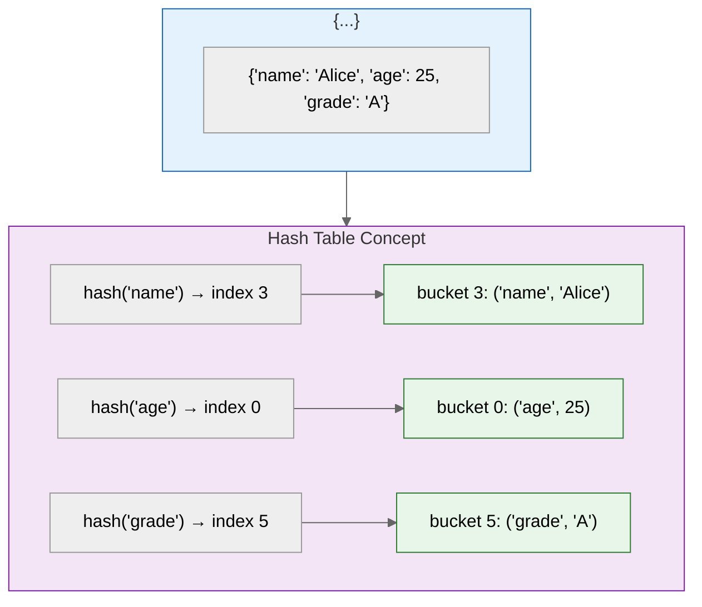
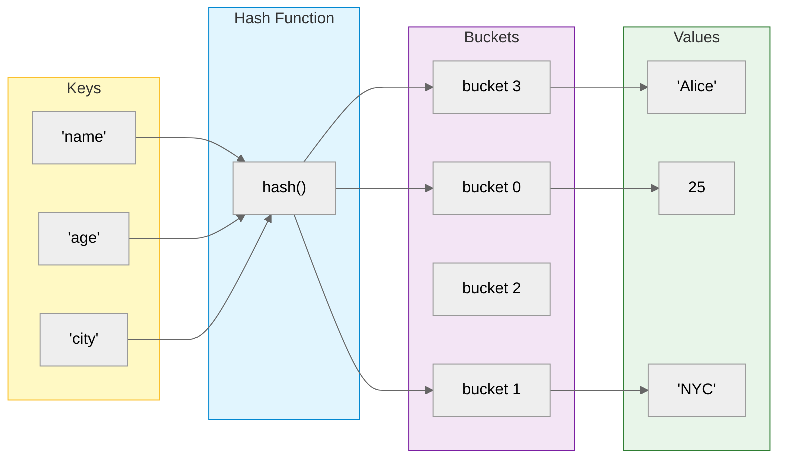

## Learning Objectives

By the end of this chapter, you will be able to:
- Create and populate dictionaries
- Understand key requirements (keys must be immutable)
- Access dictionary values safely with `.get()` and `.setdefault()`
- Modify dictionaries by adding, updating, and deleting entries
- Use dictionary methods effectively
- Write dictionary comprehensions
- Iterate over keys, values, and items
- Work with nested dictionaries

## Estimated Time

45–60 minutes

## Prerequisites

- Day 19: Lists
- Day 21: Tuples (immutability concept)

---

## Theory

### Creating Dictionaries

A **dictionary** stores key-value pairs. Each key maps to a value. Dictionaries are **mutable**, **unordered** (prior to Python 3.7; insertion-ordered from 3.7+), and **dynamic**.

```python
empty_dict = {}
student = {"name": "Alice", "age": 25, "grade": "A"}
mixed = {1: "one", "two": 2, (1, 2): "tuple key"}

# Using dict() constructor
person = dict(name="Bob", age=30, city="NYC")

# From paired sequences
keys = ["a", "b", "c"]
values = [1, 2, 3]
paired = dict(zip(keys, values))
print(paired)  # {'a': 1, 'b': 2, 'c': 3}
```

:::{important}
Dictionary keys must be **immutable** (strings, numbers, tuples of immutables). Lists, sets, or other dictionaries cannot be keys.
:::

### Keys and Values

```python
phonebook = {
    "Alice": "555-1234",
    "Bob": "555-5678",
    "Charlie": "555-9012"
}

# Keys must be unique — later values overwrite earlier ones
duplicate = {"a": 1, "b": 2, "a": 3}
print(duplicate)  # {'a': 3, 'b': 2}
```





### Accessing Values

```python
student = {"name": "Alice", "age": 25, "grade": "A"}

# Direct key access (raises KeyError if missing)
print(student["name"])   # Alice

# .get() — returns None or a default if missing
print(student.get("age"))        # 25
print(student.get("major"))      # None
print(student.get("major", "N/A"))  # N/A

# .setdefault() — returns value if key exists, otherwise inserts default
major = student.setdefault("major", "Undeclared")
print(major)            # Undeclared
print(student)
# {'name': 'Alice', 'age': 25, 'grade': 'A', 'major': 'Undeclared'}
```

:::{tip}
Always use `.get()` instead of direct access when you're not sure a key exists — it avoids unhandled `KeyError` exceptions.
:::

### Modifying Dictionaries

```python
phonebook = {"Alice": "555-1234"}

# Add new entry
phonebook["Bob"] = "555-5678"
print(phonebook)
# {'Alice': '555-1234', 'Bob': '555-5678'}

# Update existing entry
phonebook["Alice"] = "555-9999"

# Delete a key
del phonebook["Bob"]

# Remove and return a value
alice_phone = phonebook.pop("Alice")
print(alice_phone)  # 555-9999

# Remove last inserted item (Python 3.7+)
phonebook["Charlie"] = "555-0000"
last = phonebook.popitem()
print(last)  # ('Charlie', '555-0000')
```

### Dictionary Methods

| Method        | Description                              |
| ------------- | ---------------------------------------- |
| `keys()`      | Returns a view of all keys               |
| `values()`    | Returns a view of all values             |
| `items()`     | Returns a view of all (key, value) pairs |
| `pop(key)`    | Removes and returns the value for `key`  |
| `update(d)`   | Merges another dictionary in             |
| `clear()`     | Removes all items                        |

```python
student = {"name": "Alice", "age": 25, "grade": "A"}

print(list(student.keys()))    # ['name', 'age', 'grade']
print(list(student.values()))  # ['Alice', 25, 'A']
print(list(student.items()))   # [('name', 'Alice'), ('age', 25), ('grade', 'A')]

student.update({"major": "CS", "age": 26})
print(student)
# {'name': 'Alice', 'age': 26, 'grade': 'A', 'major': 'CS'}
```

### Dictionary Comprehensions

```python
# Squares as dictionary
squares = {x: x ** 2 for x in range(6)}
print(squares)
# {0: 0, 1: 1, 2: 4, 3: 9, 4: 16, 5: 25}

# Filter and transform
even_squares = {x: x ** 2 for x in range(10) if x % 2 == 0}
print(even_squares)
# {0: 0, 2: 4, 4: 16, 6: 36, 8: 64}

# Swap keys and values
original = {"a": 1, "b": 2, "c": 3}
swapped = {v: k for k, v in original.items()}
print(swapped)
# {1: 'a', 2: 'b', 3: 'c'}

# From two lists
names = ["Alice", "Bob", "Charlie"]
ages = [25, 30, 35]
people = {name: age for name, age in zip(names, ages)}
print(people)
# {'Alice': 25, 'Bob': 30, 'Charlie': 35}
```

### Iterating Over Dictionaries

```python
student = {"name": "Alice", "age": 25, "grade": "A"}

# Iterate over keys
for key in student:
    print(key)

# Iterate over values
for value in student.values():
    print(value)

# Iterate over key-value pairs
for key, value in student.items():
    print(f"{key}: {value}")
```

### Nested Dictionaries

Dictionaries can contain other dictionaries, creating rich data structures.

```python
school = {
    "Alice": {
        "math": 90,
        "science": 85,
        "english": 88
    },
    "Bob": {
        "math": 78,
        "science": 92,
        "english": 80
    }
}

# Access nested values
print(school["Alice"]["science"])  # 85

# Iterate over nested structure
for student_name, grades in school.items():
    avg = sum(grades.values()) / len(grades)
    print(f"{student_name}'s average: {avg:.1f}")
# Alice's average: 87.7
# Bob's average: 83.3
```

---

## Code Examples

```python
# Word frequency counter
text = "the quick brown fox jumps over the lazy dog the quick"
words = text.split()

freq = {}
for word in words:
    freq[word] = freq.get(word, 0) + 1

print(freq)
# {'the': 3, 'quick': 2, 'brown': 1, 'fox': 1, 'jumps': 1, 'over': 1, 'lazy': 1, 'dog': 1}

# Student roster with setdefault
students = [
    ("Alice", "Math"), ("Bob", "Science"), ("Alice", "English"),
    ("Bob", "Math"), ("Charlie", "Science")
]

roster = {}
for name, subject in students:
    roster.setdefault(name, []).append(subject)

print(roster)
# {'Alice': ['Math', 'English'], 'Bob': ['Science', 'Math'], 'Charlie': ['Science']}

# Counting with collections.Counter (more advanced)
from collections import Counter
counts = Counter(words)
print(counts.most_common(2))  # [('the', 3), ('quick', 2)]
```

## Try It Yourself

1. Create a dictionary for a book with keys: `title`, `author`, `year`, `pages`. Print each key-value pair using `.items()`.

2. Given `grades = {"Alice": 85, "Bob": 92, "Charlie": 78, "Diana": 90}`, find and print the student with the highest grade.

3. Use a dictionary comprehension to create a mapping of numbers 1–10 to their cubes (e.g., `{1: 1, 2: 8, ...}`).

4. Write a function `invert_dict(d)` that swaps keys and values. Assume all values are unique.

5. Create a nested dictionary representing a library with sections, each containing books with title and author. Write code to list all books by a specific author.

---

## Common Mistakes

:::{warning}
- **Using a mutable object as a key** — Lists, sets, and dicts are unhashable and raise `TypeError`.
- **Accessing a missing key directly** — Raises `KeyError`. Use `.get()` for safe access.
- **Forgetting that `.update()` modifies in place** — It returns `None`, not the updated dict.
- **Assuming dictionaries are ordered in older Python** — Since Python 3.7, insertion order is guaranteed. Don't rely on it for Python < 3.7.
- **Modifying a dictionary while iterating** — Can cause `RuntimeError: dictionary changed size during iteration`. Iterate over a copy of keys instead.
:::

---

## Summary

- Dictionaries store key-value pairs; keys must be immutable and unique.
- Access values with `dict[key]` (unsafe) or `.get()` (safe).
- Add/update with `dict[key] = value` or `.update()`.
- Delete with `del`, `.pop()`, or `.popitem()`.
- Dictionary comprehensions: `{k: v for ... in ...}`.
- Iterate with `.keys()`, `.values()`, `.items()`.
- Nest dictionaries for complex data models.

## Key Takeaways

- Dictionaries are Python's most important data structure for mapping relationships.
- `.get()` and `.setdefault()` are essential for safe, concise code.
- Dictionary comprehensions are powerful but keep them readable.
- Nested dictionaries model real-world hierarchical data naturally.

---

## Quiz

**Q1.** What happens when you access `d["missing"]` on a dictionary that doesn't have that key?

A. Returns `None`
B. Raises `KeyError`
C. Returns `False`
D. Creates the key with value `None`

:::{important}
**Answer: B.** Direct key access raises `KeyError`. Use `.get("missing")` to safely return `None` instead.
:::

---

**Q2.** Which of the following is a valid dictionary key?

A. `[1, 2, 3]`
B. `{1: "one"}`
C. `(1, 2, 3)`
D. `{1, 2, 3}`

:::{important}
**Answer: C.** Tuples are immutable and hashable. Lists, dicts, and sets are mutable and unhashable.
:::

---

**Q3.** What does `{x: x % 3 for x in range(6)}` produce?

A. `{0: 0, 1: 1, 2: 2, 3: 0, 4: 1, 5: 2}`
B. `{0: 0, 1: 1, 2: 2, 3: 3, 4: 4, 5: 5}`
C. `{0: 0, 0: 3, 1: 1, 2: 2}`
D. `Error`

:::{important}
**Answer: A.** It maps each number `x` to `x % 3`: `{0: 0, 1: 1, 2: 2, 3: 0, 4: 1, 5: 2}`.
:::
