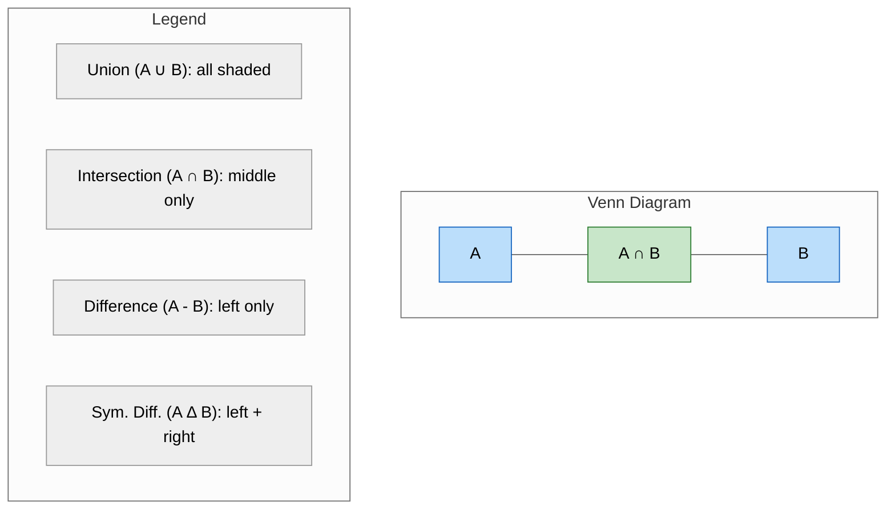

## Learning Objectives

By the end of this chapter, you will be able to:
- Create and manipulate sets
- Understand set characteristics: unordered, unique, mutable
- Perform set operations: union, intersection, difference, symmetric difference
- Use set methods: `add()`, `remove()`, `discard()`, `pop()`, `clear()`
- Work with frozensets (immutable sets)
- Identify when to use sets over lists
- Understand membership testing performance benefits

## Estimated Time

45–60 minutes

## Prerequisites

- Day 19: Lists
- Day 21: Tuples (immutability concept)

---

## Theory

### Creating Sets

A **set** is an unordered collection of **unique**, **hashable** elements. Sets are **mutable** — you can add or remove elements.

```python
# With curly braces
fruits = {"apple", "banana", "cherry", "apple"}  # duplicates removed
print(fruits)
# {'banana', 'cherry', 'apple'}  (order may vary)

# With set() constructor (required for empty set)
empty_set = set()
print(type(empty_set))  # <class 'set'>

# From any iterable
numbers = set([1, 2, 2, 3, 3, 3, 4])
print(numbers)  # {1, 2, 3, 4}

word = set("hello")
print(word)  # {'h', 'e', 'l', 'o'}  (l appears only once)
```

:::{warning}
`{}` creates an **empty dictionary**, not an empty set. Use `set()` for an empty set.
:::

### Set Characteristics

```python
# Unordered — you cannot index into a set
s = {"a", "b", "c"}
# print(s[0])  # TypeError: 'set' object is not subscriptable

# Unique — duplicates are automatically removed
unique = {1, 2, 2, 3, 3, 3}
print(unique)  # {1, 2, 3}

# Mutable — you can add and remove elements
s.add("d")
s.remove("a")
print(s)  # {'b', 'c', 'd'}

# Elements must be hashable (immutable)
# s.add([1, 2])  # TypeError: unhashable type: 'list'
s.add((1, 2))    # OK, tuple is hashable
```

### Set Operations

Sets support mathematical set operations.

```python
a = {1, 2, 3, 4, 5}
b = {4, 5, 6, 7, 8}

# Union — elements in either set
print(a | b)   # {1, 2, 3, 4, 5, 6, 7, 8}
print(a.union(b))

# Intersection — elements in both sets
print(a & b)   # {4, 5}
print(a.intersection(b))

# Difference — elements in a but not in b
print(a - b)   # {1, 2, 3}
print(a.difference(b))

# Symmetric difference — elements in either but not both
print(a ^ b)   # {1, 2, 3, 6, 7, 8}
print(a.symmetric_difference(b))
```

```mermaid
%%{init: {'theme': 'neutral'}}%%
flowchart LR
    subgraph A["Set A = {1, 2, 3, 4, 5}"]
        direction LR
        A1["1"] A2["2"] A3["3"] A4["4"] A5["5"]
    end
    subgraph B["Set B = {4, 5, 6, 7, 8}"]
        direction LR
        B4["4"] B5["5"] B6["6"] B7["7"] B8["8"]
    end
    subgraph Union["A ∪ B = {1,2,3,4,5,6,7,8}"]
        direction LR
        U["all unique elements"]
    end
    subgraph Intersection["A ∩ B = {4,5}"]
        direction LR
        I["elements in both"]
    end
    subgraph Difference["A - B = {1,2,3}"]
        direction LR
        D["elements only in A"]
    end
    subgraph SymDiff["A Δ B = {1,2,3,6,7,8}"]
        direction LR
        S["elements in either, not both"]
    end
    A --> Union
    B --> Union
    A --> Intersection
    B --> Intersection
    A --> Difference
    A --> SymDiff
    B --> SymDiff
    style A fill:#e3f2fd,stroke:#1565c0
    style B fill:#fff9c4,stroke:#fbc02d
    style Union fill:#e8f5e9,stroke:#2e7d32
    style Intersection fill:#f3e5f5,stroke:#7b1fa2
    style Difference fill:#ffebee,stroke:#c62828
    style SymDiff fill:#fff3e0,stroke:#f57c00
```



### Set Methods

| Method          | Description                              | Mutates? |
| --------------- | ---------------------------------------- | -------- |
| `add(x)`        | Adds element `x`                         | Yes      |
| `remove(x)`     | Removes `x` (raises `KeyError` if missing)| Yes      |
| `discard(x)`    | Removes `x` if present (no error)        | Yes      |
| `pop()`         | Removes and returns an arbitrary element | Yes      |
| `clear()`       | Removes all elements                     | Yes      |
| `copy()`        | Returns a shallow copy                   | No       |
| `union(other)`  | Returns new set with elements from both  | No       |
| `intersection(other)` | Returns new set with common elements   | No       |

```python
s = {1, 2, 3}

s.add(4)
print(s)  # {1, 2, 3, 4}

s.remove(2)
print(s)  # {1, 3, 4}

s.discard(10)  # no error
# s.remove(10)  # KeyError: 10

popped = s.pop()
print(popped)  # some arbitrary element (e.g., 1)

# Subset / superset checks
a = {1, 2, 3}
b = {1, 2}
print(b.issubset(a))  # True
print(a.issuperset(b))  # True
```

### Frozenset (Immutable Set)

A `frozenset` is an immutable, hashable version of a set.

```python
fs = frozenset([1, 2, 3, 3, 2])
print(fs)  # frozenset({1, 2, 3})

# fs.add(4)  # AttributeError: 'frozenset' object has no attribute 'add'

# Frozensets can be dictionary keys or set elements
valid_sets = {frozenset([1, 2]), frozenset([3, 4])}
print(valid_sets)  # {frozenset({1, 2}), frozenset({3, 4})}
```

### When to Use Sets

| Use Case                                   | Why Set?                                    |
| ------------------------------------------ | ------------------------------------------- |
| Remove duplicates from a sequence          | Sets automatically enforce uniqueness       |
| Membership testing (`x in collection`)     | O(1) average vs O(n) for lists              |
| Mathematical set operations                | Built-in operators (`\|`, `&`, `-`, `^`)    |
| Finding unique elements                    | Deduplication is automatic                  |
| Tracking visited items (graphs, algorithms)| Fast lookup and addition                    |

### Membership Testing Performance

```python
import time

n = 10_000_000
data_list = list(range(n))
data_set = set(range(n))

# List membership test
start = time.perf_counter()
9999999 in data_list
list_time = time.perf_counter() - start

# Set membership test
start = time.perf_counter()
9999999 in data_set
set_time = time.perf_counter() - start

print(f"List: {list_time:.6f}s, Set: {set_time:.6f}s")
# List: 0.089234s, Set: 0.000001s  (approximately)
```

:::{important}
Set membership is O(1) on average, while list membership is O(n). For large collections, sets are dramatically faster.
:::

---

## Code Examples

```python
# Removing duplicates from a list
names = ["Alice", "Bob", "Alice", "Charlie", "Bob", "Alice"]
unique_names = list(set(names))
print(unique_names)
# ['Charlie', 'Bob', 'Alice']  (order not preserved)

# Finding common interests
alice = {"reading", "hiking", "music", "cooking"}
bob = {"gaming", "music", "cooking", "sports"}

print("Common interests:", alice & bob)
# Common interests: {'music', 'cooking'}

print("Only Alice does:", alice - bob)
# Only Alice does: {'reading', 'hiking'}

print("All interests combined:", alice | bob)
# All interests combined: {'reading', 'hiking', 'music', 'cooking', 'gaming', 'sports'}

# Checking for unique words in a document
def unique_word_count(text):
    words = text.lower().split()
    return len(set(words))

doc = "The cat in the hat sat on the mat"
print(unique_word_count(doc))  # 6  (the, cat, in, hat, sat, on, mat -> 'the' and 'mat' are unique)
# Wait: words: ['the', 'cat', 'in', 'the', 'hat', 'sat', 'on', 'the', 'mat']
# Set: {'the', 'cat', 'in', 'hat', 'sat', 'on', 'mat'} = 7 unique
```

## Try It Yourself

1. Create a set from the list `[1, 2, 2, 3, 3, 3, 4, 4, 4, 4]`. How many elements does it contain?

2. Given `a = {1, 2, 3, 4}` and `b = {3, 4, 5, 6}`, compute the union, intersection, and difference (both directions).

3. Write a function `has_duplicates(lst)` that returns `True` if a list has duplicates using a set.

4. Given `text = "hello world hello python world hello"`, find all unique words and count them.

5. Create two frozensets and use them as keys in a dictionary. Map each frozenset to a label of your choice.

---

## Common Mistakes

:::{warning}
- **Using `{}` for an empty set** — Creates an empty dictionary. Use `set()`.
- **Assuming sets preserve order** — Sets are unordered. Use `sorted()` if you need a consistent order.
- **Mutating a set while iterating** — Raises `RuntimeError`. Iterate over a copy: `for x in set.copy():`.
- **Putting mutable elements in a set** — Lists and dicts raise `TypeError`. Use tuples or frozensets instead.
- **Forgetting that `remove()` raises an error** — Use `discard()` when you're not sure the element exists.
:::

---

## Summary

- Sets are unordered collections of unique, hashable elements.
- Created with `{...}` or `set()`; use `set()` for empty sets.
- Set operations: `|` (union), `&` (intersection), `-` (difference), `^` (symmetric difference).
- Methods: `add()`, `remove()`, `discard()`, `pop()`, `clear()`.
- `frozenset` is an immutable, hashable version of a set.
- Sets provide O(1) membership testing.

## Key Takeaways

- Sets excel at deduplication and membership testing.
- Mathematical set operators make relationship checks concise.
- Use `frozenset` when you need a set as a dictionary key.
- For large datasets, sets dramatically outperform lists for `in` checks.

---

## Quiz

**Q1.** What is the output of `len({1, 2, 2, 3, 3, 3})`?

A. `6`
B. `3`
C. `4`
D. `Error`

:::{important}
**Answer: B.** Duplicates are removed, so the set is `{1, 2, 3}` with length 3.
:::

---

**Q2.** What does `{1, 2, 3} - {2, 3, 4}` return?

A. `{1}`
B. `{4}`
C. `{1, 4}`
D. `{1, 2, 3, 4}`

:::{important}
**Answer: A.** Set difference returns elements in the first set but not the second: `{1}`.
:::

---

**Q3.** Why can't a list be an element of a set?

A. Lists are ordered
B. Lists are mutable (and therefore not hashable)
C. Sets only accept strings and numbers
D. Lists are too large

:::{important}
**Answer: B.** Set elements must be hashable. Lists are mutable, so they cannot provide a stable hash value.
:::
