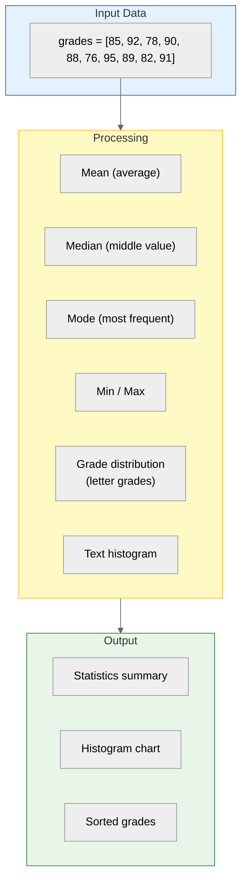
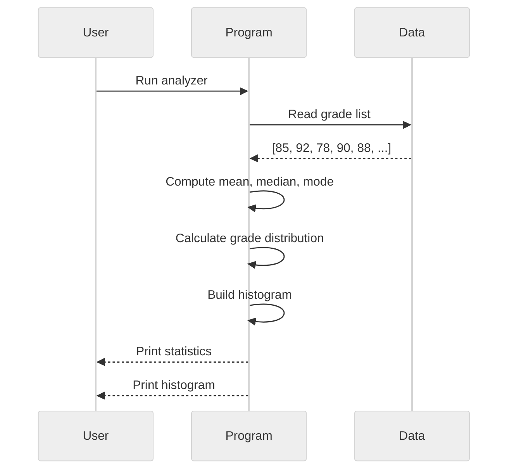

## Learning Objectives

By the end of this chapter, you will be able to:
- Apply list, tuple, dictionary, and set concepts to a real-world problem
- Compute statistical measures (mean, median, mode) using core Python
- Build a text-based histogram visualization
- Read and analyse data from a structured format
- Extend the project with nested dictionaries and CSV export

## Estimated Time

45–60 minutes

## Prerequisites

- Day 19: Lists
- Day 20: List comprehensions
- Day 21: Tuples
- Day 22: Dictionaries
- Day 23: Sets

---

## Theory — Week 4 Review

### What You Have Learned

| Day | Topic         | Key Concepts                                                   |
| --- | ------------- | -------------------------------------------------------------- |
| 19  | Lists         | `[]`, indexing, slicing, methods, nested lists, copying        |
| 20  | Comprehensions| `[expr for x in iter if cond]`, `enumerate()`, `zip()`         |
| 21  | Tuples        | `()`, immutability, packing/unpacking, named tuples            |
| 22  | Dictionaries  | `{}`, keys/values, `.get()`, `.items()`, comprehensions, nesting |
| 23  | Sets          | `{}`, `set()`, uniqueness, `\| & - ^`, frozenset               |

All of these are **collection data types** — they store and organize data. The right choice depends on:

- **Order needed?** → List or tuple
- **Key-value mapping?** → Dictionary
- **Unique elements?** → Set
- **Immutable?** → Tuple or frozenset

---

## Project: Student Grade Analyzer

You will build a program that analyses student grades stored in a list. The program will compute statistics, find high/low scores, and produce a text histogram.





### Complete Walkthrough

```python
"""
Student Grade Analyzer
Analyses a list of numerical grades and produces statistics + histogram.
"""

from statistics import mean, median, mode, multimode
from collections import Counter

# ── Sample Data ──────────────────────────────────────────────
grades = [85, 92, 78, 90, 88, 76, 95, 89, 82, 91, 85, 90, 88, 84, 93]

# ── Basic Statistics ─────────────────────────────────────────
def basic_stats(data):
    """Return tuple of (mean, median, mode(s), min, max)."""
    return (
        mean(data),
        median(data),
        multimode(data),   # handles multiple modes
        min(data),
        max(data)
    )

avg, med, modes, lo, hi = basic_stats(grades)
print(f"Mean:   {avg:.2f}")
print(f"Median: {med}")
print(f"Mode:   {', '.join(str(m) for m in modes)}")
print(f"Range:  {lo} – {hi}")
print(f"Count:  {len(grades)}")

# Output:
# Mean:   86.87
# Median: 88
# Mode:   85, 88, 90
# Range:  76 – 95
# Count:  15

# ── Grade Distribution ───────────────────────────────────────
def letter_grade(score):
    if score >= 90: return "A"
    if score >= 80: return "B"
    if score >= 70: return "C"
    if score >= 60: return "D"
    return "F"

distribution = Counter(letter_grade(g) for g in grades)
for grade in "ABCDF":
    print(f"{grade}: {distribution.get(grade, 0)}")

# Output:
# A: 5
# B: 8
# C: 2
# D: 0
# F: 0

# ── Text Histogram ───────────────────────────────────────────
def draw_histogram(data, bins=5):
    """Create a simple horizontal histogram."""
    min_val, max_val = min(data), max(data)
    bin_width = (max_val - min_val) / bins

    for i in range(bins):
        lower = min_val + i * bin_width
        upper = lower + bin_width
        count = sum(1 for x in data if lower <= x < upper)
        bar = "█" * count
        print(f"{lower:6.1f} – {upper:6.1f} | {bar} {count}")

    # Include max value in the last bin
    last_lower = min_val + (bins - 1) * bin_width
    count = sum(1 for x in data if x == max_val)
    if count:
        bar = "█" * count
        print(f"{last_lower:6.1f} – {max_val:6.1f} | {bar} {count}")

draw_histogram(grades)

# Output (approximate):
# 76.0 – 79.8 | ██ 2
# 79.8 – 83.6 | █ 1
# 83.6 – 87.4 | ███ 3
# 87.4 – 91.2 | ██████ 6
# 91.2 – 95.0 | ███ 3

# ── Sorted Output ────────────────────────────────────────────
sorted_grades = sorted(grades)
print(f"Sorted: {sorted_grades}")

# ── Top Performers ───────────────────────────────────────────
top_n = 3
print(f"Top {top_n}: {sorted_grades[-top_n:][::-1]}")

# Output:
# Top 3: [95, 93, 92]

# ── Below Average ────────────────────────────────────────────
below_avg = [g for g in grades if g < avg]
print(f"Below average ({len(below_avg)}): {below_avg}")

# Output:
# Below average (6): [78, 76, 82, 85, 84, 85]
```

### Extension: Dictionary for Student Names + Grades

```python
# ── Student Records with Dictionary ──────────────────────────
students = {
    "Alice":   85,
    "Bob":     92,
    "Charlie": 78,
    "Diana":   90,
    "Eve":     88,
    "Frank":   76,
    "Grace":   95,
    "Henry":   89,
    "Ivy":     82,
    "Jack":    91,
    "Kate":    85,
    "Leo":     90,
    "Mia":     88,
    "Noah":    84,
    "Olivia":  93
}

# Students who scored above 90
honor_roll = {name: score for name, score in students.items() if score >= 90}
print("Honor Roll:")
for name, score in sorted(honor_roll.items(), key=lambda x: x[1], reverse=True):
    print(f"  {name}: {score}")

# Output:
# Honor Roll:
#   Grace: 95
#   Olivia: 93
#   Bob: 92
#   Jack: 91
#   Diana: 90
#   Leo: 90

# Rank students by grade
ranked = sorted(students.items(), key=lambda x: x[1], reverse=True)
print("Class Ranking:")
for rank, (name, score) in enumerate(ranked, start=1):
    print(f"  #{rank}: {name} — {score}")
```

### Extension: CSV Export

```python
# ── CSV Export ───────────────────────────────────────────────
def export_to_csv(data_dict, filename="grades.csv"):
    """Export student grades to a CSV file."""
    with open(filename, "w") as f:
        f.write("name,grade\n")
        for name, grade in data_dict.items():
            f.write(f"{name},{grade}\n")
    print(f"Exported to {filename}")

export_to_csv(students)

# Output:
# Exported to grades.csv

# File contents:
# name,grade
# Alice,85
# Bob,92
# ...
```

---

## Week 4 Summary

| Concept              | Takeaway                                                         |
| -------------------- | ---------------------------------------------------------------- |
| **Lists**            | Ordered, mutable, flexible — the workhorse collection            |
| **Comprehensions**   | Concise construction + filtering of lists                        |
| **Tuples**           | Immutable, hashable — safe dictionary keys, fixed records        |
| **Dictionaries**     | Key-value mapping — fast lookups, flexible data modeling         |
| **Sets**             | Unique elements, O(1) membership, mathematical set operations    |
| **Choosing a type**  | Match the data structure to the problem                          |

## Key Takeaways

- Python's collection types each serve a distinct purpose; choose wisely.
- List comprehensions and dictionary comprehensions reduce boilerplate.
- Immutability (tuples, frozensets) enables hashing and safe sharing.
- Sets are the go-to for deduplication and membership testing.
- Combine data structures (list of dicts, dict of lists) for rich models.

---

## Week 5 Preview

**Week 5: Functions and Modules** — You will learn:

- Defining functions with `def`, parameters, return values
- Scope and lifetime of variables
- Lambda functions
- Creating and importing modules
- `__name__ == "__main__"` pattern
- Using `if __name__ == "__main__":` for script/module duality
- Package management with `pip`
- The Python standard library

---

## Quiz

**Q1.** After `grades = [85, 92, 78]`, what does `sum(grades) / len(grades)` compute?

A. The median
B. The mode
C. The mean
D. The range

:::{important}
**Answer: C.** `sum()` divided by `len()` is the arithmetic mean (average).
:::

---

**Q2.** Which data structure would you use to count the frequency of words in a document?

A. List
B. Tuple
C. Dictionary
D. Set

:::{important}
**Answer: C.** A dictionary mapping words (keys) to counts (values) is the natural choice.
:::

---

**Q3.** What is the time complexity of membership testing (`x in collection`) for a set vs a list?

A. O(1) for both
B. O(n) for set, O(1) for list
C. O(1) for set, O(n) for list
D. O(log n) for both

:::{important}
**Answer: C.** Sets use hash tables and provide O(1) average lookup. Lists require O(n) linear search.
:::
