## Learning Objectives

By the end of this chapter, you will be able to:
- Open files using the built-in `open()` function
- Understand and apply different file modes (`'r'`, `'rt'`, `'rb'`)
- Read file content using `read()`, `readline()`, and `readlines()`
- Safely manage file resources with the `with` statement (context manager)
- Iterate over file lines efficiently
- Handle `FileNotFoundError` gracefully

## Estimated Time

30–45 minutes

## Prerequisites

- Day 1: Basic Python syntax
- Day 2: Strings and string methods
- Day 9: Functions
- Day 18: Error handling basics

---

## Theory — Reading Files

### Why File I/O?

Programs often need to persist data beyond a single run. File input/output (I/O) allows you to read configuration files, process datasets, load documents, and work with logs — all essential for real-world applications.

### The `open()` Function

The `open()` function returns a **file object** (also called a file handle). Its basic syntax:

```python
file_object = open(filename, mode)
```



```mermaid
%%{init: {'theme': 'neutral'}}%%
flowchart TB
    subgraph Caller["Your Code"]
        A[open&#40;'file.txt', 'r'&#41;]
    end
    subgraph OS["Operating System"]
        B[Locate file on disk]
        C[Check permissions]
        D[Create file handle]
    end
    subgraph Python["Python Runtime"]
        E[Return file object]
        F[Buffer for reading]
    end
    A --> B
    B --> C
    C --> D
    D --> E
    E --> F
    style Caller fill:#e3f2fd,stroke:#1565c0
    style OS fill:#fff3e0,stroke:#e65100
    style Python fill:#e8f5e9,stroke:#2e7d32
```

### File Modes

| Mode | Meaning                       | Cursor Start |
| ---- | ----------------------------- | ------------ |
| `'r'`  | Read text (default)           | Beginning    |
| `'rt'` | Read text (explicit)          | Beginning    |
| `'rb'` | Read binary (images, etc.)    | Beginning    |

### Reading Methods

| Method          | Returns                           | Use Case                    |
| --------------- | --------------------------------- | --------------------------- |
| `.read()`       | Entire content as a single string | Small files                 |
| `.readline()`   | Next line (including `\n`)        | Line-by-line processing     |
| `.readlines()`  | List of all lines                 | When you need random access |

### Context Manager (`with`)

The `with` statement automatically closes the file when the block exits — even if an exception occurs.

```python
# ❌ Manual close — easy to forget
f = open("data.txt", "r")
content = f.read()
f.close()

# ✅ Context manager — safe & idiomatic
with open("data.txt", "r") as f:
    content = f.read()
# File is closed automatically here
```

---

## Code Examples

### Example 1: Reading an Entire File

```python
# sample.txt contents:
# Hello Python!
# File I/O is powerful.

with open("sample.txt", "r") as f:
    content = f.read()

print(content)

# Output:
# Hello Python!
# File I/O is powerful.
```

### Example 2: Reading Line by Line

```python
with open("sample.txt", "r") as f:
    line = f.readline()
    while line:
        print(repr(line))  # repr shows \n characters
        line = f.readline()

# Output:
# 'Hello Python!\n'
# 'File I/O is powerful.\n'
```

### Example 3: Reading All Lines into a List

```python
with open("sample.txt", "r") as f:
    lines = f.readlines()

print(lines)
for i, line in enumerate(lines, start=1):
    print(f"Line {i}: {line.strip()}")

# Output:
# ['Hello Python!\n', 'File I/O is powerful.\n']
# Line 1: Hello Python!
# Line 2: File I/O is powerful.
```

### Example 4: Iterating Over Lines (Most Efficient)

```python
with open("sample.txt", "r") as f:
    for line in f:
        print(line.strip())
```

:::{tip}
Using `for line in f:` is the **most memory-efficient** way to process large files because it reads one line at a time rather than loading the entire file into memory.
:::

### Example 5: Reading Binary Files

```python
with open("image.png", "rb") as f:
    raw_bytes = f.read(16)  # Read first 16 bytes
    print(raw_bytes)

# Output (example):
# b'\x89PNG\r\n\x1a\n\x00\x00\x00\rIHDR'
```

### Example 6: Handling File Not Found

```python
filename = "nonexistent.txt"
try:
    with open(filename, "r") as f:
        content = f.read()
except FileNotFoundError:
    print(f"❌ Error: The file '{filename}' does not exist.")
    print("Check the filename and directory path.")

# Output:
# ❌ Error: The file 'nonexistent.txt' does not exist.
# Check the filename and directory path.
```

---

## Try It Yourself

1. Create a text file with 5 of your favourite quotes. Write a program that reads and prints each quote, prefixed with its line number.
2. Write a program that counts the number of lines, words, and characters in a text file.
3. Create a file with 10 numbers (one per line). Read the file and compute the sum of all numbers.

---

## Common Mistakes

| Mistake                           | Why It Is Wrong                                    | Fix                         |
| --------------------------------- | -------------------------------------------------- | --------------------------- |
| Forgetting to close a file        | Resource leak — may lock the file on some systems  | Use `with` statement        |
| Using `.read()` on huge files     | Loads entire file into memory, may crash           | Iterate line by line        |
| Not stripping newlines            | `\n` characters cause unexpected output             | Use `.strip()` or `.rstrip()` |
| Ignoring file encoding            | UnicodeDecodeError on files with special characters | Use `encoding='utf-8'`      |

:::{warning}
Always specify the encoding when reading text files that may contain non-ASCII characters:
```python
with open("data.csv", "r", encoding="utf-8") as f:
    content = f.read()
```
:::

---

## Summary

| Concept              | Description                                      |
| -------------------- | ------------------------------------------------ |
| `open()`             | Returns a file object for reading/writing        |
| `'r'` mode           | Read text (default)                              |
| `'rb'` mode          | Read binary data                                 |
| `.read()`            | Entire content as a string                       |
| `.readline()`        | Next line as a string                            |
| `.readlines()`       | All lines as a list of strings                   |
| `with` statement     | Context manager — auto-closes the file           |
| `FileNotFoundError`  | Raised when the target file does not exist       |

---

## Key Takeaways

- Always use the `with` statement to manage file resources — it is safer and more readable.
- For large files, iterate over the file object directly instead of calling `.read()` or `.readlines()`.
- Handle `FileNotFoundError` with `try`/`except` to make your programs robust.
- Binary mode (`'rb'`) is required for non-text files like images, audio, or archives.
- Strip newlines with `.strip()` when processing line-oriented text data.

---

## Quiz

**Q1.** What does the `with` statement guarantee when working with files?

A. The file is created automatically
B. The file is closed when the block exits
C. The file is opened in write mode
D. The file is deleted after reading

:::{important}
**Answer: B.** The context manager ensures the file is closed — even if an exception occurs inside the block.
:::

---

**Q2.** Which method reads an entire file into a single string?

A. `.readline()`
B. `.readlines()`
C. `.read()`
D. `.open()`

:::{important}
**Answer: C.** `.read()` returns the entire file content as one string. `.readline()` returns one line, `.readlines()` returns a list of lines.
:::

---

**Q3.** What exception is raised when you try to open a non-existent file in read mode?

A. `IOError`
B. `FileExistsError`
C. `FileNotFoundError`
D. `PermissionError`

:::{important}
**Answer: C.** `FileNotFoundError` is raised by `open()` when the specified file does not exist in read mode.
:::
