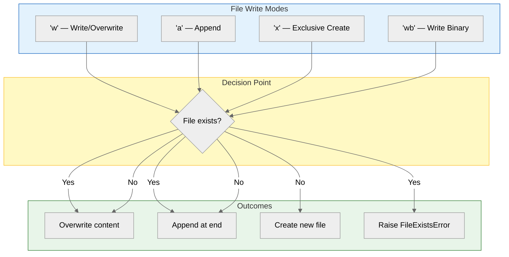

## Learning Objectives

By the end of this chapter, you will be able to:
- Write text to files using `write()` and `writelines()`
- Understand write modes: `'w'` (write), `'a'` (append), `'x'` (exclusive create)
- Append data to existing files without overwriting
- Create new files safely
- Work with multiple files simultaneously
- Understand buffering and flushing behaviour

## Estimated Time

30–45 minutes

## Prerequisites

- Day 25: Reading Files

---

## Theory — Writing Files

### Write Modes

| Mode | Behaviour                                     | Cursor Start | If File Exists         |
| ---- | --------------------------------------------- | ------------ | ---------------------- |
| `'w'`  | Write (overwrite)                             | Beginning    | Truncated (overwritten)|
| `'a'`  | Append                                        | End          | Content preserved      |
| `'x'`  | Exclusive creation — fails if file exists     | Beginning    | Raises `FileExistsError`|
| `'wb'` | Write binary                                  | Beginning    | Truncated              |



### Writing Methods

| Method                            | Description                                 |
| --------------------------------- | ------------------------------------------- |
| `f.write(string)`                 | Writes a single string to the file          |
| `f.writelines(list_of_strings)`   | Writes each string (no `\n` added)           |
| `f.flush()`                       | Forces buffered data to be written to disk  |

:::{warning}
`writelines()` does **not** add newline characters automatically. You must include `\n` in each string if you want line breaks:
```python
lines = ["line1\n", "line2\n", "line3\n"]
f.writelines(lines)
```
:::

### Buffering and Flushing

Python buffers writes for performance — data is accumulated in memory and written to disk in larger chunks.

| When Flush Happens             | Trigger                                  |
| ------------------------------ | ---------------------------------------- |
| Buffer is full (default ~8 KB) | Automatic                                |
| File is closed                 | Automatic                                |
| `f.flush()` called             | Manual immediate write                   |
| `os.fsync(f.fileno())` called  | Manual — guarantees physical disk write  |

---

## Code Examples

### Example 1: Writing to a File (Overwrite Mode)

```python
with open("hello.txt", "w") as f:
    f.write("Hello, World!\n")
    f.write("This is a new file.\n")

# Verify
with open("hello.txt", "r") as f:
    print(f.read())

# Output:
# Hello, World!
# This is a new file.
```

### Example 2: Using `writelines()`

```python
lines = [
    "First line\n",
    "Second line\n",
    "Third line\n"
]

with open("lines.txt", "w") as f:
    f.writelines(lines)

with open("lines.txt", "r") as f:
    print(f.read())

# Output:
# First line
# Second line
# Third line
```

### Example 3: Appending to a File

```python
# Start with a file
with open("log.txt", "w") as f:
    f.write("[START] Log initialized\n")

# Append more entries
with open("log.txt", "a") as f:
    f.write("[INFO] Processing data...\n")
    f.write("[INFO] Task completed\n")

with open("log.txt", "r") as f:
    print(f.read())

# Output:
# [START] Log initialized
# [INFO] Processing data...
# [INFO] Task completed
```

### Example 4: Exclusive Creation Mode (`'x'`)

```python
try:
    with open("new_data.txt", "x") as f:
        f.write("This file was created safely.\n")
    print("✅ File created successfully.")
except FileExistsError:
    print("❌ File already exists — will not overwrite.")

# Output (first run):
# ✅ File created successfully.

# Output (second run):
# ❌ File already exists — will not overwrite.
```

### Example 5: Working with Multiple Files

```python
# Merge two files into a third
names = ["Alice\n", "Bob\n", "Charlie\n"]
scores = ["95\n", "87\n", "92\n"]

with open("names.txt", "w") as f:
    f.writelines(names)

with open("scores.txt", "w") as f:
    f.writelines(scores)

# Read both and combine
with open("names.txt", "r") as f1, open("scores.txt", "r") as f2:
    names_data = [line.strip() for line in f1]
    scores_data = [line.strip() for line in f2]

with open("merged.txt", "w") as f:
    for name, score in zip(names_data, scores_data):
        f.write(f"{name}: {score}\n")

with open("merged.txt", "r") as f:
    print(f.read())

# Output:
# Alice: 95
# Bob: 87
# Charlie: 92
```

### Example 6: Buffering and Flushing

```python
with open("output.txt", "w") as f:
    f.write("This is written to buffer.\n")
    f.flush()  # Force write to disk immediately
    print("✅ Data flushed to disk.")

# f.flush() ensures data is written even if the program crashes afterwards
```

### Example 7: Writing Binary Data

```python
data = bytes(range(256))  # 0–255

with open("binary_output.bin", "wb") as f:
    f.write(data)

# Verify size
import os
size = os.path.getsize("binary_output.bin")
print(f"Written {size} bytes.")

# Output:
# Written 256 bytes.
```

---

## Try It Yourself

1. Write a program that takes user input line by line and saves it to a file. Stop when the user types `DONE`.
2. Create a to-do list manager that:
   - Adds tasks (append mode)
   - Displays all tasks (read mode)
   - Stores tasks in a file
3. Write a program that reads a file and writes its contents in reverse line order to a new file.

---

## Common Mistakes

| Mistake                          | Why It Is Wrong                               | Fix                                |
| -------------------------------- | --------------------------------------------- | ---------------------------------- |
| Opening in `'w'` instead of `'a'` | Data is overwritten instead of appended       | Use `'a'` for appending            |
| Forgetting `\n` in `writelines()` | All text ends up on one line                  | Add `\n` to each string            |
| Using `'x'` without `try`/`except`| Program crashes if file already exists        | Wrap in `try`/`except FileExistsError` |
| Not closing files                 | Data may not be written to disk               | Use `with` statement               |

---

## Summary

| Concept              | Description                                        |
| -------------------- | -------------------------------------------------- |
| `'w'` mode           | Write — overwrites existing file content           |
| `'a'` mode           | Append — adds to end of file                       |
| `'x'` mode           | Exclusive create — fails if file exists            |
| `write()`            | Writes a single string                             |
| `writelines()`       | Writes a list of strings (no `\n` added)           |
| `flush()`            | Forces buffered data to disk                       |
| Multiple files       | Use `with open(...) as f1, open(...) as f2:`       |

---

## Key Takeaways

- Choose write mode carefully: `'w'` overwrites, `'a'` appends, `'x'` protects existing files.
- `writelines()` does not add newlines — include them explicitly in each string.
- Use `flush()` to force writes to disk when data integrity is critical.
- Open multiple files in a single `with` statement for clean, concurrent access.
- The `'x'` mode prevents accidental overwrites of existing data.

---

## Quiz

**Q1.** What happens when you open an existing file in mode `'w'` and write to it?

A. Data is appended to the end
B. An error is raised
C. The file content is truncated (overwritten)
D. The file is duplicated

:::{important}
**Answer: C.** Write mode (`'w'`) truncates the file first, then writes new content — overwriting whatever was there.
:::

---

**Q2.** Which mode should you use to create a new file and raise an error if it already exists?

A. `'w'`
B. `'a'`
C. `'x'`
D. `'r'`

:::{important}
**Answer: C.** Exclusive mode (`'x'`) creates the file if it does not exist, and raises `FileExistsError` if it does.
:::

---

**Q3.** What does `f.flush()` do?

A. Closes the file permanently
B. Writes buffered data to disk immediately
C. Deletes the file contents
D. Reads the file into memory

:::{important}
**Answer: B.** `flush()` forces any data in the write buffer to be written to disk immediately, without closing the file.
:::
