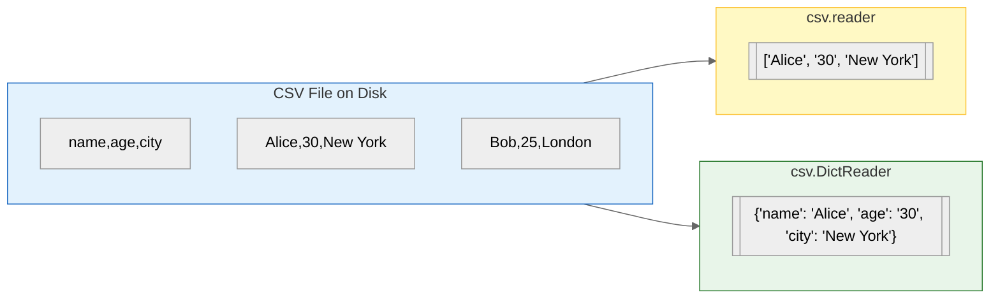

## Learning Objectives

By the end of this chapter, you will be able to:
- Understand the CSV (Comma-Separated Values) format
- Use `csv.reader` and `csv.writer` to read/write CSV files
- Use `csv.DictReader` and `csv.DictWriter` for dictionary-based access
- Read CSV data into lists and dictionaries
- Write structured data to CSV files
- Process a real-world weather dataset

## Estimated Time

35–50 minutes

## Prerequisites

- Day 25: Reading Files
- Day 26: Writing Files
- Day 22: Dictionaries
- Day 19: Lists

---

## Theory — What is CSV?

CSV (Comma-Separated Values) is a simple file format for storing tabular data. Each line is a row, and columns are separated by commas.

```text
name,age,city
Alice,30,New York
Bob,25,London
Charlie,35,Tokyo
```

### Rules of CSV

- First row is often a **header** (column names)
- Values are separated by **commas**
- Values with commas or newlines are **quoted**: `"Smith, John"`
- Different dialects exist (tabs, semicolons)

### Python's `csv` Module

The `csv` module provides reader/writer classes that handle quoting, escaping, and edge cases automatically.



---

## Code Examples

### Example 1: Reading CSV with `csv.reader`

```python
import csv

# data.csv:
# name,age,city
# Alice,30,New York
# Bob,25,London
# Charlie,35,Tokyo

with open("data.csv", "r") as f:
    reader = csv.reader(f)
    for row in reader:
        print(row)

# Output:
# ['name', 'age', 'city']
# ['Alice', '30', 'New York']
# ['Bob', '25', 'London']
# ['Charlie', '35', 'Tokyo']
```

### Example 2: Skipping the Header

```python
import csv

with open("data.csv", "r") as f:
    reader = csv.reader(f)
    header = next(reader)  # Skip header row
    print(f"Header: {header}")

    for row in reader:
        print(f"{row[0]} is {row[1]} years old and lives in {row[2]}")

# Output:
# Header: ['name', 'age', 'city']
# Alice is 30 years old and lives in New York
# Bob is 25 years old and lives in London
# Charlie is 35 years old and lives in Tokyo
```

### Example 3: Reading with `csv.DictReader`

```python
import csv

with open("data.csv", "r") as f:
    reader = csv.DictReader(f)
    for row in reader:
        print(dict(row))
        print(f"  → {row['name']} | Age: {row['age']} | City: {row['city']}")

# Output:
# {'name': 'Alice', 'age': '30', 'city': 'New York'}
#   → Alice | Age: 30 | City: New York
# {'name': 'Bob', 'age': '25', 'city': 'London'}
#   → Bob | Age: 25 | City: London
# {'name': 'Charlie', 'age': '35', 'city': 'Tokyo'}
#   → Charlie | Age: 35 | City: Tokyo
```

:::{tip}
`DictReader` uses the first row as column names automatically. You can also pass custom fieldnames if the file has no header:
```python
reader = csv.DictReader(f, fieldnames=["name", "age", "city"])
```
:::

### Example 4: Writing CSV with `csv.writer`

```python
import csv

data = [
    ["name", "age", "city"],
    ["Alice", 30, "New York"],
    ["Bob", 25, "London"],
    ["Charlie", 35, "Tokyo"],
]

with open("output.csv", "w", newline="") as f:
    writer = csv.writer(f)
    writer.writerows(data)

# Output file (output.csv):
# name,age,city
# Alice,30,New York
# Bob,25,London
# Charlie,35,Tokyo
```

:::{note}
Always use `newline=""` when writing CSV files to avoid extra blank lines on some platforms.
:::

### Example 5: Writing with `csv.DictWriter`

```python
import csv

data = [
    {"name": "Alice", "age": 30, "city": "New York"},
    {"name": "Bob", "age": 25, "city": "London"},
    {"name": "Charlie", "age": 35, "city": "Tokyo"},
]

with open("dict_output.csv", "w", newline="") as f:
    fieldnames = ["name", "age", "city"]
    writer = csv.DictWriter(f, fieldnames=fieldnames)

    writer.writeheader()   # Writes the header row
    writer.writerows(data) # Writes all data rows
```

### Example 6: Real-World — Weather Data

```python
import csv

# weather.csv:
# date,temp_max,temp_min,humidity,precip
# 2024-01-01,12.5,3.2,78,0.0
# 2024-01-02,14.1,5.0,65,2.3
# 2024-01-03,9.8,1.5,82,5.1

def analyse_weather(filename):
    with open(filename, "r") as f:
        reader = csv.DictReader(f)
        temps_max = []
        total_precip = 0.0
        humidities = []

        for row in reader:
            temps_max.append(float(row["temp_max"]))
            total_precip += float(row["precip"])
            humidities.append(float(row["humidity"]))

    avg_high = sum(temps_max) / len(temps_max)
    avg_humidity = sum(humidities) / len(humidities)

    print(f"📊 Weather Analysis")
    print(f"  Days analysed:    {len(temps_max)}")
    print(f"  Avg high temp:    {avg_high:.1f}°C")
    print(f"  Max temp recorded: {max(temps_max):.1f}°C")
    print(f"  Min temp recorded: {min(temps_max):.1f}°C")
    print(f"  Total rainfall:   {total_precip:.1f} mm")
    print(f"  Avg humidity:     {avg_humidity:.1f}%")

analyse_weather("weather.csv")

# Output:
# 📊 Weather Analysis
#   Days analysed:    3
#   Avg high temp:    12.1°C
#   Max temp recorded: 14.1°C
#   Min temp recorded: 9.8°C
#   Total rainfall:   7.4 mm
#   Avg humidity:     75.0%
```

### Example 7: Custom Delimiter (Tab-Separated)

```python
import csv

# data.tsv:
# name\tage\tcity
# Alice\t30\tNew York

with open("data.tsv", "r") as f:
    reader = csv.reader(f, delimiter="\t")
    for row in reader:
        print(row)

# Output:
# ['name', 'age', 'city']
# ['Alice', '30', 'New York']
```

---

## Try It Yourself

1. Create a CSV file of books (title, author, year, rating). Write a program that reads the file and displays books sorted by rating.
2. Write a program that asks the user for student names and grades, then saves them to a CSV file using `DictWriter`.
3. Download a small CSV dataset (e.g., from Kaggle) and write a script that computes basic statistics on a numeric column.

---

## Common Mistakes

| Mistake                           | Why It Is Wrong                              | Fix                                   |
| --------------------------------- | -------------------------------------------- | ------------------------------------- |
| Forgetting `newline=""`           | Extra blank rows in the output               | Add `newline=""` to `open()`          |
| Not converting string to numbers  | Arithmetic on strings fails or concatenates  | Use `int()` or `float()` explicitly   |
| Assuming all values are quoted    | CSV files may have unescaped commas          | Use `csv` module, not manual parsing  |
| Ignoring encoding                 | UnicodeDecodeError on international data     | Use `encoding="utf-8"`                |

:::{warning}
Never parse CSV files manually with `.split(",")`. A value like `"Smith, John"` contains a comma inside quotes — manual splitting will corrupt the data. Always use the `csv` module.
:::

---

## Summary

| Concept              | Description                                       |
| -------------------- | ------------------------------------------------- |
| CSV format           | Comma-separated values — tabular text format      |
| `csv.reader`         | Reads rows as lists                               |
| `csv.writer`         | Writes lists as rows                              |
| `csv.DictReader`     | Reads rows as dictionaries (keyed by header)      |
| `csv.DictWriter`     | Writes dictionaries as rows                       |
| `writeheader()`      | Writes the header row from fieldnames             |
| `newline=""`         | Prevents extra blank lines in output              |
| Custom delimiter     | Use `delimiter='\t'` for TSV files                |

---

## Key Takeaways

- Use `csv.reader` for simple list-based access; use `csv.DictReader` for named column access.
- Always specify `newline=""` when writing CSV files.
- Use `next(reader)` to skip the header row when using `csv.reader`.
- The `csv` module handles quoting, escaping, and delimiters — never parse CSV manually.
- `DictWriter.writeheader()` writes column names automatically from `fieldnames`.

---

## Quiz

**Q1.** Which class reads CSV rows as dictionaries using the first row as keys?

A. `csv.reader`
B. `csv.writer`
C. `csv.DictReader`
D. `csv.DictWriter`

:::{important}
**Answer: C.** `csv.DictReader` maps each row to a dictionary with keys from the first row (header).
:::

---

**Q2.** Why must `newline=""` be passed when opening a file for CSV writing?

A. To enable binary mode
B. To prevent extra blank lines between rows
C. To use tab delimiters
D. To allow Unicode characters

:::{important}
**Answer: B.** `newline=""` prevents the CSV module from adding extra carriage returns that cause blank lines on Windows.
:::

---

**Q3.** What does `csv.writer.writerows()` expect as an argument?

A. A single string
B. A dictionary
C. An iterable of rows (each row is an iterable)
D. A file object

:::{important}
**Answer: C.** `writerows()` takes an iterable of rows, where each row is a list or tuple of values.
:::
