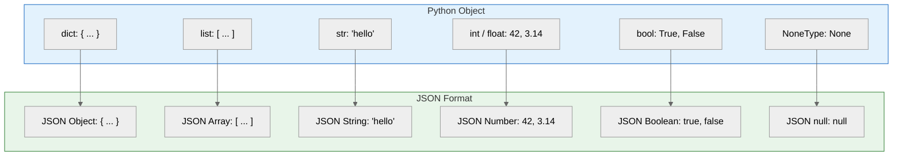

## Learning Objectives

By the end of this chapter, you will be able to:
- Understand the JSON (JavaScript Object Notation) format
- Use `json.dump()` and `json.dumps()` to serialize Python objects
- Use `json.load()` and `json.loads()` to deserialize JSON data
- Map Python types to JSON types and vice versa
- Read and write JSON data from/to files
- Pretty print JSON for readability
- Process a real-world API response example

## Estimated Time

35–50 minutes

## Prerequisites

- Day 25: Reading Files
- Day 26: Writing Files
- Day 22: Dictionaries
- Basic understanding of web APIs (helpful but not required)

---

## Theory — What is JSON?

JSON (JavaScript Object Notation) is a lightweight data-interchange format that is easy for humans to read and write, and easy for machines to parse and generate. It is the de-facto standard for data exchange on the web.

### JSON Syntax

```json
{
  "name": "Alice",
  "age": 30,
  "is_student": false,
  "courses": ["Math", "Physics"],
  "address": {
    "city": "New York",
    "zip": "10001"
  },
  "score": 95.5,
  "tags": null
}
```

### Python ↔ JSON Type Mapping

| Python            | JSON      |
| ----------------- | --------- |
| `dict`            | `{}`      |
| `list`            | `[]`      |
| `str`             | `""`      |
| `int` / `float`   | Number    |
| `True` / `False`  | `true` / `false` |
| `None`            | `null`    |



### The `json` Module — Four Core Functions

| Function       | Description                                  | Returns     |
| -------------- | -------------------------------------------- | ----------- |
| `json.dumps()` | Serializes Python object → JSON string       | `str`       |
| `json.dump()`  | Serializes Python object → file              | `None`      |
| `json.loads()` | Deserializes JSON string → Python object     | Python type |
| `json.load()`  | Deserializes JSON file → Python object       | Python type |

---

## Code Examples

### Example 1: Serializing with `json.dumps()`

```python
import json

data = {
    "name": "Alice",
    "age": 30,
    "is_student": False,
    "courses": ["Math", "Physics"],
    "score": 95.5,
    "tags": None
}

json_string = json.dumps(data)
print(json_string)
print(type(json_string))

# Output:
# {"name": "Alice", "age": 30, "is_student": false, "courses": ["Math", "Physics"], "score": 95.5, "tags": null}
# <class 'str'>
```

### Example 2: Pretty Printing with `indent`

```python
import json

data = {
    "name": "Alice",
    "age": 30,
    "courses": ["Math", "Physics"],
    "address": {
        "city": "New York",
        "zip": "10001"
    }
}

print(json.dumps(data, indent=2))

# Output:
# {
#   "name": "Alice",
#   "age": 30,
#   "courses": [
#     "Math",
#     "Physics"
#   ],
#   "address": {
#     "city": "New York",
#     "zip": "10001"
#   }
# }
```

### Example 3: Deserializing with `json.loads()`

```python
import json

json_string = '{"name": "Bob", "age": 25, "is_student": true}'
data = json.loads(json_string)

print(data)
print(data["name"])
print(data["age"])

# Output:
# {'name': 'Bob', 'age': 25, 'is_student': True}
# Bob
# 25
```

:::{note}
Notice that `true` in JSON becomes `True` (Python bool) and `null` becomes `None`.
:::

### Example 4: Writing JSON to a File with `json.dump()`

```python
import json

data = {
    "name": "Charlie",
    "age": 35,
    "skills": ["Python", "SQL", "Docker"],
    "employed": True
}

with open("profile.json", "w") as f:
    json.dump(data, f, indent=2)

# File contents (profile.json):
# {
#   "name": "Charlie",
#   "age": 35,
#   "skills": [
#     "Python",
#     "SQL",
#     "Docker"
#   ],
#   "employed": true
# }
```

### Example 5: Reading JSON from a File with `json.load()`

```python
import json

with open("profile.json", "r") as f:
    data = json.load(f)

print(f"Name: {data['name']}")
print(f"Skills: {', '.join(data['skills'])}")
print(f"Employed: {data['employed']}")

# Output:
# Name: Charlie
# Skills: Python, SQL, Docker
# Employed: True
```

### Example 6: Real-World — API Response

```python
import json

# Simulated API response (as a JSON string)
api_response = """
{
  "status": "success",
  "data": {
    "users": [
      {"id": 1, "name": "Alice", "email": "alice@example.com"},
      {"id": 2, "name": "Bob", "email": "bob@example.com"},
      {"id": 3, "name": "Charlie", "email": "charlie@example.com"}
    ],
    "total": 3,
    "page": 1
  },
  "message": "Users retrieved successfully"
}
"""

data = json.loads(api_response)

if data["status"] == "success":
    print(f"Page {data['data']['page']} of {data['data']['total']} users:\n")
    for user in data["data"]["users"]:
        print(f"  #{user['id']}: {user['name']} — {user['email']}")
else:
    print(f"Error: {data['message']}")

# Output:
# Page 1 of 3 users:
#
#   #1: Alice — alice@example.com
#   #2: Bob — bob@example.com
#   #3: Charlie — charlie@example.com
```

### Example 7: Sorting Keys and Custom Formatting

```python
import json

data = {"z": 1, "a": 2, "m": 3, "b": 4}

# Sort keys alphabetically
print(json.dumps(data, indent=2, sort_keys=True))

# Output:
# {
#   "a": 2,
#   "b": 4,
#   "m": 3,
#   "z": 1
# }
```

### Example 8: Handling Non-Serializable Types

```python
import json
from datetime import datetime

data = {
    "event": "Meeting",
    "time": datetime.now()
}

try:
    json.dumps(data)
except TypeError as e:
    print(f"❌ TypeError: {e}")

# Output:
# ❌ TypeError: Object of type datetime is not JSON serializable

# Fix: Convert to string first
data["time"] = data["time"].isoformat()
print(json.dumps(data, indent=2))

# Output:
# {
#   "event": "Meeting",
#   "time": "2026-07-06T10:30:00"
# }
```

---

## Try It Yourself

1. Create a dictionary representing a library (list of books with title, author, year). Save it to a JSON file and read it back.
2. Write a program that loads a JSON configuration file and prints the settings in a user-friendly format.
3. Use the `json` module to pretty-print a nested dictionary with 4+ levels of nesting and sorted keys.

---

## Common Mistakes

| Mistake                          | Why It Is Wrong                               | Fix                                    |
| -------------------------------- | --------------------------------------------- | -------------------------------------- |
| Using single quotes in JSON      | JSON requires double quotes                   | Use `json.dumps()` to generate JSON    |
| Forgetting `indent` for humans   | Output is on one long line                    | Use `indent=2` or `indent=4`           |
| Serializing non-serializable types | `TypeError: Object of type X is not JSON serializable` | Convert to string or custom encoder |
| Opening binary file for JSON     | `json.load()` expects text mode               | Use `open(filename, "r")` or `"w"`     |

:::{warning}
JSON strictly requires **double quotes** for strings and keys. Single quotes are not valid JSON:
```python
# ❌ Invalid JSON
{'name': 'Alice'}

# ✅ Valid JSON
{"name": "Alice"}
```
:::

---

## Summary

| Concept              | Description                                       |
| -------------------- | ------------------------------------------------- |
| JSON                 | Lightweight, language-independent data format     |
| `json.dumps()`       | Python object → JSON string                       |
| `json.dump()`        | Python object → JSON file                         |
| `json.loads()`       | JSON string → Python object                       |
| `json.load()`        | JSON file → Python object                         |
| `indent`             | Pretty-print with specified indentation           |
| `sort_keys`          | Sort dictionary keys alphabetically               |
| Type mapping         | `dict→{}`, `list→[]`, `True→true`, `None→null`   |

---

## Key Takeaways

- JSON is the universal data format for web APIs and configuration files.
- Use `json.dumps()` with `indent` for human-readable output.
- Python types (`dict`, `list`, `str`, `int`, `float`, `bool`, `None`) map directly to JSON types.
- `json.load()` and `json.dump()` work directly with file objects — no manual string conversion needed.
- Non-serializable types (datetime, custom objects) must be converted to serializable types first.

---

## Quiz

**Q1.** Which function converts a Python dictionary into a JSON string?

A. `json.loads()`
B. `json.dumps()`
C. `json.dump()`
D. `json.load()`

:::{important}
**Answer: B.** `json.dumps()` (dump-string) serializes a Python object to a JSON string.
:::

---

**Q2.** What does JSON `null` become when deserialized to Python?

A. `False`
B. `0`
C. `None`
D. `""`

:::{important}
**Answer: C.** JSON `null` maps to Python `None`.
:::

---

**Q3.** What exception is raised when you try to serialize a `datetime` object with `json.dumps()`?

A. `ValueError`
B. `KeyError`
C. `TypeError`
D. `SerializationError`

:::{important}
**Answer: C.** `TypeError` is raised because `datetime` objects are not JSON-serializable by default.
:::
