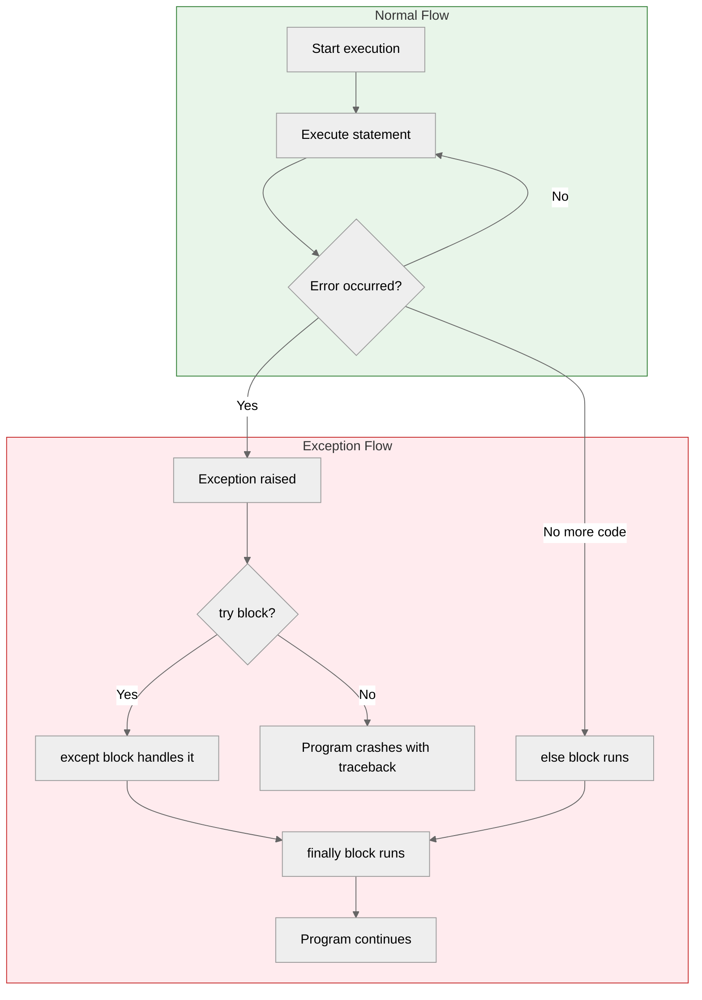

## Learning Objectives

By the end of this chapter, you will be able to:
- Understand what exceptions are and how they propagate
- Use `try`, `except`, `else`, and `finally` blocks effectively
- Identify and handle common exceptions (`ValueError`, `TypeError`, `FileNotFoundError`, `ZeroDivisionError`)
- Handle multiple exception types in a single block
- Raise exceptions intentionally with `raise`
- Create custom exception classes
- Follow best practices for exception handling

## Estimated Time

40–55 minutes

## Prerequisites

- Day 1: Basic Python syntax
- Day 9: Functions
- Day 25: Reading Files
- Day 26: Writing Files

---

## Theory — What are Exceptions?

An **exception** is an event that occurs during program execution that disrupts the normal flow of instructions. When Python encounters an error it cannot handle, it **raises** an exception. If not caught, the program crashes with a **traceback**.



### The Exception Hierarchy

```
BaseException
 ├── SystemExit
 ├── KeyboardInterrupt
 └── Exception
      ├── ArithmeticError
      │    └── ZeroDivisionError
      ├── LookupError
      │    ├── IndexError
      │    └── KeyError
      ├── ValueError
      ├── TypeError
      ├── FileNotFoundError
      └── (your custom exceptions)
```

### The `try`/`except`/`else`/`finally` Structure

| Block     | When It Runs                                         |
| --------- | ---------------------------------------------------- |
| `try`     | Code that might raise an exception                   |
| `except`  | Runs if an exception of the specified type occurs     |
| `else`    | Runs if **no** exception occurred in `try`            |
| `finally` | Runs **always** — used for cleanup (close files, etc.) |

---

## Code Examples

### Example 1: Basic `try`/`except`

```python
try:
    num = int(input("Enter a number: "))
    print(f"You entered: {num}")
except ValueError:
    print("❌ That is not a valid number!")

# Run 1:
# Enter a number: 42
# You entered: 42

# Run 2:
# Enter a number: hello
# ❌ That is not a valid number!
```

### Example 2: Handling Multiple Exceptions

```python
def divide_numbers(a, b):
    try:
        result = a / b
        print(f"{a} / {b} = {result}")
    except ZeroDivisionError:
        print("❌ Cannot divide by zero!")
    except TypeError:
        print("❌ Both arguments must be numbers!")

divide_numbers(10, 2)     # ✅ 10 / 2 = 5.0
divide_numbers(10, 0)     # ❌ Cannot divide by zero!
divide_numbers(10, "2")   # ❌ Both arguments must be numbers!
```

### Example 3: Single `except` for Multiple Types

```python
try:
    value = int(input("Enter a number: "))
    result = 100 / value
    print(f"100 / {value} = {result}")
except (ValueError, ZeroDivisionError) as e:
    print(f"❌ Error: {e}")

# Run 1:
# Enter a number: 0
# ❌ Error: division by zero

# Run 2:
# Enter a number: abc
# ❌ Error: invalid literal for int() with base 10: 'abc'
```

### Example 4: `else` and `finally`

```python
def safe_read_file(filename):
    file_content = None
    try:
        f = open(filename, "r")
        file_content = f.read()
    except FileNotFoundError:
        print(f"❌ File '{filename}' not found.")
    except PermissionError:
        print(f"❌ Permission denied for '{filename}'.")
    else:
        print(f"✅ Successfully read {len(file_content)} characters.")
        return file_content
    finally:
        print(f"📁 Operation completed for '{filename}'.")

# Run:
content = safe_read_file("existing.txt")
# Output:
# ✅ Successfully read 124 characters.
# 📁 Operation completed for 'existing.txt'.

content = safe_read_file("missing.txt")
# Output:
# ❌ File 'missing.txt' not found.
# 📁 Operation completed for 'missing.txt'.
```

:::{important}
The `finally` block runs **regardless** of whether an exception occurred. It is the perfect place for cleanup code like closing files, releasing network connections, or freeing resources.
:::

### Example 5: Raising Exceptions with `raise`

```python
def set_age(age):
    if not isinstance(age, int):
        raise TypeError("Age must be an integer.")
    if age < 0 or age > 150:
        raise ValueError("Age must be between 0 and 150.")
    print(f"✅ Age set to {age}.")

try:
    set_age(200)
except ValueError as e:
    print(f"❌ {e}")

try:
    set_age("twenty")
except TypeError as e:
    print(f"❌ {e}")

# Output:
# ❌ Age must be between 0 and 150.
# ❌ Age must be an integer.
```

### Example 6: Custom Exceptions

```python
class InsufficientFundsError(Exception):
    """Raised when a withdrawal exceeds the account balance."""
    pass

class NegativeAmountError(Exception):
    """Raised when a deposit or withdrawal amount is negative."""
    pass

class BankAccount:
    def __init__(self, owner, balance=0):
        self.owner = owner
        self.balance = balance

    def deposit(self, amount):
        if amount < 0:
            raise NegativeAmountError("Deposit amount cannot be negative.")
        self.balance += amount
        print(f"💵 Deposited ${amount}. Balance: ${self.balance}")

    def withdraw(self, amount):
        if amount < 0:
            raise NegativeAmountError("Withdrawal amount cannot be negative.")
        if amount > self.balance:
            raise InsufficientFundsError(
                f"Insufficient funds. Balance: ${self.balance}, "
                f"Withdrawal: ${amount}"
            )
        self.balance -= amount
        print(f"💰 Withdrew ${amount}. Balance: ${self.balance}")

# Usage
account = BankAccount("Alice", 500)

try:
    account.withdraw(600)
except InsufficientFundsError as e:
    print(f"❌ {e}")

try:
    account.deposit(-50)
except NegativeAmountError as e:
    print(f"❌ {e}")

account.withdraw(200)
# Output:
# ❌ Insufficient funds. Balance: $500, Withdrawal: $600
# ❌ Deposit amount cannot be negative.
# 💰 Withdrew $200. Balance: $300
```

### Example 7: Exception Chaining and Re-raising

```python
import math

def calculate_sqrt(value):
    try:
        return math.sqrt(value)
    except TypeError as e:
        raise ValueError("Input must be a number.") from e

try:
    result = calculate_sqrt("hello")
except ValueError as e:
    print(f"❌ {e}")
    print(f"   Original cause: {e.__cause__}")

# Output:
# ❌ Input must be a number.
#    Original cause: must be real number, not str
```

### Example 8: Common Built-in Exceptions

```python
# ValueError — when a function receives a valid type but invalid value
int("abc")  # ValueError: invalid literal for int()

# TypeError — when an operation receives an incompatible type
"hello" + 5  # TypeError: can only concatenate str (not "int") to str

# FileNotFoundError — when opening a non-existent file in read mode
open("nope.txt", "r")  # FileNotFoundError

# ZeroDivisionError — when dividing by zero
10 / 0  # ZeroDivisionError: division by zero

# IndexError — when accessing a list index that does not exist
[1, 2, 3][10]  # IndexError: list index out of range

# KeyError — when accessing a dictionary key that does not exist
{"a": 1}["b"]  # KeyError: 'b'
```

---

## Try It Yourself

1. Write a function `safe_divide(a, b)` that handles `ZeroDivisionError` and `TypeError`. Return `None` on error.
2. Create a custom exception `InvalidEmailError`. Write a function `validate_email(email)` that raises it if the email does not contain `@`.
3. Write a calculator (+, -, *, /) that handles invalid input, division by zero, and type errors gracefully.

---

## Best Practices

| Principle                          | Why                                                             |
| ---------------------------------- | --------------------------------------------------------------- |
| Catch specific exceptions          | Avoid bare `except:` that hides bugs                            |
| Keep `try` blocks minimal          | Only wrap code that may raise (not unrelated code)              |
| Use `else` for success paths       | Separates normal flow from error handling                       |
| Use `finally` for cleanup          | Guarantees resource release                                     |
| Raise with specific types          | Let callers catch precisely what they need                      |
| Document exceptions in docstrings  | Helps users of your code understand failure modes               |

:::{tip}
Bad: `except:` — cathes everything including `KeyboardInterrupt` and `SystemExit`.
Good: `except ValueError:` — catches only what you expect.
:::

---

## Common Mistakes

| Mistake                        | Why It Is Wrong                               | Fix                                   |
| ------------------------------ | --------------------------------------------- | ------------------------------------- |
| Bare `except:` clause          | Catches `KeyboardInterrupt`, hides all errors | Use `except SpecificException:`       |
| Swallowing exceptions silently | `except: pass` hides bugs                     | Log the error or re-raise             |
| Overly broad exception typing  | `except Exception:` is barely better than bare| Catch the most specific type          |
| Too much code in `try`         | Hard to tell which line caused the exception  | Only wrap risky code                  |
| Not using `finally` for cleanup| Resource leaks if exception skips cleanup     | Use `finally` or context manager      |

---

## Summary

| Concept                   | Description                                       |
| ------------------------- | ------------------------------------------------- |
| Exception                 | An error that interrupts normal program flow      |
| `try`/`except`            | Catches and handles exceptions                    |
| `else`                    | Runs when no exception occurs in `try`            |
| `finally`                 | Runs always — for cleanup                         |
| `raise`                   | Intentionally triggers an exception               |
| Custom exceptions         | Subclass `Exception` for domain-specific errors   |
| Common exceptions         | `ValueError`, `TypeError`, `FileNotFoundError`, `ZeroDivisionError` |

---

## Key Takeaways

- Always catch the **most specific** exception type — never use bare `except:`.
- Use `else` for code that should run only on success, and `finally` for code that must run always.
- Raise exceptions with `raise` to signal invalid states or inputs explicitly.
- Create custom exception classes by subclassing `Exception` for domain-specific errors.
- Use `from e` (exception chaining) when wrapping exceptions to preserve the original traceback.

---

## Quiz

**Q1.** In a `try`/`except`/`else`/`finally` structure, which block always executes regardless of exceptions?

A. `try`
B. `except`
C. `else`
D. `finally`

:::{important}
**Answer: D.** The `finally` block runs whether an exception occurred or not — it is designed for cleanup.
:::

---

**Q2.** What is the problem with a bare `except:` clause?

A. It is too slow
B. It catches `KeyboardInterrupt` and `SystemExit`, making programs hard to stop
C. It only works with built-in exceptions
D. It requires a `finally` block

:::{important}
**Answer: B.** A bare `except:` catches all exceptions including `KeyboardInterrupt` (Ctrl+C) and `SystemExit`, which is almost never what you want.
:::

---

**Q3.** How do you create a custom exception?

A. `class MyError: pass`
B. `class MyError(Exception): pass`
C. `def MyError(): pass`
D. `error MyError: pass`

:::{important}
**Answer: B.** Custom exceptions should inherit from `Exception` (directly or indirectly).
:::
