## Learning Objectives

By the end of this chapter, you will be able to:
- Apply file I/O and exception handling concepts to a real-world project
- Build a complete Student Management System with JSON persistence
- Add, view, search, and manage student records
- Save and load data from JSON files
- Calculate class averages and generate statistics
- Implement robust error handling for all operations
- Extend the project with CSV export and statistical analysis

## Estimated Time

60–90 minutes

## Prerequisites

- Day 25: Reading Files
- Day 26: Writing Files
- Day 27: Working with CSV
- Day 28: Working with JSON
- Day 29: Exception Handling

---

## Theory — Week 5 Review

### What You Have Learned

| Day | Topic               | Key Concepts                                                |
| --- | ------------------- | ----------------------------------------------------------- |
| 25  | Reading Files       | `open()`, modes, `read()`, `readline()`, `readlines()`, `with` statement |
| 26  | Writing Files       | `'w'`, `'a'`, `'x'` modes, `write()`, `writelines()`, flushing |
| 27  | Working with CSV    | `csv.reader`, `csv.writer`, `DictReader`, `DictWriter`      |
| 28  | Working with JSON   | `json.dump()`, `json.load()`, `json.dumps()`, `json.loads()`, pretty printing |
| 29  | Exception Handling  | `try`/`except`/`else`/`finally`, `raise`, custom exceptions |

All of these combine to make programs that can **persist data**, **handle errors gracefully**, and **interoperate with other systems**.

---

## Project: Student Management System

You will build a complete Student Management System that stores student records in a JSON file and provides a menu-driven interface.

```mermaid
%%{init: {'theme': 'neutral'}}%%
flowchart TB
    subgraph UI["User Interface (Menu)"]
        M1["1. Add Student"]
        M2["2. View All Students"]
        M3["3. Search by ID"]
        M4["4. Class Averages"]
        M5["5. Save & Exit"]
    end

    subgraph Core["Core Logic"]
        A["add_student&#40;name, id, grades&#41;"]
        V["view_all&#40;&#41;"]
        S["search_by_id&#40;id&#41;"]
        C["calculate_averages&#40;&#41;"]
    end

    subgraph Persistence["Data Persistence"]
        J["students.json<br/>&#40;JSON file&#41;"]
        CS["export.csv<br/>&#40;CSV export&#41;"]
    end

    subgraph Validation["Error Handling"]
        E1["Duplicate ID check"]
        E2["Grade validation"]
        E3["File not found"]
        E4["Corrupt data detection"]
    end

    M1 --> A
    M2 --> V
    M3 --> S
    M4 --> C

    A --> J
    A --> Validation
    V --> J
    S --> J
    C --> J

    J --> CS

    style UI fill:#e3f2fd,stroke:#1565c0
    style Core fill:#fff9c4,stroke:#fbc02d
    style Persistence fill:#e8f5e9,stroke:#2e7d32
    style Validation fill:#ffebee,stroke:#c62828
```



### Complete Walkthrough

```python
"""
Student Management System
A complete CRUD application with JSON persistence.
"""

import json
import os
import sys
from typing import Optional


# ── Custom Exceptions ──────────────────────────────────────────

class DuplicateStudentError(Exception):
    """Raised when a student with the same ID already exists."""
    pass

class InvalidGradeError(Exception):
    """Raised when a grade is out of the valid range (0–100)."""
    pass

class StudentNotFoundError(Exception):
    """Raised when no student matches the given ID."""
    pass

class CorruptDataError(Exception):
    """Raised when the data file cannot be parsed."""
    pass


# ── Data File Path ─────────────────────────────────────────────

DATA_FILE = "students.json"


# ── Core Functions ─────────────────────────────────────────────

def load_data() -> dict:
    """Load student data from JSON file."""
    try:
        with open(DATA_FILE, "r") as f:
            data = json.load(f)
        if not isinstance(data, dict):
            raise CorruptDataError("Data file must contain a dictionary.")
        return data
    except FileNotFoundError:
        return {}
    except json.JSONDecodeError as e:
        raise CorruptDataError(f"Invalid JSON in data file: {e}")


def save_data(data: dict) -> None:
    """Save student data to JSON file."""
    try:
        with open(DATA_FILE, "w") as f:
            json.dump(data, f, indent=2)
        print(f"💾 Data saved to {DATA_FILE}")
    except (IOError, PermissionError) as e:
        print(f"❌ Could not save data: {e}")


def validate_grade(grade: float) -> None:
    """Validate that a grade is between 0 and 100."""
    if not isinstance(grade, (int, float)):
        raise InvalidGradeError("Grade must be a number.")
    if grade < 0 or grade > 100:
        raise InvalidGradeError(
            f"Grade {grade} is out of range. Must be 0–100."
        )


def add_student(
    data: dict,
    name: str,
    student_id: str,
    grades: list[float]
) -> dict:
    """Add a new student to the data dictionary."""
    if student_id in data:
        raise DuplicateStudentError(
            f"Student with ID '{student_id}' already exists."
        )

    for grade in grades:
        validate_grade(grade)

    data[student_id] = {
        "name": name,
        "grades": grades
    }
    print(f"✅ Added student: {name} (ID: {student_id})")
    return data


def view_all(data: dict) -> None:
    """Display all students and their grades."""
    if not data:
        print("📭 No students in the system.")
        return

    print(f"\n{'='*50}")
    print(f"{'ID':<10} {'Name':<20} {'Grades':<30} {'Average':<10}")
    print(f"{'='*50}")

    for student_id, info in sorted(data.items()):
        grades = info["grades"]
        avg = sum(grades) / len(grades) if grades else 0
        grades_str = ", ".join(f"{g:.1f}" for g in grades)
        print(
            f"{student_id:<10} {info['name']:<20} "
            f"{grades_str:<30} {avg:.2f}"
        )
    print(f"{'='*50}\n")


def search_by_id(data: dict, student_id: str) -> None:
    """Search for a student by their ID."""
    if student_id not in data:
        raise StudentNotFoundError(
            f"No student found with ID '{student_id}'."
        )

    student = data[student_id]
    grades = student["grades"]
    avg = sum(grades) / len(grades) if grades else 0

    print(f"\n📋 Student Record")
    print(f"  Name:   {student['name']}")
    print(f"  ID:     {student_id}")
    print(f"  Grades: {', '.join(f'{g:.1f}' for g in grades)}")
    print(f"  Average: {avg:.2f}")
    print(f"  Status:  {'PASS ✅' if avg >= 50 else 'FAIL ❌'}")


def calculate_averages(data: dict) -> None:
    """Calculate and display class-wide statistics."""
    if not data:
        print("📭 No students to analyse.")
        return

    all_grades = []
    student_averages = {}

    for student_id, info in data.items():
        grades = info["grades"]
        if grades:
            avg = sum(grades) / len(grades)
            student_averages[student_id] = avg
            all_grades.extend(grades)

    overall_avg = sum(all_grades) / len(all_grades)
    class_avg = sum(student_averages.values()) / len(student_averages)
    best_student = max(student_averages, key=student_averages.get)
    worst_student = min(student_averages, key=student_averages.get)

    print(f"\n📊 Class Statistics")
    print(f"  Total students:     {len(data)}")
    print(f"  Total grades:       {len(all_grades)}")
    print(f"  Overall grade avg:  {overall_avg:.2f}")
    print(f"  Class average:      {class_avg:.2f}")
    print(f"  Highest avg:        {data[best_student]['name']} "
          f"({student_averages[best_student]:.2f})")
    print(f"  Lowest avg:         {data[worst_student]['name']} "
          f"({student_averages[worst_student]:.2f})")
    print(f"  Grade range:        {min(all_grades):.1f} – "
          f"{max(all_grades):.1f}")


# ── Menu System ────────────────────────────────────────────────

def clear_screen():
    """Clear the terminal screen."""
    os.system("cls" if os.name == "nt" else "clear")


def main():
    """Main program loop."""
    data = {}

    # Load existing data
    try:
        data = load_data()
        print(f"📂 Loaded {len(data)} student(s) from {DATA_FILE}")
    except CorruptDataError as e:
        print(f"⚠️  Warning: {e}. Starting with empty data.")

    while True:
        print(f"\n{'='*40}")
        print("  STUDENT MANAGEMENT SYSTEM")
        print(f"{'='*40}")
        print("  1. Add Student")
        print("  2. View All Students")
        print("  3. Search Student by ID")
        print("  4. Class Averages & Stats")
        print("  5. Save & Exit")
        print(f"{'='*40}")

        choice = input("Enter your choice (1–5): ").strip()

        try:
            if choice == "1":
                name = input("  Student name: ").strip()
                if not name:
                    print("❌ Name cannot be empty.")
                    continue

                student_id = input("  Student ID: ").strip()
                if not student_id:
                    print("❌ ID cannot be empty.")
                    continue

                grades_input = input(
                    "  Grades (comma-separated, e.g. 85,92,78): "
                ).strip()
                try:
                    grades = [
                        float(g.strip())
                        for g in grades_input.split(",")
                        if g.strip()
                    ]
                except ValueError:
                    print("❌ Grades must be numbers.")
                    continue

                if not grades:
                    print("❌ At least one grade is required.")
                    continue

                data = add_student(data, name, student_id, grades)

            elif choice == "2":
                view_all(data)

            elif choice == "3":
                student_id = input("  Enter student ID: ").strip()
                search_by_id(data, student_id)

            elif choice == "4":
                calculate_averages(data)

            elif choice == "5":
                save_data(data)
                print("👋 Goodbye!")
                break

            else:
                print("❌ Invalid choice. Please enter 1–5.")

        except DuplicateStudentError as e:
            print(f"❌ {e}")
        except StudentNotFoundError as e:
            print(f"❌ {e}")
        except InvalidGradeError as e:
            print(f"❌ {e}")
        except KeyboardInterrupt:
            print("\n⚠️  Interrupted.")
            save_data(data)
            break


if __name__ == "__main__":
    main()
```

### Expected Usage

```text
📂 Loaded 0 student(s) from students.json

========================================
  STUDENT MANAGEMENT SYSTEM
========================================
  1. Add Student
  2. View All Students
  3. Search Student by ID
  4. Class Averages & Stats
  5. Save & Exit
========================================
Enter your choice (1–5): 1
  Student name: Alice Johnson
  Student ID: S1001
  Grades (comma-separated, e.g. 85,92,78): 85, 92, 78
✅ Added student: Alice Johnson (ID: S1001)

Enter your choice (1–5): 1
  Student name: Bob Smith
  Student ID: S1002
  Grades (comma-separated, e.g. 85,92,78): 76, 88, 95, 90
✅ Added student: Bob Smith (ID: S1002)

Enter your choice (1–5): 2

==================================================
ID         Name                 Grades                        Average
==================================================
S1001      Alice Johnson        85.0, 92.0, 78.0              85.00
S1002      Bob Smith            76.0, 88.0, 95.0, 90.0       87.25
==================================================

Enter your choice (1–5): 3
  Enter student ID: S1001

📋 Student Record
  Name:   Alice Johnson
  ID:     S1001
  Grades: 85.0, 92.0, 78.0
  Average: 85.00
  Status:  PASS ✅

Enter your choice (1–5): 4

📊 Class Statistics
  Total students:     2
  Total grades:       7
  Overall grade avg:  86.29
  Class average:      86.13
  Highest avg:        Bob Smith (87.25)
  Lowest avg:         Alice Johnson (85.00)
  Grade range:        76.0 – 95.0

Enter your choice (1–5): 5
💾 Data saved to students.json
👋 Goodbye!
```

### Generated JSON File (`students.json`)

```json
{
  "S1001": {
    "name": "Alice Johnson",
    "grades": [
      85.0,
      92.0,
      78.0
    ]
  },
  "S1002": {
    "name": "Bob Smith",
    "grades": [
      76.0,
      88.0,
      95.0,
      90.0
    ]
  }
}
```

---

## Extensions

### Extension 1: CSV Export

```python
import csv

def export_to_csv(data: dict, filename: str = "students.csv") -> None:
    """Export student data to a CSV file."""
    try:
        with open(filename, "w", newline="") as f:
            writer = csv.writer(f)
            writer.writerow(["ID", "Name", "Grade 1", "Grade 2",
                           "Grade 3", "Grade 4", "Average"])

            for student_id, info in sorted(data.items()):
                grades = info["grades"]
                avg = sum(grades) / len(grades) if grades else 0
                row = [student_id, info["name"], *grades, round(avg, 2)]
                writer.writerow(row)

        print(f"✅ Data exported to {filename}")
    except (IOError, PermissionError) as e:
        print(f"❌ Could not export: {e}")

# Usage — add as option 6 in the menu
```

### Extension 2: Grade Statistics with Visualisation

```python
from collections import Counter

def grade_distribution(data: dict) -> None:
    """Show letter-grade distribution across all students."""
    letter_map = {"A": 0, "B": 0, "C": 0, "D": 0, "F": 0}

    for info in data.values():
        for g in info["grades"]:
            if g >= 90: letter_map["A"] += 1
            elif g >= 80: letter_map["B"] += 1
            elif g >= 70: letter_map["C"] += 1
            elif g >= 60: letter_map["D"] += 1
            else: letter_map["F"] += 1

    print("\n📊 Grade Distribution")
    total = sum(letter_map.values())
    for grade, count in letter_map.items():
        pct = count / total * 100 if total else 0
        bar = "█" * count
        print(f"  {grade}: {bar} {count} ({pct:.1f}%)")

# Usage — add as another menu option
```

### Extension 3: Delete Student Record

```python
def delete_student(data: dict, student_id: str) -> dict:
    """Remove a student record by ID."""
    if student_id not in data:
        raise StudentNotFoundError(
            f"No student found with ID '{student_id}'."
        )

    name = data[student_id]["name"]
    del data[student_id]
    print(f"🗑️  Deleted student: {name} (ID: {student_id})")
    return data
```

---

## Week 5 Summary

| Concept              | Takeaway                                                        |
| -------------------- | --------------------------------------------------------------- |
| **Reading Files**    | Use `with open(...) as f:` — safe, automatic cleanup            |
| **Writing Files**    | Choose mode carefully: `'w'` overwrites, `'a'` appends, `'x'` protects |
| **CSV**              | `csv.reader`/`csv.writer` for tabular data, never parse manually |
| **JSON**             | `json.dump()`/`json.load()` for structured data persistence     |
| **Exception Handling** | Catch specific types, use `else`/`finally`, raise custom exceptions |
| **Project Design**   | Separate concerns: UI, logic, persistence, validation           |

---

## Key Takeaways

- File I/O enables data persistence beyond a single program run.
- The `csv` and `json` modules handle edge cases (quoting, encoding, formatting) so you do not have to.
- Exception handling makes programs robust and user-friendly — always anticipate failure modes.
- Custom exceptions make error handling more readable and domain-specific.
- A well-structured project separates user interface logic from business logic and data persistence.

---

## Week 6 Preview

**Week 6: Object-Oriented Programming** — You will learn:

- Classes and objects
- The `__init__` method and `self`
- Instance vs class vs static methods
- Inheritance and polymorphism
- Encapsulation and property decorators
- Special methods (`__str__`, `__repr__`, `__eq__`)
- Composition and aggregation
- Building a library management system with OOP

---

## Quiz

**Q1.** What is the primary purpose of the `finally` block in exception handling?

A. To run code only when an error occurs
B. To run cleanup code regardless of exceptions
C. To catch all exceptions
D. To raise new exceptions

:::{important}
**Answer: B.** `finally` runs whether an exception occurred or not — used for releasing resources.
:::

---

**Q2.** In the Student Management System project, why is JSON chosen over plain text for data storage?

A. JSON is faster to read
B. JSON preserves data structure (nested dicts, lists, types)
C. JSON files are smaller
D. JSON does not need error handling

:::{important}
**Answer: B.** JSON preserves the hierarchical structure of the data (students mapped by ID, each with name and grades list) and supports native types like numbers and booleans.
:::

---

**Q3.** Which method of reading a file is most memory-efficient for a file with 1 million lines?

A. `f.read()`
B. `f.readlines()`
C. `f.readline()` in a loop
D. `for line in f:`

:::{important}
**Answer: D.** Iterating directly over the file object (`for line in f:`) reads one line at a time into memory, making it the most efficient for large files.
:::
