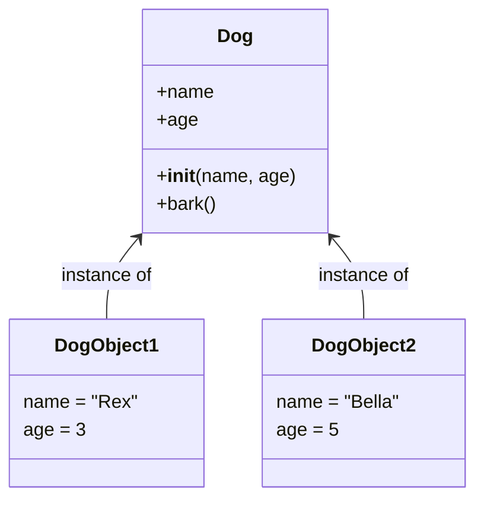

# Day 31: Introduction to OOP

## Learning Objectives
- Understand what Object-Oriented Programming is and why it matters
- Differentiate between a class and an object
- Define a class using the `class` keyword
- Create objects (instances) from a class
- Implement the `__init__` method (constructor)
- Explain the `self` parameter
- Work with instance attributes
- Build simple classes like `Dog` and `Car`

## Estimated Time
**2 hours**

## Prerequisites
- Python functions (defining and calling)
- Variables and data types
- Basic understanding of dictionaries

---

## Theory

### What is OOP?

Object-Oriented Programming (OOP) is a programming paradigm that organizes code around **objects** rather than functions and logic. An object is a bundle of **data** (attributes) and **behavior** (methods).

**Real-world analogy:** Think of a **car blueprint**. The blueprint itself is not a car — it's the **class**. The actual cars you drive are **objects** (instances). Every car built from the same blueprint has the same structure, but each one has its own color, engine, and license plate.

```text
+---------------------+          +-----------------------+
|   Blueprint (Class) |          |   Actual Car (Object) |
|   - 4 wheels        |  ===>    |   - Red color         |
|   - engine specs    |          |   - V6 engine         |
|   - dimensions      |          |   - ABC 1234 plate    |
+---------------------+          +-----------------------+
```

### Classes vs Objects

| Concept | Definition | Example |
|---------|-----------|---------|
| **Class** | A blueprint or template | `Dog` (the concept of a dog) |
| **Object** | A specific instance | `my_dog = Dog("Rex")` (a real dog named Rex) |

### Defining a Class

Use the `class` keyword:

```python
class Dog:
    pass
```

### Creating Objects

```python
my_dog = Dog()
your_dog = Dog()
```

### The `__init__` Method

The `__init__` method is the **constructor**. Python calls it automatically when you create an object.

```python
class Dog:
    def __init__(self, name, age):
        self.name = name    # instance attribute
        self.age = age      # instance attribute
```

### The `self` Parameter

- `self` refers to the **current instance** of the class
- It is always the first parameter of instance methods
- You do **not** pass it explicitly — Python does it for you

```python
my_dog = Dog("Rex", 3)
# Python calls: Dog.__init__(my_dog, "Rex", 3)
```

### Instance Attributes

Attributes are variables tied to a specific object. Each object has its own copy.

---

## Code Examples

### Example 1: Dog Class

```python
class Dog:
    """A simple Dog class."""

    def __init__(self, name, age):
        self.name = name
        self.age = age

    def bark(self):
        return f"{self.name} says woof!"


# Create objects
dog1 = Dog("Rex", 3)
dog2 = Dog("Bella", 5)

print(dog1.bark())    # Rex says woof!
print(dog2.bark())    # Bella says woof!
print(f"{dog1.name} is {dog1.age} years old.")
```

**Output:**
```
Rex says woof!
Bella says woof!
Rex is 3 years old.
```

### Example 2: Car Class

```python
class Car:
    """A simple Car class."""

    def __init__(self, make, model, year):
        self.make = make
        self.model = model
        self.year = year

    def description(self):
        return f"{self.year} {self.make} {self.model}"


my_car = Car("Toyota", "Corolla", 2020)
print(my_car.description())  # 2020 Toyota Corolla
```

**Output:**
```
2020 Toyota Corolla
```

### Example 3: Multiple Objects

```python
class Student:
    def __init__(self, name, student_id):
        self.name = name
        self.student_id = student_id


s1 = Student("Alice", "S001")
s2 = Student("Bob", "S002")
s3 = Student("Charlie", "S003")

students = [s1, s2, s3]
for s in students:
    print(f"{s.name} (ID: {s.student_id})")
```

**Output:**
```
Alice (ID: S001)
Bob (ID: S002)
Charlie (ID: S003)
```

---

## Mermaid Diagram



---

## Try It Yourself

1. Create a `Book` class with `title`, `author`, and `pages` attributes.
2. Add a method `summary()` that returns a string like `"'Title' by Author (X pages)"`.
3. Create 3 book objects and store them in a list. Loop through and print each summary.

---

## Common Mistakes

| Mistake | Why It's Wrong | Correct |
|---------|---------------|---------|
| Forgetting `self` parameter | Method gets wrong number of args | Always include `self` as first parameter |
| Using `self` as another name | `this`, `me`, etc. work but break convention | Always use `self` |
| Defining attributes outside `__init__` | Works but inconsistent | Initialize all attributes in `__init__` |
| Forgetting parentheses in `__init__` | Syntax error | Use double underscores `__init__` |
| Accessing class without `self` inside method | NameError | Use `self.attribute_name` |

---

## Summary

- **OOP** organizes code into objects that combine data and behavior
- A **class** is a blueprint; an **object** is an instance of that blueprint
- `__init__` is the constructor that initializes new objects
- `self` refers to the current instance
- **Instance attributes** are unique to each object

## Key Takeaways

1. Classes define the structure; objects are concrete instances
2. Every method must have `self` as its first parameter
3. `__init__` runs automatically when an object is created
4. Instance attributes store data specific to each object
5. The `class` keyword starts a class definition

---

## Quiz

**Q1:** What is the purpose of the `self` parameter in Python class methods?
1. It refers to the class itself
2. It refers to the current instance of the class
3. It is used to call static methods
4. It is optional and can be omitted

<details>
<summary>Solution</summary>
**Answer: 2**

`self` refers to the current instance. It is always passed automatically when you call a method on an object.
</details>

**Q2:** What does the `__init__` method do?
1. Deletes an object from memory
2. Returns a string representation of the object
3. Initializes a newly created object
4. Defines a class-level constant

<details>
<summary>Solution</summary>
**Answer: 3**

`__init__` is the constructor. It runs automatically when an object is created and initializes the object's attributes.
</details>

**Q3:** Given `class Cat: pass`, how do you create a Cat object?
1. `my_cat = Cat`
2. `my_cat = new Cat()`
3. `my_cat = Cat()`
4. `my_cat = create Cat`

<details>
<summary>Solution</summary>
**Answer: 3**

In Python, you create an object by calling the class name with parentheses, just like calling a function.
</details>
