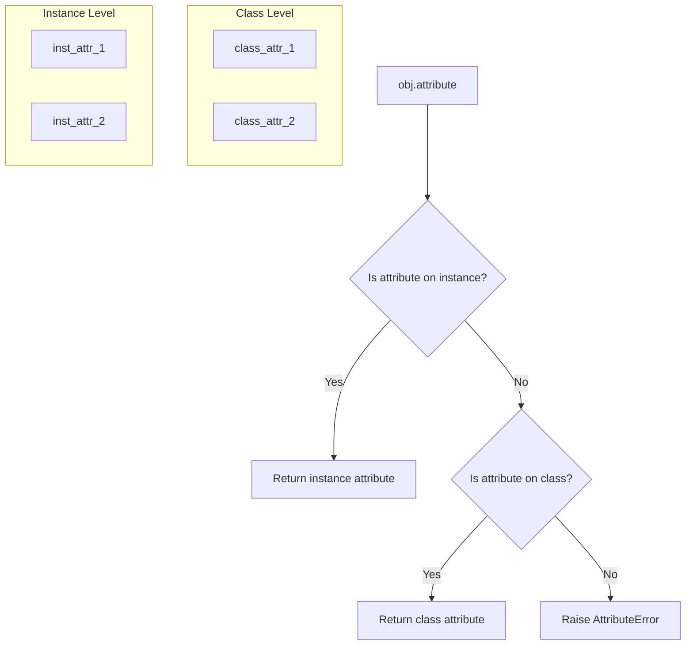

# Day 32: Instance Methods and Attributes

## Learning Objectives
- Write instance methods that use `self`
- Define and use class attributes shared across instances
- Modify instance and class attributes
- Use `@property`, `@setter`, and `@deleter` decorators
- Understand encapsulation and name mangling
- Apply naming conventions: `_protected` and `__private`

## Estimated Time
**2 hours**

## Prerequisites
- Day 31: Introduction to OOP (classes, `__init__`, `self`)
- Basic understanding of functions

---

## Theory

### Instance Methods

Instance methods are functions defined inside a class that operate on an instance. They always take `self` as the first parameter, giving them access to the instance's attributes and other methods.

```python
class Rectangle:
    def __init__(self, width, height):
        self.width = width
        self.height = height

    def area(self):           # instance method
        return self.width * self.height

    def perimeter(self):      # instance method
        return 2 * (self.width + self.height)
```

### Class Attributes

Class attributes are shared across **all instances** of a class. They are defined directly inside the class body, outside any methods.

```python
class Employee:
    company = "Tech Corp"      # class attribute — shared
    employee_count = 0         # class attribute — shared

    def __init__(self, name):
        self.name = name       # instance attribute — unique
        Employee.employee_count += 1
```

### Modifying Attributes

You can change attributes at any time:

```python
obj.attribute = new_value      # instance attribute
ClassName.class_attr = value   # class attribute
```

:::{important}
Changing a class attribute through an instance **creates a new instance attribute** instead of modifying the class attribute. Always use the class name to modify class attributes.
:::

### Property Decorators

The `@property` decorator lets you define methods that can be accessed like attributes. `@setter` allows controlled assignment. `@deleter` controls deletion.

```python
class Temperature:
    def __init__(self, celsius):
        self._celsius = celsius

    @property
    def fahrenheit(self):
        return (self._celsius * 9/5) + 32

    @fahrenheit.setter
    def fahrenheit(self, value):
        self._celsius = (value - 32) * 5/9
```

### Encapsulation and Naming Conventions

Python uses naming conventions (not strict enforcement) for access control:

| Convention | Meaning | Example |
|-----------|---------|---------|
| `name` | Public attribute | `self.name` |
| `_name` | Protected (internal use) | `self._salary` |
| `__name` | Private (name mangling) | `self.__password` |

Name mangling transforms `__name` to `_ClassName__name` to prevent accidental access.

---

## Code Examples

### Example 1: Instance Methods and Class Attributes

```python
class BankAccount:
    bank_name = "Python Savings"  # class attribute
    interest_rate = 0.02          # class attribute

    def __init__(self, owner, balance=0):
        self.owner = owner        # instance attribute
        self.balance = balance    # instance attribute

    def deposit(self, amount):
        self.balance += amount
        return f"Deposited ${amount}. Balance: ${self.balance}"

    def withdraw(self, amount):
        if amount > self.balance:
            return "Insufficient funds!"
        self.balance -= amount
        return f"Withdrew ${amount}. Balance: ${self.balance}"

    def apply_interest(self):
        self.balance += self.balance * BankAccount.interest_rate
        return f"Interest applied. Balance: ${self.balance:.2f}"


acc1 = BankAccount("Alice", 1000)
acc2 = BankAccount("Bob", 500)

print(acc1.deposit(200))          # Deposited $200. Balance: $1200
print(acc2.withdraw(100))         # Withdrew $100. Balance: $400
print(acc1.apply_interest())      # Interest applied. Balance: $1224.00

print(f"Bank: {acc1.bank_name}")  # Python Savings
print(f"Bank: {BankAccount.bank_name}")  # Python Savings
```

**Output:**
```
Deposited $200. Balance: $1200
Withdrew $100. Balance: $400
Interest applied. Balance: $1224.00
Bank: Python Savings
Bank: Python Savings
```

### Example 2: Property Decorators

```python
class Circle:
    def __init__(self, radius):
        self._radius = radius

    @property
    def radius(self):
        """Getter for radius."""
        return self._radius

    @radius.setter
    def radius(self, value):
        """Setter with validation."""
        if value < 0:
            raise ValueError("Radius cannot be negative")
        self._radius = value

    @property
    def area(self):
        """Computed property (no setter needed)."""
        import math
        return math.pi * self._radius ** 2

    @property
    def diameter(self):
        return self._radius * 2


c = Circle(5)
print(c.radius)       # 5  (uses getter)
print(c.area)         # 78.5398... (computed)
print(c.diameter)     # 10 (computed)

c.radius = 10         # uses setter
print(c.area)         # 314.159...

# c.radius = -5       # raises ValueError
```

**Output:**
```
5
78.53981633974483
10
314.1592653589793
```

### Example 3: Encapsulation and Name Mangling

```python
class User:
    def __init__(self, username, password):
        self.username = username            # public
        self._email = ""                    # protected (convention)
        self.__password = password          # private (name mangling)

    def set_email(self, email):
        if "@" in email:
            self._email = email
        else:
            print("Invalid email")

    def get_password(self):
        return "***hidden***"


u = User("alice99", "secret123")
u.set_email("alice@example.com")
print(u.username)         # alice99
print(u._email)           # alice@example.com (accessible but discouraged)
# print(u.__password)     # AttributeError!

# Name mangling in action:
print(u._User__password)  # secret123 (mangled name, still accessible)
```

**Output:**
```
alice99
alice@example.com
secret123
```

---

## Mermaid Diagram



---

## Try It Yourself

1. Create a `Student` class with class attribute `school = "Springfield High"`.
2. Add instance attributes: `name`, `grade`, `_id` (protected).
3. Add a `@property` for `grade` that validates it is between 9–12.
4. Add a method `promote()` that increases grade by 1 (max 12).
5. Create 2–3 students and test the features.

---

## Common Mistakes

| Mistake | Why It's Wrong | Correct |
|---------|---------------|---------|
| Modifying class attr via instance | Creates new instance attr, doesn't update class | `ClassName.attr = value` |
| Forgetting `self.` when accessing attribute | NameError | Always use `self.attribute` |
| Expecting `__private` to be truly private | Python only mangles names | Use `_` convention and respect it |
| Defining property without matching setter | Attribute is read-only | Omit setter intentionally or add one |
| Using `@property` unnecessarily for simple attributes | Over-engineering | Only use when logic/validation needed |

---

## Summary

- **Instance methods** operate on individual objects via `self`
- **Class attributes** are shared across all instances
- **Properties** provide getter/setter/deleter behavior with attribute syntax
- **Encapsulation** uses naming conventions: `_protected`, `__private`
- Name mangling (`__attr` → `_ClassName__attr`) discourages direct access

## Key Takeaways

1. Use `self` to access instance attributes and methods
2. Class attributes belong to the class, not any single instance
3. `@property` lets computed values look like simple attributes
4. Use `_` for internal use; `__` triggers name mangling
5. Validation logic belongs in property setters

---

## Quiz

**Q1:** What happens when you assign a value to `obj.class_attr` (where `class_attr` is defined on the class)?
1. The class attribute is updated for all instances
2. A new instance attribute is created, shadowing the class attribute
3. Python raises an error
4. The assignment is silently ignored

<details>
<summary>Solution</summary>
**Answer: 2**

Assigning to an instance creates a new instance attribute that shadows the class attribute. The class attribute remains unchanged.
</details>

**Q2:** What does the `@property` decorator do?
1. Makes a method private
2. Allows a method to be accessed like an attribute
3. Converts an attribute to a class attribute
4. Deletes an attribute

<details>
<summary>Solution</summary>
**Answer: 2**

`@property` allows you to define methods that can be accessed using attribute syntax (no parentheses), while hiding the underlying implementation.
</details>

**Q3:** How does Python make `__secret` attributes harder to access?
1. It raises an error when accessed
2. It renames the attribute to `_ClassName__secret`
3. It encrypts the attribute value
4. It deletes the attribute after initialization

<details>
<summary>Solution</summary>
**Answer: 2**

Python uses name mangling: `__secret` becomes `_ClassName__secret`. This is not true security but prevents accidental access.
</details>
