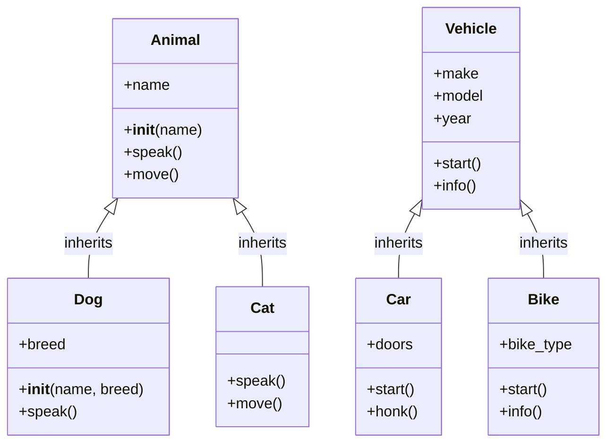

# Day 33: Inheritance

## Learning Objectives
- Understand inheritance and the IS-A relationship
- Create parent (base) and child (derived) classes
- Use the `super()` function to call parent methods
- Override methods in child classes
- Use `isinstance()` and `issubclass()` built-ins
- Understand multiple inheritance basics

## Estimated Time
**2.5 hours**

## Prerequisites
- Day 31: Introduction to OOP (classes, `__init__`, `self`)
- Day 32: Instance methods and attributes

---

## Theory

### What is Inheritance?

Inheritance lets a **child class** derive properties and methods from a **parent class**. This creates an **IS-A** relationship.

:::{important}
A Dog IS-A Animal. A Car IS-A Vehicle. If the relationship isn't "IS-A", use composition instead (Day 35).
:::

### Parent/Child Classes

```python
class Animal:              # Parent class
    def __init__(self, name):
        self.name = name

    def speak(self):
        return "..."

class Dog(Animal):         # Child class inherits from Animal
    def speak(self):       # Override parent method
        return "Woof!"
```

### The `super()` Function

`super()` gives access to methods of the parent class from within the child class. It is commonly used in `__init__`:

```python
class Dog(Animal):
    def __init__(self, name, breed):
        super().__init__(name)        # Call parent __init__
        self.breed = breed            # Child-specific attribute
```

### Method Overriding

A child class can redefine a method inherited from the parent. The child's version takes precedence.

### `isinstance()` and `issubclass()`

```python
isinstance(obj, ClassName)    # Is obj an instance of ClassName (or subclass)?
issubclass(Child, Parent)     # Is Child a subclass of Parent?
```

### Multiple Inheritance

A class can inherit from multiple parent classes:

```python
class FlyingFish(Fish, Bird):
    pass
```

:::{warning}
Multiple inheritance can lead to the **Diamond Problem** (ambiguity when two parents share a method). Python resolves this with the **Method Resolution Order (MRO)**. Use it sparingly.
:::

---

## Code Examples

### Example 1: Animal Hierarchy

```python
class Animal:
    def __init__(self, name):
        self.name = name

    def speak(self):
        return "..."

    def move(self):
        return f"{self.name} moves."


class Dog(Animal):
    def __init__(self, name, breed):
        super().__init__(name)
        self.breed = breed

    def speak(self):
        return "Woof!"


class Cat(Animal):
    def speak(self):
        return "Meow!"

    def move(self):
        return f"{self.name} stalks silently."


animals = [
    Dog("Rex", "Golden Retriever"),
    Cat("Whiskers"),
    Animal("Generic")
]

for a in animals:
    print(f"{a.name}: {a.speak()} — {a.move()}")
```

**Output:**
```
Rex: Woof! — Rex moves.
Whiskers: Meow! — Whiskers stalks silently.
Generic: ... — Generic moves.
```

### Example 2: Vehicle Hierarchy

```python
class Vehicle:
    def __init__(self, make, model, year):
        self.make = make
        self.model = model
        self.year = year

    def start(self):
        return "Engine starting..."

    def info(self):
        return f"{self.year} {self.make} {self.model}"


class Car(Vehicle):
    def __init__(self, make, model, year, doors):
        super().__init__(make, model, year)
        self.doors = doors

    def start(self):
        return f"{super().start()} Vroom vroom!"

    def honk(self):
        return "Beep beep!"


class Bike(Vehicle):
    def __init__(self, make, model, year, bike_type):
        super().__init__(make, model, year)
        self.bike_type = bike_type

    def start(self):
        return "Pedaling..."

    def info(self):
        return f"{super().info()} ({self.bike_type})"


car = Car("Toyota", "Camry", 2022, 4)
bike = Bike("Trek", "Domane", 2023, "Road")

print(car.info())           # 2022 Toyota Camry
print(car.start())          # Engine starting... Vroom vroom!
print(car.honk())           # Beep beep!

print(bike.info())          # 2023 Trek Domane (Road)
print(bike.start())         # Pedaling...
```

**Output:**
```
2022 Toyota Camry
Engine starting... Vroom vroom!
Beep beep!
2023 Trek Domane (Road)
Pedaling...
```

### Example 3: isinstance() and issubclass()

```python
class Animal: pass
class Dog(Animal): pass
class Cat(Animal): pass

d = Dog()
c = Cat()

print(isinstance(d, Dog))       # True
print(isinstance(d, Animal))    # True (Dog IS-A Animal)
print(isinstance(d, Cat))       # False
print(issubclass(Dog, Animal))  # True
print(issubclass(Cat, Animal))  # True
print(issubclass(Dog, Cat))     # False
```

**Output:**
```
True
True
False
True
True
False
```

### Example 4: Multiple Inheritance and MRO

```python
class A:
    def greet(self):
        return "Hello from A"

class B(A):
    def greet(self):
        return "Hello from B"

class C(A):
    def greet(self):
        return "Hello from C"

class D(B, C):
    pass

obj = D()
print(obj.greet())            # Hello from B
print(D.__mro__)              # Shows resolution order
```

**Output:**
```
Hello from B
(<class '__main__.D'>, <class '__main__.B'>, <class '__main__.C'>, <class '__main__.A'>, <class 'object'>)
```

---

## Mermaid Diagram



---

## Try It Yourself

1. Create a base `Employee` class with `name`, `salary`, and a `work()` method.
2. Create `Manager` and `Developer` subclasses.
3. `Manager` has a `team` list and overrides `work()` to say "Managing team".
4. `Developer` has a `language` attribute and overrides `work()` to say "Writing code".
5. Use `super()` in both subclasses to call the parent `__init__`.
6. Test polymorphism by storing employees in a list and calling `work()`.

---

## Common Mistakes

| Mistake | Why It's Wrong | Correct |
|---------|---------------|---------|
| Forgetting `super().__init__()` | Parent attributes not initialized | Call `super().__init__(args)` |
| Wrong `super()` arguments | Mismatch with parent's `__init__` | Match the parent signature exactly |
| Circular inheritance | `class A(B): class B(A):` | Redesign the hierarchy |
| Deep inheritance chains | Hard to maintain | Prefer shallow hierarchies |
| Misusing multiple inheritance | Diamond problem | Prefer composition over multiple inheritance |

---

## Summary

- **Inheritance** creates an IS-A relationship between classes
- Use `super()` to call parent methods and constructors
- **Method overriding** lets child classes redefine parent behavior
- `isinstance()` checks object types; `issubclass()` checks class relationships
- **Multiple inheritance** is possible but should be used carefully

## Key Takeaways

1. Inheritance promotes code reuse through hierarchical relationships
2. Always call `super().__init__()` in child constructors
3. Overridden methods still allow access to parent versions via `super()`
4. Python's MRO resolves method lookup in multiple inheritance
5. Favor "IS-A" for inheritance; use composition for "HAS-A"

---

## Quiz

**Q1:** What does `super()` do in a child class?
1. Creates a new parent class
2. Returns a reference to the parent class
3. Deletes the child class
4. Makes the child class private

<details>
<summary>Solution</summary>
**Answer: 2**

`super()` returns a temporary object of the superclass, allowing you to call its methods.
</details>

**Q2:** If class `B(A)` overrides method `foo()`, and you call `obj.foo()` on a `B` instance, which version runs?
1. `A`'s version
2. `B`'s version
3. Both, starting with `A`
4. Python's default `foo()`

<details>
<summary>Solution</summary>
**Answer: 2**

The child class's overridden method takes precedence. `B`'s version of `foo()` runs.
</details>

**Q3:** `issubclass(Dog, Animal)` returns `True`. What does this indicate?
1. `Dog` is an instance of `Animal`
2. `Dog` inherits from `Animal` (directly or indirectly)
3. `Animal` inherits from `Dog`
4. `Dog` and `Animal` are the same class

<details>
<summary>Solution</summary>
**Answer: 2**

`issubclass(Dog, Animal)` is `True` when `Dog` is a subclass (direct or indirect) of `Animal`.
</details>
