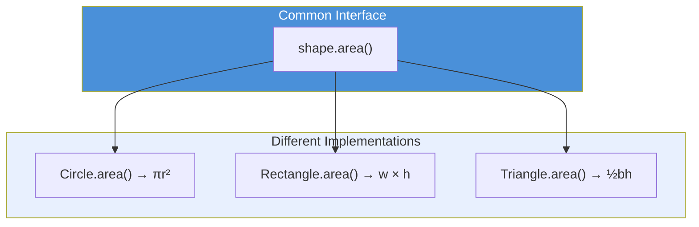

# Day 34: Polymorphism and Special Methods

## Learning Objectives
- Define polymorphism and explain its benefits
- Apply duck typing in Python
- Override methods to achieve polymorphic behavior
- Implement special (dunder) methods: `__str__`, `__repr__`, `__len__`, `__add__`, `__eq__`
- Overload operators through dunder methods

## Estimated Time
**2 hours**

## Prerequisites
- Day 33: Inheritance (parent/child classes, method overriding)

---

## Theory

### What is Polymorphism?

Polymorphism means "many forms." It allows objects of different classes to be treated through a **common interface**. The same method call can produce different behavior depending on the object.

```python
for animal in [Dog(), Cat(), Bird()]:
    print(animal.speak())   # Same call, different results
```

### Duck Typing

"If it walks like a duck and quacks like a duck, it's a duck." Python doesn't care about an object's type — it cares about whether the object has the **methods you call**.

```python
def make_it_speak(thing):
    print(thing.speak())   # Works for anything with .speak()

make_it_speak(Dog())       # Woof!
make_it_speak(Cat())       # Meow!
make_it_speak(AlarmClock()) # Beep! (if AlarmClock has speak())
```

### Method Overriding

A child class redefines a method from its parent, providing specialized behavior. This is the primary mechanism for polymorphism in inheritance hierarchies.

### Special (Dunder) Methods

Special methods start and end with double underscores (`__`). They let you define behavior for Python's built-in operations.

| Method | Operator/Function | Purpose |
|--------|------------------|---------|
| `__str__` | `str(obj)`, `print(obj)` | Human-readable string |
| `__repr__` | `repr(obj)` | Developer-friendly string |
| `__len__` | `len(obj)` | Length/size |
| `__add__` | `obj1 + obj2` | Addition |
| `__eq__` | `obj1 == obj2` | Equality comparison |
| `__lt__` | `obj1 < obj2` | Less-than |
| `__getitem__` | `obj[key]` | Indexing |
| `__call__` | `obj()` | Callable objects |

### Operator Overloading

By implementing dunder methods, you make your objects work with Python's operators naturally.

---

## Code Examples

### Example 1: Polymorphism Through Inheritance

```python
class Shape:
    def area(self):
        return 0

    def description(self):
        return "Generic shape"

class Circle(Shape):
    def __init__(self, radius):
        self.radius = radius

    def area(self):
        import math
        return math.pi * self.radius ** 2

    def description(self):
        return f"Circle (r={self.radius})"

class Rectangle(Shape):
    def __init__(self, width, height):
        self.width = width
        self.height = height

    def area(self):
        return self.width * self.height

    def description(self):
        return f"Rectangle ({self.width}x{self.height})"

class Triangle(Shape):
    def __init__(self, base, height):
        self.base = base
        self.height = height

    def area(self):
        return 0.5 * self.base * self.height

    def description(self):
        return f"Triangle ({self.base}x{self.height})"


shapes = [Circle(5), Rectangle(4, 6), Triangle(3, 8)]

for s in shapes:
    print(f"{s.description()}: area = {s.area():.2f}")
```

**Output:**
```
Circle (r=5): area = 78.54
Rectangle (4x6): area = 24.00
Triangle (3x8): area = 12.00
```

### Example 2: Duck Typing

```python
class Duck:
    def quack(self):
        return "Quack!"
    def walk(self):
        return "Waddles"

class Person:
    def quack(self):
        return "Imitates a duck"
    def walk(self):
        return "Walks upright"

def interact_with_duck(thing):
    print(thing.quack())
    print(thing.walk())

interact_with_duck(Duck())    # Quack! / Waddles
interact_with_duck(Person())  # Imitates a duck / Walks upright
```

**Output:**
```
Quack!
Waddles
Imitates a duck
Walks upright
```

### Example 3: Special Methods

```python
class Book:
    def __init__(self, title, author, pages):
        self.title = title
        self.author = author
        self.pages = pages

    def __str__(self):
        return f"'{self.title}' by {self.author}"

    def __repr__(self):
        return f"Book({self.title!r}, {self.author!r}, {self.pages})"

    def __len__(self):
        return self.pages

    def __add__(self, other):
        if isinstance(other, Book):
            total_pages = self.pages + other.pages
            return Book(f"{self.title} & {other.title}", f"{self.author} & {other.author}", total_pages)
        return NotImplemented

    def __eq__(self, other):
        if isinstance(other, Book):
            return self.title == other.title and self.author == other.author
        return False


b1 = Book("The Hobbit", "J.R.R. Tolkien", 310)
b2 = Book("1984", "George Orwell", 328)
b3 = Book("The Hobbit", "J.R.R. Tolkien", 310)

print(str(b1))           # 'The Hobbit' by J.R.R. Tolkien
print(repr(b1))          # Book('The Hobbit', 'J.R.R. Tolkien', 310)
print(len(b1))           # 310
print(b1 == b3)          # True
print(b1 == b2)          # False

bundle = b1 + b2
print(bundle)            # 'The Hobbit & 1984' by J.R.R. Tolkien & George Orwell
print(len(bundle))       # 638
```

**Output:**
```
'The Hobbit' by J.R.R. Tolkien
Book('The Hobbit', 'J.R.R. Tolkien', 310)
310
True
False
'The Hobbit & 1984' by J.R.R. Tolkien & George Orwell
638
```

### Example 4: Operator Overloading (Vector Class)

```python
class Vector:
    def __init__(self, x, y):
        self.x = x
        self.y = y

    def __str__(self):
        return f"Vector({self.x}, {self.y})"

    def __add__(self, other):
        return Vector(self.x + other.x, self.y + other.y)

    def __sub__(self, other):
        return Vector(self.x - other.x, self.y - other.y)

    def __mul__(self, scalar):
        return Vector(self.x * scalar, self.y * scalar)

    def __eq__(self, other):
        return self.x == other.x and self.y == other.y

    def __abs__(self):
        return (self.x ** 2 + self.y ** 2) ** 0.5


v1 = Vector(3, 4)
v2 = Vector(1, 2)

print(v1 + v2)      # Vector(4, 6)
print(v1 - v2)      # Vector(2, 2)
print(v1 * 3)       # Vector(9, 12)
print(v1 == Vector(3, 4))  # True
print(abs(v1))      # 5.0
```

**Output:**
```
Vector(4, 6)
Vector(2, 2)
Vector(9, 12)
True
5.0
```

---

## Mermaid Diagram



---

## Try It Yourself

1. Create a `Playlist` class with a `songs` list.
2. Implement `__len__` (number of songs), `__str__` (friendly display), `__add__` (combine two playlists), `__getitem__` (access by index).
3. Create a `Song` class with `title` and `artist`.
4. Add songs, combine playlists, print them, and access individual songs by index.

---

## Common Mistakes

| Mistake | Why It's Wrong | Correct |
|---------|---------------|---------|
| Forgetting `self` in dunder methods | Wrong signature | `def __add__(self, other):` |
| Returning `None` from `__str__` | Must return a string | Always `return str(...)` |
| Implementing `__eq__` without `__hash__` | Dict/set use broken | Either implement both or neither |
| Confusing `__str__` and `__repr__` | Wrong use case | `__str__` for users, `__repr__` for devs |
| Returning `NotImplemented` incorrectly | Unexpected behavior | Return `NotImplemented` (not `raise`) for unsupported types |

---

## Summary

- **Polymorphism** lets different classes share the same interface
- **Duck typing** focuses on what an object can do, not what it is
- **Method overriding** customizes parent behavior in child classes
- **Special methods** (`__str__`, `__add__`, etc.) integrate classes with Python's syntax
- **Operator overloading** makes custom objects behave like built-in types

## Key Takeaways

1. Polymorphism simplifies code by treating different objects uniformly
2. Duck typing is Python's dynamic approach to polymorphism
3. `__str__` is for end-users; `__repr__` is for developers
4. Implement `__add__`, `__eq__`, etc. to make objects feel "Pythonic"
5. Special methods are the key to seamless operator overloading

---

## Quiz

**Q1:** What is duck typing?
1. A type of inheritance pattern
2. Checking an object's type before calling methods
3. Relying on an object's behavior rather than its type
4. A debugging technique for classes

<details>
<summary>Solution</summary>
**Answer: 3**

Duck typing means "if it walks like a duck and quacks like a duck, it's a duck." Python checks for the presence of methods, not the type.
</details>

**Q2:** Which dunder method is called by `print(obj)`?
1. `__repr__`
2. `__str__`
3. `__format__`
4. `__print__`

<details>
<summary>Solution</summary>
**Answer: 2**

`print()` calls `__str__` to get a human-readable string. `__repr__` is used by `repr()` and as a fallback if `__str__` is not defined.
</details>

**Q3:** What should `__add__` return when `other` is an unsupported type?
1. `None`
2. `raise TypeError`
3. `NotImplemented`
4. `False`

<details>
<summary>Solution</summary>
**Answer: 3**

Return `NotImplemented` (not an error) to allow Python to try the reflected operation on the other object.
</details>
