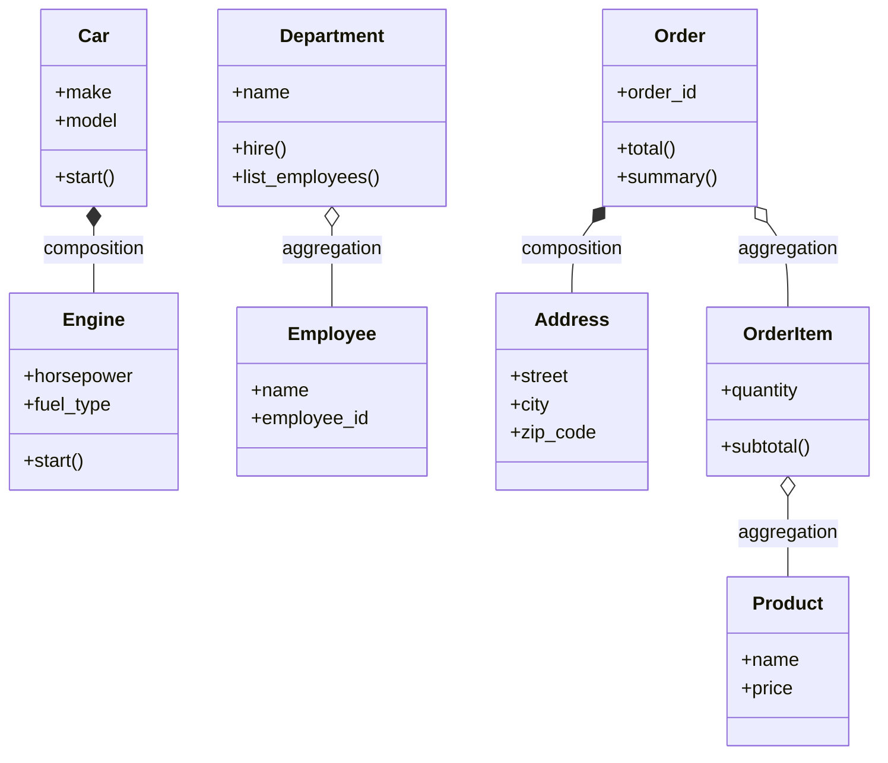

# Day 35: Composition and Aggregation

## Learning Objectives
- Understand the HAS-A relationship vs the IS-A relationship
- Implement composition (strong ownership)
- Implement aggregation (weaker relationship)
- Decide when to use inheritance vs composition
- Apply composition in practical examples

## Estimated Time
**2 hours**

## Prerequisites
- Day 33: Inheritance
- Day 34: Polymorphism

---

## Theory

### HAS-A vs IS-A

Two fundamental relationships in OOP:

| Relationship | Keyword | Meaning | Example |
|-------------|---------|---------|---------|
| **IS-A** | Inheritance | A specialized version of | A Dog IS-A Animal |
| **HAS-A** | Composition/Aggregation | Contains or is composed of | A Car HAS-A Engine |

### Composition (Strong Ownership)

In composition, the **part cannot exist without the whole**. If the whole is destroyed, the parts are destroyed too.

```python
class Engine:
    def __init__(self, horsepower):
        self.horsepower = horsepower

class Car:
    def __init__(self, model):
        self.model = model
        self.engine = Engine(150)  # Engine is created with Car
```

### Aggregation (Weaker Relationship)

In aggregation, the **part can exist independently** of the whole.

```python
class Student:
    def __init__(self, name):
        self.name = name

class School:
    def __init__(self, name):
        self.name = name
        self.students = []  # Students added independently

    def add_student(self, student):
        self.students.append(student)
```

### Inheritance vs Composition: When to Use

:::{tip}
**Favor composition over inheritance.** Inheritance creates tight coupling; composition is more flexible.
:::

| Use Inheritance (IS-A) When | Use Composition (HAS-A) When |
|----------------------------|-----------------------------|
| Clear hierarchical relationship | Objects contain other objects |
| Child is a specialized parent | You need flexibility at runtime |
| Shared interface with different behavior | The part can be swapped/removed |
| `class Dog(Animal)` | `class Car` has an `Engine` |

---

## Code Examples

### Example 1: Composition — Car and Engine

```python
class Engine:
    def __init__(self, horsepower, fuel_type):
        self.horsepower = horsepower
        self.fuel_type = fuel_type
        self.is_running = False

    def start(self):
        self.is_running = True
        return f"Engine ({self.horsepower}hp) started."

    def stop(self):
        self.is_running = False
        return "Engine stopped."

    def __str__(self):
        return f"{self.fuel_type} engine ({self.horsepower}hp)"


class Car:
    def __init__(self, make, model, year, horsepower, fuel_type):
        self.make = make
        self.model = model
        self.year = year
        self.engine = Engine(horsepower, fuel_type)  # Composition

    def start(self):
        return f"{self.year} {self.make} {self.model}: {self.engine.start()}"

    def stop(self):
        return self.engine.stop()

    def __str__(self):
        return f"{self.year} {self.make} {self.model} with {self.engine}"


# When car is deleted, engine is also deleted (composition)
car = Car("Honda", "Civic", 2023, 158, "Gasoline")
print(car.start())    # 2023 Honda Civic: Engine (158hp) started.
print(car)            # 2023 Honda Civic with Gasoline engine (158hp)
```

**Output:**
```
2023 Honda Civic: Engine (158hp) started.
2023 Honda Civic with Gasoline engine (158hp)
```

### Example 2: Aggregation — Department and Employees

```python
class Employee:
    def __init__(self, name, employee_id):
        self.name = name
        self.employee_id = employee_id

    def __str__(self):
        return f"{self.name} (ID: {self.employee_id})"


class Department:
    def __init__(self, name):
        self.name = name
        self.employees = []  # Aggregation — list of references

    def hire(self, employee):
        self.employees.append(employee)
        print(f"Hired {employee.name} into {self.name}")

    def fire(self, employee_id):
        self.employees = [e for e in self.employees if e.employee_id != employee_id]

    def list_employees(self):
        if not self.employees:
            return "No employees."
        return "\n".join(f"  - {e}" for e in self.employees)

    def __str__(self):
        return f"{self.name} ({len(self.employees)} employees)"


# Employees exist independently of the department
alice = Employee("Alice", "E001")
bob = Employee("Bob", "E002")
charlie = Employee("Charlie", "E003")

eng = Department("Engineering")
sales = Department("Sales")

eng.hire(alice)       # Hired Alice into Engineering
eng.hire(bob)         # Hired Bob into Engineering
sales.hire(charlie)   # Hired Charlie into Sales

print(eng)
print(eng.list_employees())

# Employee still exists even if department reference is removed
del eng
print(f"Alice still exists: {alice}")
```

**Output:**
```
Hired Alice into Engineering
Hired Bob into Engineering
Hired Charlie into Sales
Engineering (2 employees)
  - Alice (ID: E001)
  - Bob (ID: E002)
Alice still exists: Alice (ID: E001)
```

### Example 3: Practical — E-Commerce Order System

```python
class Address:
    def __init__(self, street, city, zip_code):
        self.street = street
        self.city = city
        self.zip_code = zip_code

    def __str__(self):
        return f"{self.street}, {self.city} {self.zip_code}"


class Product:
    def __init__(self, name, price):
        self.name = name
        self.price = price

    def __str__(self):
        return f"{self.name} (${self.price:.2f})"


class OrderItem:
    def __init__(self, product, quantity):
        self.product = product      # Aggregation
        self.quantity = quantity

    def subtotal(self):
        return self.product.price * self.quantity

    def __str__(self):
        return f"  {self.product.name} x{self.quantity} = ${self.subtotal():.2f}"


class Order:
    def __init__(self, order_id, shipping_address):
        self.order_id = order_id
        self.shipping_address = shipping_address  # Composition
        self.items = []                           # Aggregation

    def add_item(self, product, quantity=1):
        self.items.append(OrderItem(product, quantity))

    def total(self):
        return sum(item.subtotal() for item in self.items)

    def summary(self):
        lines = [f"Order #{self.order_id}"]
        lines.append(f"Ship to: {self.shipping_address}")
        lines.append("Items:")
        for item in self.items:
            lines.append(str(item))
        lines.append(f"Total: ${self.total():.2f}")
        return "\n".join(lines)


# Usage
addr = Address("123 Main St", "Springfield", "12345")
laptop = Product("Laptop", 999.99)
mouse = Product("Wireless Mouse", 29.99)
keyboard = Product("Mechanical Keyboard", 89.99)

order = Order("ORD-001", addr)       # Address is composed into Order
order.add_item(laptop, 1)            # Products/OrderItems are aggregated
order.add_item(mouse, 2)
order.add_item(keyboard, 1)

print(order.summary())
```

**Output:**
```
Order #ORD-001
Ship to: 123 Main St, Springfield 12345
Items:
  Laptop x1 = $999.99
  Wireless Mouse x2 = $59.98
  Mechanical Keyboard x1 = $89.99
Total: $1149.96
```

### Example 4: Composition vs Inheritance Side-by-Side

```python
# Inheritance approach — IS-A
class Dog:
    def __init__(self, name):
        self.name = name

    def bark(self):
        return "Woof!"

class Robot:
    def __init__(self, id_number):
        self.id_number = id_number

    def charge(self):
        return "Charging..."

# Problem: a RobotDog? Can't inherit from both cleanly
# Solution: Composition

# Composition approach — HAS-A
class RobotDog:
    def __init__(self, name, id_number):
        self.dog_behavior = Dog(name)   # HAS-A Dog
        self.robot_behavior = Robot(id_number)  # HAS-A Robot

    def bark(self):
        return self.dog_behavior.bark()

    def charge(self):
        return self.robot_behavior.charge()

    def __str__(self):
        return f"RobotDog '{self.dog_behavior.name}' (#{self.robot_behavior.id_number})"


rd = RobotDog("Spot", "R001")
print(rd)                # RobotDog 'Spot' (#R001)
print(rd.bark())         # Woof!
print(rd.charge())       # Charging...
```

**Output:**
```
RobotDog 'Spot' (#R001)
Woof!
Charging...
```

---

## Mermaid Diagram



---

## Try It Yourself

1. Design a `Library` system:
   - `Book` class (title, author, isbn)
   - `Shelf` class holds multiple books (composition: shelves are part of the library)
   - `Member` class that borrows books (aggregation: members exist independently)
   - `Library` class has shelves and members
2. Implement `add_book()`, `register_member()`, `borrow_book()`, `return_book()`
3. Decide which relationships are composition vs aggregation

---

## Common Mistakes

| Mistake | Why It's Wrong | Correct |
|---------|---------------|---------|
| Using inheritance for HAS-A | Creates wrong relationships | Use composition |
| Exposing internal parts directly | Breaks encapsulation | Provide methods that delegate to parts |
| Creating deep composition trees | Hard to maintain | Keep 1–2 levels of nesting |
| Confusing aggregation with composition | Wrong lifecycle management | Parts shouldn't outlive owner (composition) or can (aggregation) |
| Overusing inheritance because it's "OOP" | Tight coupling | "Favor composition over inheritance" |

---

## Summary

- **Composition** is a strong HAS-A (whole owns parts; parts die with whole)
- **Aggregation** is a weaker HAS-A (whole references parts; parts live independently)
- **Inheritance** models IS-A relationships
- Prefer composition for flexibility and loose coupling
- Real systems use all three together

## Key Takeaways

1. Composition: parts are created and destroyed with their container
2. Aggregation: parts exist independently of their container
3. Inheritance creates tight coupling; composition is more flexible
4. Use composition to combine behaviors from multiple sources
5. Always ask: IS-A or HAS-A? If HAS-A, use composition/aggregation

---

## Quiz

**Q1:** What is the key difference between composition and aggregation?
1. Composition uses classes; aggregation uses functions
2. In composition, parts cannot exist without the whole; in aggregation, they can
3. Aggregation is faster than composition
4. Composition is only for primitive types

<details>
<summary>Solution</summary>
**Answer: 2**

In composition, the part's lifecycle is tied to the whole. In aggregation, the part can outlive the whole.
</details>

**Q2:** A `House` class creates `Room` objects inside its constructor. When the `House` is destroyed, the `Room` objects are also destroyed. This is an example of:
1. Inheritance
2. Aggregation
3. Composition
4. Polymorphism

<details>
<summary>Solution</summary>
**Answer: 3**

Since `Room` is created inside `House` and destroyed with it, this is composition (strong ownership).
</details>

**Q3:** Which of the following is a reason to prefer composition over inheritance?
1. Composition is faster at runtime
2. Composition is easier to write
3. Composition is more flexible and reduces coupling
4. Composition works with primitive types only

<details>
<summary>Solution</summary>
**Answer: 3**

Composition makes it easier to change behavior at runtime, swap implementations, and avoid tight coupling between classes.
</details>
