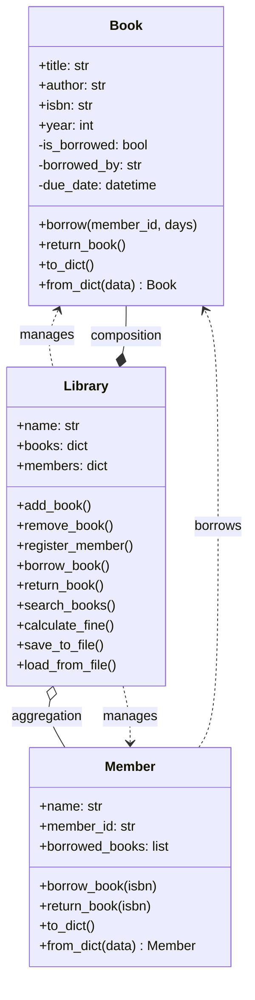

# Day 36: Week 6 Project — Library Management System

## Learning Objectives
- Apply all OOP concepts from Week 6 in a complete project
- Design classes with proper relationships (inheritance, composition, aggregation)
- Implement file persistence (save/load with JSON)
- Handle errors gracefully
- Build search functionality
- Extend the system with fine calculation and reservations

## Estimated Time
**3 hours**

## Prerequisites
- Day 31–35: All of Week 6 (OOP)
- Python file I/O (reading/writing files)
- JSON module basics
- Exception handling

---

## Project Overview

We'll build a **Library Management System** with these classes:

```
Library Management System
├── Book (title, author, isbn, status, year)
├── Member (name, member_id, borrowed_books)
├── Library (collection, members, books)
│   ├── add_book / remove_book
│   ├── register_member
│   ├── borrow_book / return_book
│   ├── search_books
│   ├── save_to_file / load_from_file
│   └── calculate_fine
└── LibrarySystem (CLI interface)
```

---

## Complete Code Walkthrough

### book.py — Book Class

```python
import json
from datetime import datetime, timedelta

class Book:
    """Represents a book in the library."""

    def __init__(self, title, author, isbn, year=2024):
        self.title = title
        self.author = author
        self.isbn = isbn
        self.year = year
        self._is_borrowed = False
        self._borrowed_by = None
        self._due_date = None

    @property
    def is_borrowed(self):
        return self._is_borrowed

    @property
    def status(self):
        if self._is_borrowed:
            due = self._due_date.strftime("%Y-%m-%d") if self._due_date else "Unknown"
            return f"Borrowed by {self._borrowed_by} (Due: {due})"
        return "Available"

    def borrow(self, member_id, days=14):
        if self._is_borrowed:
            raise ValueError(f"Book '{self.title}' is already borrowed.")
        self._is_borrowed = True
        self._borrowed_by = member_id
        self._due_date = datetime.now() + timedelta(days=days)

    def return_book(self):
        if not self._is_borrowed:
            raise ValueError(f"Book '{self.title}' was not borrowed.")
        self._is_borrowed = False
        self._borrowed_by = None
        self._due_date = None

    def to_dict(self):
        return {
            "title": self.title,
            "author": self.author,
            "isbn": self.isbn,
            "year": self.year,
            "is_borrowed": self._is_borrowed,
            "borrowed_by": self._borrowed_by,
            "due_date": self._due_date.isoformat() if self._due_date else None
        }

    @classmethod
    def from_dict(cls, data):
        book = cls(data["title"], data["author"], data["isbn"], data["year"])
        if data["is_borrowed"]:
            book._is_borrowed = True
            book._borrowed_by = data["borrowed_by"]
            if data["due_date"]:
                book._due_date = datetime.fromisoformat(data["due_date"])
        return book

    def __str__(self):
        return f"'{self.title}' by {self.author} ({self.year}) — {self.status}"

    def __repr__(self):
        return f"Book({self.title!r}, {self.author!r}, {self.isbn!r})"
```

### member.py — Member Class

```python
class Member:
    """Represents a library member."""

    def __init__(self, name, member_id):
        self.name = name
        self.member_id = member_id
        self.borrowed_books = []

    def borrow_book(self, isbn):
        if len(self.borrowed_books) >= 5:
            raise ValueError(f"{self.name} has reached the borrowing limit (5).")
        self.borrowed_books.append(isbn)

    def return_book(self, isbn):
        if isbn not in self.borrowed_books:
            raise ValueError(f"{self.name} did not borrow ISBN {isbn}.")
        self.borrowed_books.remove(isbn)

    def to_dict(self):
        return {
            "name": self.name,
            "member_id": self.member_id,
            "borrowed_books": self.borrowed_books
        }

    @classmethod
    def from_dict(cls, data):
        member = cls(data["name"], data["member_id"])
        member.borrowed_books = data["borrowed_books"]
        return member

    def __str__(self):
        return f"{self.name} (ID: {self.member_id}, Books: {len(self.borrowed_books)})"

    def __repr__(self):
        return f"Member({self.name!r}, {self.member_id!r})"
```

### library.py — Library Class

```python
import json
import os
from datetime import datetime

class Library:
    """Core library system managing books and members."""

    DATA_FILE = "library_data.json"
    FINE_PER_DAY = 0.50  # $0.50 per day overdue

    def __init__(self, name="City Library"):
        self.name = name
        self.books = {}       # ISBN -> Book  (composition)
        self.members = {}     # member_id -> Member  (aggregation)

    # --- Book Management ---

    def add_book(self, title, author, isbn, year=2024):
        if isbn in self.books:
            raise ValueError(f"Book with ISBN {isbn} already exists.")
        self.books[isbn] = Book(title, author, isbn, year)
        print(f"✓ Added: {self.books[isbn]}")

    def remove_book(self, isbn):
        if isbn not in self.books:
            raise KeyError(f"No book found with ISBN {isbn}.")
        book = self.books.pop(isbn)
        print(f"✓ Removed: '{book.title}'")

    # --- Member Management ---

    def register_member(self, name, member_id):
        if member_id in self.members:
            raise ValueError(f"Member ID {member_id} already exists.")
        self.members[member_id] = Member(name, member_id)
        print(f"✓ Registered: {self.members[member_id]}")

    # --- Borrowing / Returning ---

    def borrow_book(self, member_id, isbn):
        if member_id not in self.members:
            raise KeyError(f"Member ID {member_id} not found.")
        if isbn not in self.books:
            raise KeyError(f"No book found with ISBN {isbn}.")

        member = self.members[member_id]
        book = self.books[isbn]

        book.borrow(member_id)
        member.borrow_book(isbn)
        print(f"✓ {member.name} borrowed '{book.title}'. Due: {book._due_date.strftime('%Y-%m-%d')}")

    def return_book(self, member_id, isbn):
        if isbn not in self.books:
            raise KeyError(f"No book found with ISBN {isbn}.")

        book = self.books[isbn]
        member = self.members.get(member_id)

        if not book.is_borrowed:
            raise ValueError(f"Book '{book.title}' was not borrowed.")

        fine = self.calculate_fine(book)
        book.return_book()
        if member:
            member.return_book(isbn)

        print(f"✓ '{book.title}' returned.")
        if fine > 0:
            print(f"  Fine due: ${fine:.2f}")

    # --- Search ---

    def search_books(self, query, field="all"):
        """Search books by title, author, or ISBN."""
        results = []
        query = query.lower()

        for book in self.books.values():
            if field == "title" and query in book.title.lower():
                results.append(book)
            elif field == "author" and query in book.author.lower():
                results.append(book)
            elif field == "isbn" and query in book.isbn.lower():
                results.append(book)
            elif field == "all":
                if (query in book.title.lower() or
                    query in book.author.lower() or
                    query in book.isbn.lower()):
                    results.append(book)

        return results

    # --- Fine Calculation ---

    def calculate_fine(self, book):
        if not book._is_borrowed or not book._due_date:
            return 0.0

        now = datetime.now()
        if now <= book._due_date:
            return 0.0

        days_overdue = (now - book._due_date).days
        return days_overdue * self.FINE_PER_DAY

    # --- Persistence ---

    def save_to_file(self, filepath=None):
        filepath = filepath or self.DATA_FILE
        data = {
            "name": self.name,
            "books": [book.to_dict() for book in self.books.values()],
            "members": [member.to_dict() for member in self.members.values()]
        }
        with open(filepath, "w") as f:
            json.dump(data, f, indent=2)
        print(f"✓ Data saved to {filepath}")

    def load_from_file(self, filepath=None):
        filepath = filepath or self.DATA_FILE
        if not os.path.exists(filepath):
            print("No saved data found. Starting fresh.")
            return

        with open(filepath, "r") as f:
            data = json.load(f)

        self.name = data["name"]
        self.books = {b["isbn"]: Book.from_dict(b) for b in data["books"]}
        self.members = {m["member_id"]: Member.from_dict(m) for m in data["members"]}
        print(f"✓ Loaded data for {len(self.books)} books and {len(self.members)} members.")

    # --- Display ---

    def display_books(self, books=None):
        books = books or self.books.values()
        if not books:
            print("No books in the library.")
            return
        for book in books:
            print(f"  [{book.isbn}] {book}")

    def display_members(self):
        if not self.members:
            print("No registered members.")
            return
        for member in self.members.values():
            print(f"  {member}")

    def __str__(self):
        return f"{self.name}: {len(self.books)} books, {len(self.members)} members"
```

### main.py — CLI Interface

```python
def main():
    library = Library("City Library")
    library.load_from_file()

    while True:
        print(f"\n{'='*50}")
        print(f"  {library.name} — Library Management System")
        print(f"{'='*50}")
        print("  1. Add Book")
        print("  2. Remove Book")
        print("  3. Register Member")
        print("  4. Borrow Book")
        print("  5. Return Book")
        print("  6. Search Books")
        print("  7. Display All Books")
        print("  8. Display Members")
        print("  9. Save & Exit")
        print(f"{'='*50}")

        choice = input("Choose an option (1-9): ").strip()

        try:
            if choice == "1":
                title = input("Title: ").strip()
                author = input("Author: ").strip()
                isbn = input("ISBN: ").strip()
                year = int(input("Year (2024): ") or "2024")
                library.add_book(title, author, isbn, year)

            elif choice == "2":
                isbn = input("ISBN to remove: ").strip()
                library.remove_book(isbn)

            elif choice == "3":
                name = input("Member name: ").strip()
                mid = input("Member ID: ").strip()
                library.register_member(name, mid)

            elif choice == "4":
                mid = input("Member ID: ").strip()
                isbn = input("Book ISBN: ").strip()
                library.borrow_book(mid, isbn)

            elif choice == "5":
                mid = input("Member ID: ").strip()
                isbn = input("Book ISBN: ").strip()
                library.return_book(mid, isbn)

            elif choice == "6":
                query = input("Search query: ").strip()
                print("Search in (title/author/isbn/all): ")
                field = input().strip() or "all"
                results = library.search_books(query, field)
                if results:
                    print(f"\nFound {len(results)} book(s):")
                    library.display_books(results)
                else:
                    print("No books found.")

            elif choice == "7":
                library.display_books()

            elif choice == "8":
                library.display_members()

            elif choice == "9":
                library.save_to_file()
                print("Goodbye!")
                break

            else:
                print("Invalid choice. Please enter 1-9.")

        except (ValueError, KeyError) as e:
            print(f"Error: {e}")
        except Exception as e:
            print(f"Unexpected error: {e}")


if __name__ == "__main__":
    main()
```

---

## Sample Run

```
==================================================
  City Library — Library Management System
==================================================
  1. Add Book
  2. Remove Book
  3. Register Member
  4. Borrow Book
  5. Return Book
  6. Search Books
  7. Display All Books
  8. Display Members
  9. Save & Exit
==================================================
Choose an option (1-9): 1
Title: The Great Gatsby
Author: F. Scott Fitzgerald
ISBN: 978-0-0001
Year (2024): 1925
✓ Added: 'The Great Gatsby' by F. Scott Fitzgerald (1925) — Available

Choose an option (1-9): 3
Member name: Alice
Member ID: M001
✓ Registered: Alice (ID: M001, Books: 0)

Choose an option (1-9): 4
Member ID: M001
Book ISBN: 978-0-0001
✓ Alice borrowed 'The Great Gatsby'. Due: 2024-07-20

Choose an option (1-9): 6
Search query: gatsby
Found 1 book(s):
  [978-0-0001] 'The Great Gatsby' by F. Scott Fitzgerald (1925) — Borrowed by M001 (Due: 2024-07-20)
```

---

## Extensions

### 1. Reservation System

```python
class Reservation:
    def __init__(self, member_id, isbn):
        self.member_id = member_id
        self.isbn = isbn
        self.created_at = datetime.now()

class Library:
    def __init__(self, name):
        # ... existing code ...
        self.reservations = {}  # ISBN -> list of Reservations

    def reserve_book(self, member_id, isbn):
        if isbn not in self.books:
            raise KeyError("Book not found.")
        if not self.books[isbn].is_borrowed:
            raise ValueError("Book is available — borrow it instead.")

        if isbn not in self.reservations:
            self.reservations[isbn] = []
        self.reservations[isbn].append(Reservation(member_id, isbn))
        print(f"✓ {self.members[member_id].name} reserved '{self.books[isbn].title}'")

    def process_reservations(self, isbn):
        """When a book is returned, assign to the next person in queue."""
        if isbn in self.reservations and self.reservations[isbn]:
            next_res = self.reservations[isbn].pop(0)
            print(f"  → Notifying {self.members[next_res.member_id].name} that '{self.books[isbn].title}' is available.")
```

### 2. Enhanced Fine Calculation

```python
class ProgressiveFineCalculator:
    """Fine increases the longer a book is overdue."""
    RATES = [
        (0, 7, 0.50),      # First week: $0.50/day
        (7, 30, 1.00),     # Next 3 weeks: $1.00/day
        (30, float('inf'), 2.00)  # After 30 days: $2.00/day
    ]

    @staticmethod
    def calculate(overdue_days):
        total_fine = 0.0
        remaining = overdue_days
        for start_day, end_day, rate in ProgressiveFineCalculator.RATES:
            days_in_bracket = min(remaining, end_day - start_day)
            if days_in_bracket > 0:
                total_fine += days_in_bracket * rate
                remaining -= days_in_bracket
            if remaining <= 0:
                break
        return total_fine
```

---

## Week 6 Summary

| Concept | Key Takeaway |
|---------|-------------|
| **Classes & Objects** | Blueprint (class) vs instance (object) |
| **`__init__` & `self`** | Constructor and reference to current instance |
| **Instance/Class Attributes** | Per-object data vs shared data |
| **Properties** | Getters/setters with attribute syntax |
| **Encapsulation** | `_protected` and `__private` conventions |
| **Inheritance** | IS-A relationship with `super()` |
| **Polymorphism** | Same interface, different behavior |
| **Special Methods** | `__str__`, `__add__`, `__eq__`, etc. |
| **Composition** | Strong HAS-A (parts die with whole) |
| **Aggregation** | Weak HAS-A (parts live independently) |

## Key Takeaways

1. OOP models real-world entities as classes and objects
2. Inheritance promotes code reuse; composition promotes flexibility
3. Properties control access with validation
4. Special methods make classes work with Python's syntax
5. File persistence and error handling are essential for real applications

## Preview: Week 7 — Beyond Basics

Next week, we'll explore powerful libraries that extend Python beyond the standard library:

- **Day 37:** NumPy — numerical computing with arrays
- **Day 38:** Pandas — data analysis and manipulation
- **Day 39:** Matplotlib — data visualization
- **Day 40:** APIs and Automation — connecting to web services and automating tasks

---

## Mermaid Diagram



---

## Try It Yourself

1. Add a `Genre` attribute to the `Book` class and implement filtering by genre.
2. Implement the reservation system extension.
3. Add a `LateFeeWaiver(max_days)` feature that waives fines for books returned within 1 day of the due date.
4. Create a simple GUI or web interface for this system using Tkinter or Flask (optional challenge).

---

## Quiz

**Q1:** Why is the relationship between `Library` and `Book` in this project considered composition?
1. Because books are stored in a dictionary
2. Because books cannot exist outside the library context
3. Because the library reads books from a file
4. Because members borrow books

<details>
<summary>Solution</summary>
**Answer: 2**

Books are created and managed by the library. If the library is destroyed, its books cease to exist in the system (the `books` dict mapping is removed).
</details>

**Q2:** What happens when a member tries to borrow a 6th book in the current implementation?
1. The system allows it silently
2. A `ValueError` is raised with a message about the borrowing limit
3. The oldest borrowed book is returned automatically
4. The program crashes

<details>
<summary>Solution</summary>
**Answer: 2**

The `Member.borrow_book()` method checks that `len(self.borrowed_books) < 5` and raises a `ValueError` showing the limit has been reached.
</details>

**Q3:** What pattern does the `FineCalculator` extension use?
1. Singleton pattern
2. Factory pattern
3. Strategy pattern (varying fine rates per bracket)
4. Observer pattern

<details>
<summary>Solution</summary>
**Answer: 3**

The progressive fine calculator uses different rate brackets (strategy pattern), checking the overdue days against each bracket and applying the corresponding rate.
</details>
