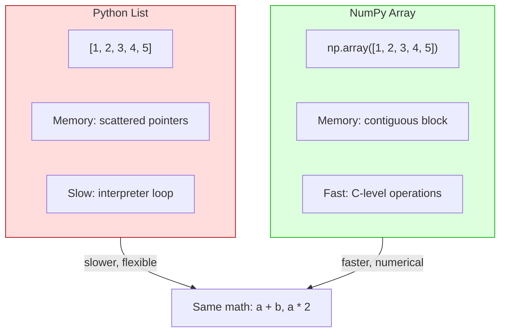

# Day 37: NumPy Basics

## Learning Objectives
- Understand what NumPy is and why it's used
- Create arrays using `array()`, `zeros()`, `ones()`, `arange()`, `linspace()`
- Inspect array attributes: `shape`, `dtype`, `size`, `ndim`
- Perform vectorized mathematical operations
- Index and slice NumPy arrays

## Estimated Time
**2 hours**

## Prerequisites
- Python lists and list operations
- Basic mathematical operations
- Loops and list comprehensions

---

## Theory

### What is NumPy?

NumPy (Numerical Python) is the fundamental package for **numerical computing** in Python. It provides:

- **ndarray**: A fast, memory-efficient array object
- **Vectorized operations**: Operate on entire arrays without explicit loops
- **Linear algebra, random number generation, Fourier transforms**

:::{important}
NumPy arrays are **faster** than Python lists because they store data in contiguous memory blocks and operations are implemented in C.
:::

### Creating Arrays

| Function | Description | Example |
|----------|-------------|---------|
| `array()` | From a list/tuple | `np.array([1, 2, 3])` |
| `zeros()` | All zeros | `np.zeros((3, 4))` |
| `ones()` | All ones | `np.ones((2, 2))` |
| `arange()` | Like `range()` | `np.arange(0, 10, 2)` |
| `linspace()` | Evenly spaced | `np.linspace(0, 1, 5)` |

### Array Attributes

| Attribute | Meaning | Example |
|-----------|---------|---------|
| `shape` | Dimensions tuple | `(3, 4)` for 3×4 |
| `dtype` | Data type | `int64`, `float64` |
| `size` | Total elements | `12` for 3×4 |
| `ndim` | Number of dims | `2` for matrix |

### Vectorized Operations

Instead of looping:

```python
# Python list (slow)
c = [a[i] + b[i] for i in range(len(a))]

# NumPy (fast)
c = a + b
```

### Indexing and Slicing

Similar to lists, but supports multi-dimensional slicing:

```python
arr[1:4, 0:3]   # rows 1-3, columns 0-2
arr[:, 0]        # all rows, column 0
arr[0, :]        # row 0, all columns
```

---

## Code Examples

### Example 1: Creating Arrays

```python
import numpy as np

# From a list
a = np.array([1, 2, 3, 4, 5])
print("From list:", a)

# Zeros and ones
zeros = np.zeros((2, 3))
ones = np.ones((3, 2))
print("Zeros:\n", zeros)
print("Ones:\n", ones)

# Range and linear space
step = np.arange(0, 10, 2)         # 0, 2, 4, 6, 8
even = np.linspace(0, 1, 5)        # 0, 0.25, 0.5, 0.75, 1.0
print("arange:", step)
print("linspace:", even)

# Identity matrix
eye = np.eye(4)                     # 4x4 identity
print("Identity:\n", eye)

# Random arrays
rand = np.random.random((3, 3))     # uniform [0, 1)
normal = np.random.randn(1000)      # standard normal
print("Random 3x3:\n", rand)
```

**Output:**
```
From list: [1 2 3 4 5]
Zeros:
 [[0. 0. 0.]
 [0. 0. 0.]]
Ones:
 [[1. 1.]
 [1. 1.]
 [1. 1.]]
arange: [0 2 4 6 8]
linspace: [0.   0.25 0.5  0.75 1.  ]
Identity:
 [[1. 0. 0. 0.]
 [0. 1. 0. 0.]
 [0. 0. 1. 0.]
 [0. 0. 0. 1.]]
Random 3x3:
 [[0.37454012 0.95071431 0.73199394]
 [0.59865848 0.15601864 0.15599452]
 [0.05808361 0.86617615 0.60111501]]
```

### Example 2: Array Attributes

```python
import numpy as np

arr = np.array([[1, 2, 3],
                [4, 5, 6],
                [7, 8, 9],
                [10, 11, 12]])

print(f"Array:\n{arr}")
print(f"Shape:      {arr.shape}")      # (4, 3)
print(f"Dimensions: {arr.ndim}")       # 2
print(f"Size:       {arr.size}")       # 12
print(f"Data type:  {arr.dtype}")      # int64
print(f"Item size:  {arr.itemsize}")   # 8 bytes
print(f"Total bytes: {arr.nbytes}")    # 96 bytes

# Changing data type
float_arr = arr.astype(float)
print(f"Float dtype: {float_arr.dtype}")
```

**Output:**
```
Array:
[[ 1  2  3]
 [ 4  5  6]
 [ 7  8  9]
 [10 11 12]]
Shape:      (4, 3)
Dimensions: 2
Size:       12
Data type:  int64
Item size:  8
Total bytes: 96
Float dtype: float64
```

### Example 3: Vectorized Operations

```python
import numpy as np

a = np.array([10, 20, 30, 40])
b = np.array([1, 2, 3, 4])

# Arithmetic (vectorized — no loops!)
print(f"a + b = {a + b}")           # [11 22 33 44]
print(f"a - b = {a - b}")           # [9 18 27 36]
print(f"a * b = {a * b}")           # [10 40 90 160]
print(f"a / b = {a / b}")           # [10. 10. 10. 10.]
print(f"a ** 2 = {a ** 2}")         # [100 400 900 1600]
print(f"a > 25 = {a > 25}")         # [False False  True  True]

# Universal functions (ufuncs)
print(f"sin(a) = {np.sin(a)}")
print(f"sqrt(a) = {np.sqrt(a)}")
print(f"mean(a) = {np.mean(a)}")
print(f"sum(a)  = {np.sum(a)}")
print(f"min(a)  = {np.min(a)}")
print(f"max(a)  = {np.max(a)}")
```

**Output:**
```
a + b = [11 22 33 44]
a - b = [9 18 27 36]
a * b = [10 40 90 160]
a / b = [10. 10. 10. 10.]
a ** 2 = [100 400 900 1600]
a > 25 = [False False  True  True]
sin(a) = [-0.54402111  0.91294525 -0.98803162  0.74511316]
sqrt(a) = [3.16227766 4.47213595 5.47722558 6.32455532]
mean(a) = 25.0
sum(a)  = 100
min(a)  = 10
max(a)  = 40
```

### Example 4: Indexing and Slicing

```python
import numpy as np

arr = np.array([[1,  2,  3,  4],
                [5,  6,  7,  8],
                [9, 10, 11, 12]])

# Basic indexing
print(arr[0, 0])          # 1
print(arr[1, 2])          # 7
print(arr[-1, -1])        # 12

# Row / column slicing
print("First row:", arr[0, :])         # [1 2 3 4]
print("Last column:", arr[:, -1])      # [4 8 12]
print("Middle 2x2:\n", arr[0:2, 1:3])

# Fancy indexing (integer arrays)
rows = np.array([0, 2])
cols = np.array([0, 3])
print("Fancy:", arr[rows, cols])       # [1 12]

# Boolean indexing
print("Even elements:", arr[arr % 2 == 0])  # [2 4 6 8 10 12]
print("Greater than 5:", arr[arr > 5])       # [6 7 8 9 10 11 12]
```

**Output:**
```
1
7
12
First row: [1 2 3 4]
Last column: [ 4  8 12]
Middle 2x2:
 [[2 3]
 [6 7]]
Fancy: [ 1 12]
Even elements: [ 2  4  6  8 10 12]
Greater than 5: [ 6  7  8  9 10 11 12]
```

### Example 5: Reshaping and Broadcasting

```python
import numpy as np

arr = np.arange(12)
print("Original:", arr)               # [0 1 2 ... 11]

reshaped = arr.reshape(3, 4)
print("Reshaped (3x4):\n", reshaped)

flattened = reshaped.flatten()
print("Flattened:", flattened)         # [0 1 2 ... 11]

# Broadcasting — operate on different shapes
a = np.array([[1], [2], [3]])          # (3, 1)
b = np.array([10, 20, 30])             # (3,)

result = a + b      # Broadcasting: (3,1) + (3,) → (3,3)
print("Broadcasting result:\n", result)
```

**Output:**
```
Original: [ 0  1  2  3  4  5  6  7  8  9 10 11]
Reshaped (3x4):
 [[ 0  1  2  3]
 [ 4  5  6  7]
 [ 8  9 10 11]]
Flattened: [ 0  1  2  3  4  5  6  7  8  9 10 11]
Broadcasting result:
 [[11 21 31]
 [12 22 32]
 [13 23 33]]
```

---

## Mermaid Diagram



---

## Try It Yourself

1. Create a 5×5 array of random floats between 0 and 1.
2. Replace all values > 0.5 with 1.0 and all values ≤ 0.5 with 0.0 (thresholding).
3. Compute the mean, median, and standard deviation of a 1000-element array from `np.random.randn()`.
4. Create a 10×10 array and extract the 5×5 sub-array from its center.

---

## Common Mistakes

| Mistake | Why It's Wrong | Correct |
|---------|---------------|---------|
| Using `np.array([1,2,3], [4,5,6])` | Missing extra brackets | `np.array([[1,2,3],[4,5,6]])` |
| Confusing `shape` for number of elements | `shape` is a tuple, not int | Use `arr.size` for total count |
| Doing `arr = a; b = a` expecting a copy | Creates view (aliasing) | Use `b = a.copy()` for a real copy |
| Indexing out of bounds | Shape mismatch | Check `arr.shape` first |
| Mixing incompatible shapes | Broadcasting fails | Align dimensions or reshape |

---

## Summary

- **NumPy** provides efficient multi-dimensional array operations
- Create arrays with `array()`, `zeros()`, `ones()`, `arange()`, `linspace()`
- Key attributes: `shape`, `dtype`, `size`, `ndim`
- **Vectorized** operations eliminate explicit loops
- Indexing includes slicing, fancy indexing, and boolean masking
- **Broadcasting** allows operations on different-shaped arrays

## Key Takeaways

1. NumPy is the foundation for scientific computing in Python
2. Vectorized operations are orders of magnitude faster than list loops
3. Always check array shapes before operations
4. Use `arr.copy()` when you need an independent copy
5. Boolean indexing is a powerful filtering tool

---

## Quiz

**Q1:** What is the main advantage of NumPy arrays over Python lists for numerical data?
1. NumPy arrays can store mixed data types
2. NumPy arrays are dynamically resizable
3. NumPy arrays provide vectorized operations that run at C speed
4. NumPy arrays use less memory for strings

<details>
<summary>Solution</summary>
**Answer: 3**

Vectorized operations in NumPy are implemented in C and operate on contiguous memory, making them much faster than Python list comprehensions or loops.
</details>

**Q2:** Given `arr = np.array([[1,2],[3,4],[5,6]])`, what is `arr.shape`?
1. `(3,)`
2. `(2,)`
3. `(3, 2)`
4. `(2, 3)`

<details>
<summary>Solution</summary>
**Answer: 3**

The array has 3 rows and 2 columns, so `shape` is `(3, 2)`.
</details>

**Q3:** What does `np.linspace(0, 10, 5)` return?
1. `[0, 2, 4, 6, 8]`
2. `[0, 2.5, 5, 7.5, 10]`
3. `[0, 5, 10, 15, 20]`
4. `[0, 10, 20, 30, 40]`

<details>
<summary>Solution</summary>
**Answer: 2**

`linspace(0, 10, 5)` returns 5 evenly spaced numbers from 0 to 10 inclusive: `[0, 2.5, 5, 7.5, 10]`.
</details>
