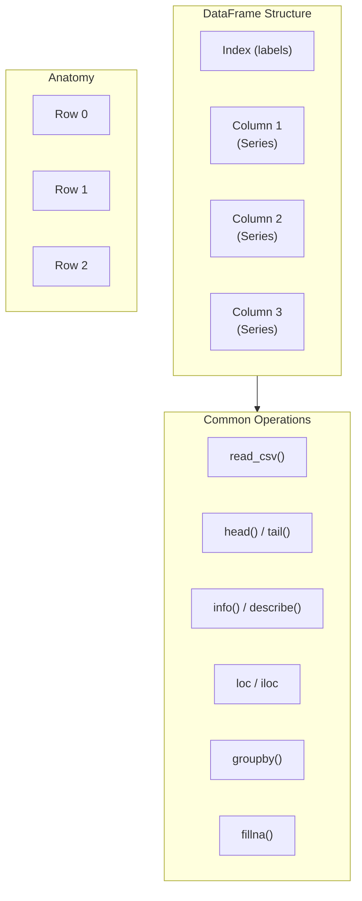

# Day 38: Pandas Basics

## Learning Objectives
- Understand what Pandas is and its core data structures
- Create and work with Series and DataFrame objects
- Read data from CSV and Excel files
- Use `head()`, `info()`, `describe()` for data exploration
- Select columns and rows using `loc` and `iloc`
- Filter data with boolean conditions
- Perform simple data analysis

## Estimated Time
**2.5 hours**

## Prerequisites
- Day 37: NumPy basics
- Python file I/O
- Dictionary and list operations

---

## Theory

### What is Pandas?

Pandas is a Python library for **data manipulation and analysis**. It provides two main data structures:

- **Series**: 1D labeled array (like a column)
- **DataFrame**: 2D labeled table (like a spreadsheet)

### Series

A Series is a one-dimensional array with labels (index):

```python
s = pd.Series([10, 20, 30], index=['a', 'b', 'c'])
```

### DataFrame

A DataFrame is a two-dimensional table with rows and columns:

```python
df = pd.DataFrame({
    'Name': ['Alice', 'Bob'],
    'Age': [25, 30],
    'City': ['NYC', 'LA']
})
```

### Reading Data

| Function | File Format | Example |
|----------|-------------|---------|
| `read_csv()` | CSV (comma-separated) | `pd.read_csv('data.csv')` |
| `read_excel()` | Excel (.xlsx) | `pd.read_excel('data.xlsx')` |
| `read_json()` | JSON | `pd.read_json('data.json')` |
| `read_sql()` | SQL query | `pd.read_sql('SELECT * FROM t', conn)` |

### Common Exploration Methods

| Method | Description |
|--------|-------------|
| `head(n)` | First n rows (default 5) |
| `tail(n)` | Last n rows |
| `info()` | Column dtypes, non-null counts, memory |
| `describe()` | Summary statistics for numeric columns |
| `shape` | (rows, columns) tuple |
| `columns` | Column names |
| `dtypes` | Data type per column |

### Selecting Data

| Method | Syntax | Description |
|--------|--------|-------------|
| Column access | `df['col']` or `df.col` | Single column (Series) |
| Multiple columns | `df[['a', 'b']]` | Returns DataFrame |
| Label-based | `df.loc[rows, cols]` | By label/index |
| Integer-based | `df.iloc[rows, cols]` | By integer position |
| Boolean filter | `df[df.col > 5]` | Conditional rows |

---

## Code Examples

### Example 1: Creating Series and DataFrames

```python
import pandas as pd

# Series
s = pd.Series([100, 200, 300, 400], index=['Q1', 'Q2', 'Q3', 'Q4'])
print("Series:")
print(s)
print(f"Index: {s.index.tolist()}")
print(f"Values: {s.values}")
print()

# DataFrame from dict
df = pd.DataFrame({
    'Product': ['Widget A', 'Widget B', 'Widget C', 'Widget D'],
    'Price': [9.99, 14.99, 24.99, 4.99],
    'Quantity': [100, 200, 50, 500],
    'InStock': [True, True, False, True]
})
print("DataFrame:")
print(df)
print(f"Shape: {df.shape}")
```

**Output:**
```
Series:
Q1    100
Q2    200
Q3    300
Q4    400
dtype: int64
Index: ['Q1', 'Q2', 'Q3', 'Q4']
Values: [100 200 300 400]

DataFrame:
     Product  Price  Quantity  InStock
0   Widget A   9.99       100     True
1   Widget B  14.99       200     True
2   Widget C  24.99        50    False
3   Widget D   4.99       500     True
Shape: (4, 4)
```

### Example 2: Reading CSV Data

Assume `sales.csv` exists with 1000 rows of sales data.

```python
import pandas as pd

# Read CSV
df = pd.read_csv('sales.csv')
print(f"Dataset: {df.shape[0]} rows × {df.shape[1]} columns")

# First 5 rows
print("\nFirst 5 rows:")
print(df.head())

# Last 3 rows
print("\nLast 3 rows:")
print(df.tail(3))

# Column info
print("\nColumns:", df.columns.tolist())
print("\nData types:")
print(df.dtypes)

# Summary info
print("\nInfo:")
df.info()

# Numeric summary
print("\nSummary statistics:")
print(df.describe())
```

**Output (abbreviated):**
```
Dataset: 1000 rows × 8 columns

First 5 rows:
   OrderID   Customer  Product      Date  Quantity  Price  Total  Region
0    1001     Alice  Laptop   2024-01-15       1   999.99  999.99   North
1    1002       Bob  Mouse    2024-01-15       3    29.99   89.97   South
2    1003   Charlie  Keyboard 2024-01-16       2    89.99  179.98   East
3    1004     Diana  Monitor  2024-01-16       1   399.99  399.99   West
4    1005      Evan  Laptop   2024-01-17       1   999.99  999.99   North

Summary statistics:
          Quantity       Price       Total
count  1000.000000  1000.00000  1000.00000
mean      2.450000   329.45670   723.87456
std       1.872345   289.12345   567.23456
min       1.000000     9.99000     9.99000
25%       1.000000    59.99000   109.98000
50%       2.000000   249.99000   499.98000
75%       3.000000   499.99000   999.99000
max      10.000000  1299.99000  3999.98000
```

### Example 3: Selecting Columns and Rows

```python
import pandas as pd

df = pd.read_csv('sales.csv')

# Single column (returns Series)
prices = df['Price']
print(f"Mean price: ${prices.mean():.2f}")
print(f"Max price: ${prices.max():.2f}")

# Multiple columns (returns DataFrame)
subset = df[['Customer', 'Product', 'Total']]
print("\nSubset:")
print(subset.head())

# loc — label-based selection
print("\nRows 0-2, columns 'Customer' and 'Total':")
print(df.loc[0:2, ['Customer', 'Total']])

# iloc — integer-based selection
print("\nFirst 3 rows, first 3 columns:")
print(df.iloc[:3, :3])

# Single cell
print(f"\nValue at [0, 'Total']: ${df.loc[0, 'Total']}")
```

**Output:**
```
Mean price: $329.46
Max price: $1299.99

Subset:
  Customer   Product    Total
0    Alice    Laptop   999.99
1      Bob     Mouse    89.97
2  Charlie  Keyboard   179.98
3    Diana   Monitor   399.99
4     Evan    Laptop   999.99

Rows 0-2, columns 'Customer' and 'Total':
  Customer    Total
0    Alice   999.99
1      Bob    89.97
2  Charlie   179.98
```

### Example 4: Filtering Data

```python
import pandas as pd

df = pd.read_csv('sales.csv')

# Single condition
high_value = df[df['Total'] > 500]
print(f"Orders over $500: {len(high_value)}")
print(high_value[['Customer', 'Product', 'Total']].head())

# Multiple conditions (& for AND, | for OR)
laptop_orders = df[(df['Product'] == 'Laptop') & (df['Quantity'] >= 2)]
print(f"\nLaptop orders with qty ≥ 2: {len(laptop_orders)}")

# .isin() for multiple values
specific_products = df[df['Product'].isin(['Laptop', 'Monitor'])]
print(f"\nLaptop & Monitor orders: {len(specific_products)}")

# String methods
contains_er = df[df['Product'].str.contains('er', case=False)]
print(f"\nProducts containing 'er':")
print(contains_er['Product'].unique())
```

**Output:**
```
Orders over $500: 423
  Customer   Product    Total
0    Alice    Laptop   999.99
3    Diana   Monitor   399.99
4     Evan    Laptop   999.99

Laptop orders with qty ≥ 2: 45

Laptop & Monitor orders: 312

Products containing 'er':
['Monitor' 'Computer' 'Printer']
```

### Example 5: Simple Analysis

```python
import pandas as pd

df = pd.read_csv('sales.csv')

# Total revenue per product
product_revenue = df.groupby('Product')['Total'].sum().sort_values(ascending=False)
print("Revenue by Product:")
print(product_revenue)

# Average order value per region
region_stats = df.groupby('Region').agg({
    'Total': ['mean', 'sum', 'count'],
    'Quantity': 'mean'
}).round(2)
print("\nRegion Statistics:")
print(region_stats)

# Best customers
top_customers = df.groupby('Customer')['Total'].sum().nlargest(5)
print("\nTop 5 Customers:")
print(top_customers)

# Monthly trend
df['Date'] = pd.to_datetime(df['Date'])
df['Month'] = df['Date'].dt.month
monthly = df.groupby('Month')['Total'].sum()
print("\nMonthly Revenue:")
print(monthly)
```

**Output:**
```
Revenue by Product:
Laptop      249997.50
Monitor      98990.25
Keyboard     54990.00
Printer      49980.00
Mouse        29985.00
Name: Total, dtype: float64

Region Statistics:
            Total                  Quantity
             mean      sum count    mean
Region
East     689.23  137846.25   200    2.31
North    745.67  186417.50   250    2.52
South    702.45  140490.00   200    2.38
West     757.34  189335.00   250    2.57

Top 5 Customers:
Alice      4999.95
Bob        4899.90
Charlie    4799.85
Diana      4699.80
Evan       4599.75
Name: Total, dtype: float64
```

### Example 6: Handling Missing Data

```python
import pandas as pd
import numpy as np

# DataFrame with missing values
df = pd.DataFrame({
    'A': [1, 2, np.nan, 4],
    'B': [5, np.nan, np.nan, 8],
    'C': [10, 20, 30, 40]
})

print("Original:")
print(df)

# Check for nulls
print(f"\nNull count:\n{df.isnull().sum()}")

# Drop rows with any null
print(f"\nDrop rows with any NA:\n{df.dropna()}")

# Fill nulls
print(f"\nFill NA with 0:\n{df.fillna(0)}")
print(f"\nForward fill:\n{df.fillna(method='ffill')}")
```

**Output:**
```
Original:
     A    B   C
0  1.0  5.0  10
1  2.0  NaN  20
2  NaN  NaN  30
3  4.0  8.0  40

Null count:
A    1
B    2
C    0
dtype: int64

Drop rows with any NA:
     A    B   C
0  1.0  5.0  10
3  4.0  8.0  40

Fill NA with 0:
     A    B   C
0  1.0  5.0  10
1  2.0  0.0  20
2  0.0  0.0  30
3  4.0  8.0  40
```

---

## Mermaid Diagram



---

## Try It Yourself

1. Download a public dataset (e.g., `titanic.csv` from Kaggle) or use the sales data concept.
2. Load it into a DataFrame.
3. Print `head()`, `info()`, and `describe()`.
4. Filter rows where a numeric column exceeds its mean.
5. Group by a categorical column and compute the mean of a numeric column.
6. Find the top 3 rows by a numeric column.

---

## Common Mistakes

| Mistake | Why It's Wrong | Correct |
|---------|---------------|---------|
| `df['Column']` vs `df.column` | Column name with spaces/dots fails | Use bracket notation for safety |
| Chained assignment `df[df.a > 0]['b'] = 5` | Modifies a copy, not original | Use `df.loc[df.a > 0, 'b'] = 5` |
| Forgetting `pd.to_datetime()` | Dates treated as strings | Convert with `pd.to_datetime()` |
| `df[df.col == None]` | Doesn't work with NaN | Use `df[df.col.isna()]` |
| Ignoring index after filtering | Index is preserved, not reset | Use `.reset_index(drop=True)` |

---

## Summary

- **Series** = 1D labeled array; **DataFrame** = 2D labeled table
- Read data from CSV, Excel, JSON, SQL
- Explore with `head()`, `info()`, `describe()`
- Select data with `loc` (labels) and `iloc` (positions)
- Filter with boolean conditions using `&` and `|`
- Group and aggregate with `groupby()`

## Key Takeaways

1. Pandas is the go-to library for tabular data in Python
2. DataFrames are more powerful than spreadsheets for programmatic analysis
3. Use `loc`/`iloc` for safe, explicit row/column selection
4. Boolean filtering is both intuitive and performant
5. `groupby()` followed by aggregation is the heart of data analysis

---

## Quiz

**Q1:** What is the difference between `loc` and `iloc`?
1. `loc` is for rows, `iloc` is for columns
2. `loc` uses label-based indexing; `iloc` uses integer-based indexing
3. `loc` is faster than `iloc`
4. There is no difference — they are aliases

<details>
<summary>Solution</summary>
**Answer: 2**

`loc` selects by label/index value; `iloc` selects by integer position (0-based).
</details>

**Q2:** Which method provides summary statistics (mean, min, max, quartiles) for numeric columns?
1. `df.summary()`
2. `df.stats()`
3. `df.describe()`
4. `df.info()`

<details>
<summary>Solution</summary>
**Answer: 3**

`df.describe()` computes summary statistics for all numeric columns. `info()` shows dtypes and memory usage.
</details>

**Q3:** How do you filter a DataFrame `df` to rows where column 'Sales' > 1000 AND 'Region' is 'North'?
1. `df[df.Sales > 1000 and df.Region == 'North']`
2. `df[(df.Sales > 1000) & (df.Region == 'North')]`
3. `df[df.Sales > 1000 | df.Region == 'North']`
4. `df.filter(Sales > 1000, Region == 'North')`

<details>
<summary>Solution</summary>
**Answer: 2**

Each condition must be in parentheses and combined with `&` (not `and`). `|` is for OR, not AND.
</details>
