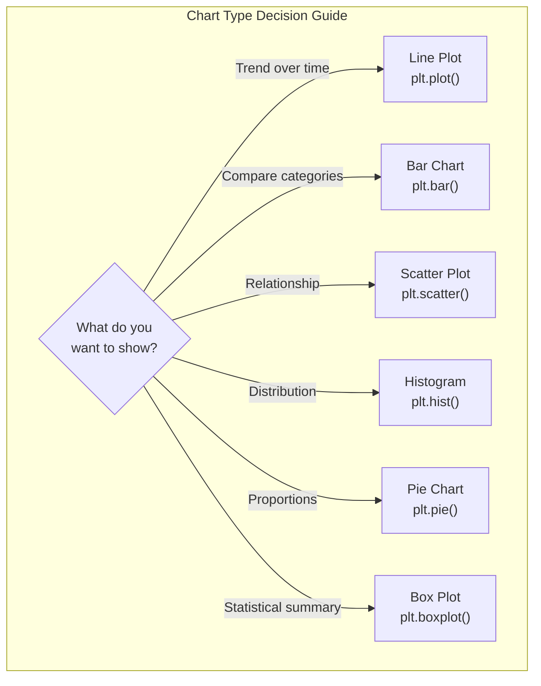

# Day 39: Matplotlib Basics

## Learning Objectives
- Understand what Matplotlib is and how it integrates with NumPy/Pandas
- Create line plots, bar charts, scatter plots, and histograms
- Add labels, titles, legends, and grid lines
- Create subplots for multi-chart layouts
- Customize plot styles and colors
- Save figures to files

## Estimated Time
**2 hours**

## Prerequisites
- Day 37: NumPy basics
- Day 38: Pandas basics (optional, for data input)

---

## Theory

### What is Matplotlib?

Matplotlib is Python's most popular **data visualization** library. It produces publication-quality plots in various formats.

The main module is `matplotlib.pyplot`, typically imported as:

```python
import matplotlib.pyplot as plt
```

### Chart Types

| Chart Type | Function | Best For |
|-----------|----------|----------|
| **Line plot** | `plt.plot()` | Trends over time, continuous data |
| **Bar chart** | `plt.bar()` | Comparing categories |
| **Scatter plot** | `plt.scatter()` | Relationship between two variables |
| **Histogram** | `plt.hist()` | Distribution of a single variable |
| **Pie chart** | `plt.pie()` | Proportions of a whole |
| **Box plot** | `plt.boxplot()` | Statistical distribution summary |

### Anatomy of a Figure

A Matplotlib figure consists of:

- **Figure**: The top-level container
- **Axes**: The actual plot area (can have multiple)
- **Axis**: x and y axes (ticks, labels)
- **Artist**: Everything visible on the plot

```text
┌─────────────────────────────────────┐
│  Figure                             │
│  ┌───────────────────────────────┐  │
│  │  Axes                         │  │
│  │  • Title                      │  │
│  │  • Y-axis label               │  │
│  │  • Data lines / bars          │  │
│  │  • Legend                     │  │
│  │  • X-axis label               │  │
│  └───────────────────────────────┘  │
└─────────────────────────────────────┘
```

### Key Functions

| Function | Purpose |
|----------|---------|
| `plt.figure()` | Create a new figure |
| `plt.plot(x, y)` | Line plot |
| `plt.scatter(x, y)` | Scatter plot |
| `plt.bar(x, height)` | Vertical bar chart |
| `plt.hist(data, bins)` | Histogram |
| `plt.xlabel()`, `plt.ylabel()` | Axis labels |
| `plt.title()` | Chart title |
| `plt.legend()` | Show legend |
| `plt.grid()` | Toggle gridlines |
| `plt.subplots()` | Create multiple axes |
| `plt.savefig()` | Save to file |
| `plt.show()` | Display the plot |

---

## Code Examples

### Example 1: Line Plot — Temperature Trend

```python
import matplotlib.pyplot as plt
import numpy as np

# Data
days = np.arange(1, 32)
temps = 20 + 10 * np.sin(2 * np.pi * days / 30) + np.random.randn(31) * 2

# Create the plot
plt.figure(figsize=(10, 5))
plt.plot(days, temps, 'b-o', label='Daily Temperature', linewidth=2, markersize=4)

# Customize
plt.title('Daily Temperature — January 2024', fontsize=14, fontweight='bold')
plt.xlabel('Day of Month')
plt.ylabel('Temperature (°C)')
plt.grid(True, alpha=0.3)
plt.legend()
plt.axhline(y=20, color='r', linestyle='--', alpha=0.5, label='Average (20°C)')

plt.tight_layout()
plt.show()
```

**Output:**
*A line chart titled "Daily Temperature — January 2024" with blue line and markers, a horizontal dashed red line at 20°C, grid lines, and legend.*

### Example 2: Bar Chart — Sales by Product

```python
import matplotlib.pyplot as plt
import numpy as np

# Data
products = ['Laptop', 'Monitor', 'Keyboard', 'Mouse', 'Printer']
sales = [250, 180, 300, 450, 120]
colors = ['#4CAF50', '#2196F3', '#FF9800', '#9C27B0', '#F44336']

plt.figure(figsize=(10, 6))
bars = plt.bar(products, sales, color=colors, edgecolor='black', linewidth=1.2)

# Add value labels on top of bars
for bar in bars:
    height = bar.get_height()
    plt.text(bar.get_x() + bar.get_width()/2., height + 5,
             f'{int(height)}', ha='center', va='bottom', fontweight='bold')

plt.title('Q1 Sales by Product', fontsize=14, fontweight='bold')
plt.xlabel('Product')
plt.ylabel('Units Sold')
plt.grid(axis='y', alpha=0.3)
plt.ylim(0, max(sales) + 50)

plt.tight_layout()
plt.show()
```

**Output:**
*A vertical bar chart showing units sold per product, with color-coded bars and value annotations on top.*

### Example 3: Scatter Plot — Height vs Weight

```python
import matplotlib.pyplot as plt
import numpy as np

# Synthetic data
np.random.seed(42)
n = 100
height = 150 + 30 * np.random.randn(n)  # cm
weight = 50 + 0.6 * (height - 150) + 10 * np.random.randn(n)  # kg

plt.figure(figsize=(10, 6))
scatter = plt.scatter(height, weight, c=weight, cmap='viridis',
                       s=50, alpha=0.7, edgecolors='black', linewidth=0.5)

# Trend line
z = np.polyfit(height, weight, 1)
p = np.poly1d(z)
plt.plot(sorted(height), p(sorted(height)), 'r--', linewidth=2, label='Trend')

plt.colorbar(scatter, label='Weight (kg)')
plt.title('Height vs Weight', fontsize=14, fontweight='bold')
plt.xlabel('Height (cm)')
plt.ylabel('Weight (kg)')
plt.legend()
plt.grid(True, alpha=0.3)

plt.tight_layout()
plt.show()
```

**Output:**
*A scatter plot with points colored by weight (viridis colormap), a red dashed trend line, colorbar, and grid.*

### Example 4: Histogram — Pixel Intensity Distribution

```python
import matplotlib.pyplot as plt
import numpy as np

# Generate synthetic image data
np.random.seed(42)
image_data = np.concatenate([
    np.random.normal(50, 15, 500),    # Dark pixels
    np.random.normal(150, 30, 1000),  # Mid pixels
    np.random.normal(220, 20, 500)    # Bright pixels
])

plt.figure(figsize=(12, 5))

# Histogram with custom bins
plt.subplot(1, 2, 1)
plt.hist(image_data, bins=50, color='steelblue', edgecolor='black', alpha=0.7)
plt.title('Pixel Intensity Distribution')
plt.xlabel('Intensity')
plt.ylabel('Frequency')
plt.grid(alpha=0.3)

# Cumulative histogram
plt.subplot(1, 2, 2)
plt.hist(image_data, bins=50, density=True, cumulative=True,
         color='coral', edgecolor='black', alpha=0.7, histtype='step', linewidth=2)
plt.title('Cumulative Distribution')
plt.xlabel('Intensity')
plt.ylabel('Cumulative Probability')
plt.grid(alpha=0.3)

plt.tight_layout()
plt.show()
```

**Output:**
*Two subplots: (left) a regular histogram with three peaks, (right) a cumulative step histogram.*

### Example 5: Subplots and Multiple Axes

```python
import matplotlib.pyplot as plt
import numpy as np

x = np.linspace(0, 2 * np.pi, 100)

fig, axes = plt.subplots(2, 2, figsize=(12, 8))
fig.suptitle('Trigonometric Functions', fontsize=16, fontweight='bold')

# Sine
axes[0, 0].plot(x, np.sin(x), 'b-', linewidth=2)
axes[0, 0].set_title('sin(x)')
axes[0, 0].grid(True, alpha=0.3)
axes[0, 0].axhline(y=0, color='k', linewidth=0.5)

# Cosine
axes[0, 1].plot(x, np.cos(x), 'r-', linewidth=2)
axes[0, 1].set_title('cos(x)')
axes[0, 1].grid(True, alpha=0.3)
axes[0, 1].axhline(y=0, color='k', linewidth=0.5)

# Tangent
axes[1, 0].plot(x, np.tan(x), 'g-', linewidth=2)
axes[1, 0].set_ylim(-5, 5)
axes[1, 0].set_title('tan(x)')
axes[1, 0].grid(True, alpha=0.3)
axes[1, 0].axhline(y=0, color='k', linewidth=0.5)

# Combined
axes[1, 1].plot(x, np.sin(x), 'b-', label='sin(x)', linewidth=2)
axes[1, 1].plot(x, np.cos(x), 'r-', label='cos(x)', linewidth=2)
axes[1, 1].set_title('sin(x) + cos(x)')
axes[1, 1].legend()
axes[1, 1].grid(True, alpha=0.3)
axes[1, 1].axhline(y=0, color='k', linewidth=0.5)

plt.tight_layout()
plt.show()
```

**Output:**
*A 2×2 grid of subplots showing sine, cosine, tangent, and a combined plot.*

### Example 6: Saving Figures

```python
import matplotlib.pyplot as plt
import numpy as np

x = np.linspace(0, 10, 100)
y = x ** 2

plt.figure(figsize=(8, 5))
plt.plot(x, y, 'b-', linewidth=2)
plt.title('y = x²')
plt.xlabel('x')
plt.ylabel('y')
plt.grid(True, alpha=0.3)

# Save in multiple formats
plt.savefig('plot.png', dpi=150, bbox_inches='tight')   # PNG
plt.savefig('plot.pdf', bbox_inches='tight')              # PDF (vector)
plt.savefig('plot.svg', bbox_inches='tight')              # SVG (vector)

print("Figures saved: plot.png, plot.pdf, plot.svg")

# Don't show if you only want to save
# plt.show()
```

**Output:**
```
Figures saved: plot.png, plot.pdf, plot.svg
```

### Example 7: Pandas + Matplotlib Integration

```python
import pandas as pd
import numpy as np
import matplotlib.pyplot as plt

# Create a DataFrame
dates = pd.date_range('2024-01-01', periods=100, freq='D')
df = pd.DataFrame({
    'Date': dates,
    'Sales': 100 + 20 * np.sin(np.linspace(0, 4*np.pi, 100)) + np.random.randn(100)*10,
    'Region': np.random.choice(['North', 'South', 'East', 'West'], 100)
})

# Line plot directly from DataFrame
plt.figure(figsize=(12, 8))

plt.subplot(2, 2, 1)
df.plot(x='Date', y='Sales', ax=plt.gca(), color='green', linewidth=2)
plt.title('Daily Sales Trend')
plt.grid(alpha=0.3)

# Bar plot
plt.subplot(2, 2, 2)
df.groupby('Region')['Sales'].sum().plot(kind='bar', ax=plt.gca(), color=['#FF6B6B', '#4ECDC4', '#45B7D1', '#96CEB4'])
plt.title('Total Sales by Region')
plt.xticks(rotation=0)
plt.grid(axis='y', alpha=0.3)

# Histogram
plt.subplot(2, 2, 3)
df['Sales'].plot(kind='hist', ax=plt.gca(), bins=20, color='steelblue', edgecolor='black')
plt.title('Sales Distribution')
plt.xlabel('Sales ($)')
plt.grid(alpha=0.3)

# Box plot
plt.subplot(2, 2, 4)
df.boxplot(column='Sales', by='Region', ax=plt.gca())
plt.title('Sales by Region — Box Plot')
plt.suptitle('')  # Remove automatic suptitle

plt.tight_layout()
plt.show()
```

**Output:**
*A 2×2 grid with daily sales line plot, region bar chart, sales histogram, and region box plots.*

---

## Mermaid Diagram



---

## Try It Yourself

1. Create a line plot of `sin(x)` for `x` from 0 to `2π` with labels, title, and grid.
2. Create a bar chart of your favorite movies and their ratings (list of 5–8 movies).
3. Generate 200 random `(x, y)` points and create a scatter plot with a color gradient.
4. Load any dataset and create a 2×2 subplot layout with different chart types.
5. Save one of your plots as a PNG and as a PDF.

---

## Common Mistakes

| Mistake | Why It's Wrong | Correct |
|---------|---------------|---------|
| Calling `plt.show()` before `plt.savefig()` | Saves an empty plot | `savefig()` before `show()` |
| Not using `plt.tight_layout()` | Labels get cut off | Call `plt.tight_layout()` before saving |
| Forgetting `ax = plt.gca()` in Pandas `.plot()` | Overwrites previous subplot | Pass `ax=plt.gca()` explicitly |
| Using `plt.subplot` instead of `plt.subplots` | Manual management | Prefer `plt.subplots()` |
| Mixing `plt` and `ax` methods | Inconsistent style | Pick one style and stick with it |

---

## Summary

- **Matplotlib** is the foundation for visualization in Python
- Four core chart types: line, bar, scatter, histogram
- Customize with labels, titles, legends, grid, colors
- **Subplots** allow multiple charts in one figure
- **Pandas integration** lets you plot directly from DataFrames
- Save figures with `savefig()` for PNG, PDF, SVG

## Key Takeaways

1. `plt.figure()` creates a new figure; `plt.subplots()` creates a grid of axes
2. Always label your axes and add a title
3. Use `plt.tight_layout()` to avoid overlapping elements
4. `savefig()` must be called before `show()` to save properly
5. Matplotlib integrates seamlessly with NumPy and Pandas

---

## Quiz

**Q1:** What is the correct order for saving and displaying a plot?
1. Save, then show
2. Show, then save
3. Order doesn't matter
4. Only one is possible

<details>
<summary>Solution</summary>
**Answer: 1**

Always call `plt.savefig()` before `plt.show()`. `show()` clears the figure, so saving after would result in an empty file.
</details>

**Q2:** How do you create a 2×3 grid of subplots?
1. `plt.subplot(2, 3)`
2. `fig, axes = plt.subplots(2, 3)`
3. `plt.grid(2, 3)`
4. `plt.figure(2, 3)`

<details>
<summary>Solution</summary>
**Answer: 2**

`plt.subplots(2, 3)` creates a 2-row, 3-column grid and returns an array of Axes objects (`axes`).
</details>

**Q3:** Which function would you use to show the distribution of a single variable?
1. `plt.scatter()`
2. `plt.plot()`
3. `plt.hist()`
4. `plt.bar()`

<details>
<summary>Solution</summary>
**Answer: 3**

A histogram (`plt.hist()`) is designed to show the distribution (frequency) of values in a single variable.
</details>
