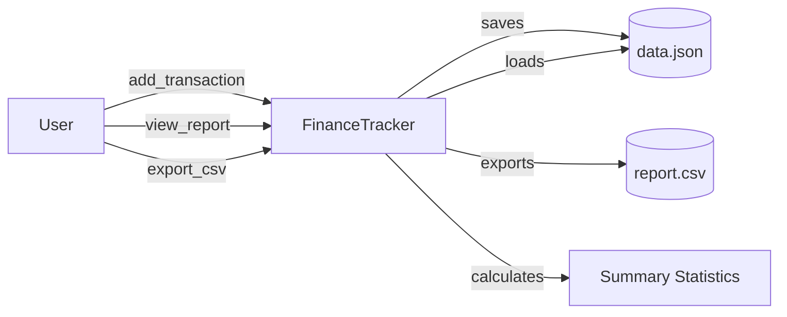
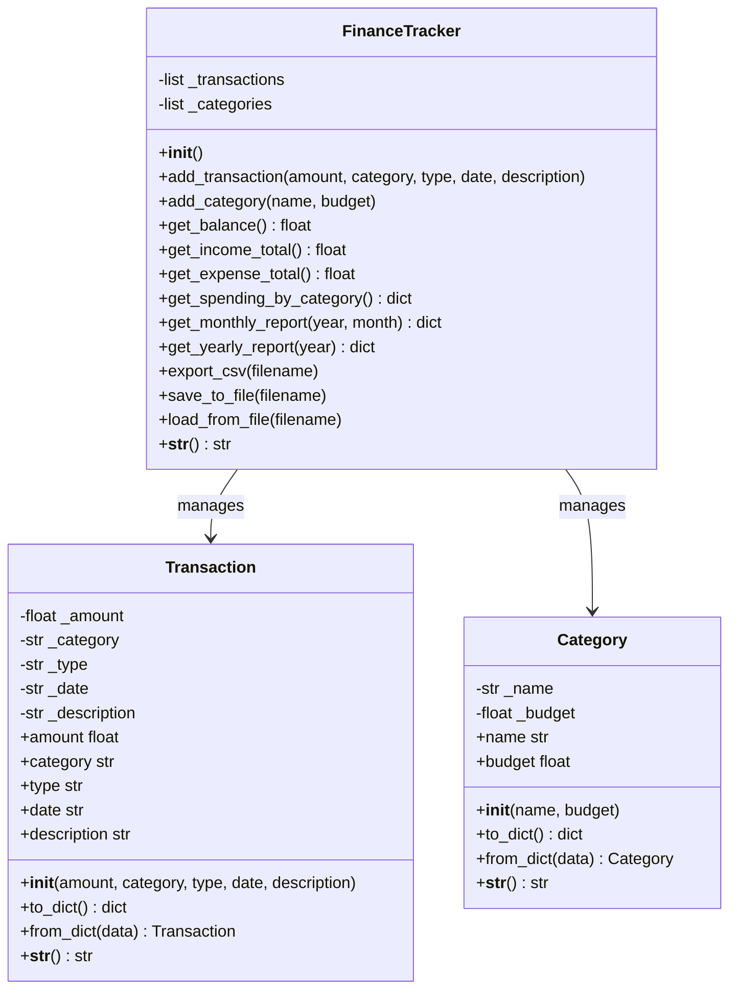

# Capstone Project: Personal Finance Tracker

:::{important}
**Learning Objectives**
- Integrate all concepts from the course (variables, conditionals, loops, functions, collections, OOP, file I/O, error handling)
- Design and implement a multi-class object-oriented system
- Build a practical application with real-world utility
- Handle data persistence, reporting, and export
- Apply defensive programming throughout
:::

| **Aspect** | **Details** |
|------------|-------------|
| **Time** | 90 minutes |
| **Prerequisites** | Weeks 1-6 (all prior material) |

---

## Theory

### System Architecture

The Finance Tracker follows a three-class design:

1. **`Transaction`** — Represents a single financial transaction (income or expense).
2. **`Category`** — Represents a spending/income category with a budget limit.
3. **`FinanceTracker`** — Orchestrates everything: stores transactions, computes reports, persists data.

### Data Flow



### Class Diagram



---

## Step-by-Step Instructions

### Step 1: Create the `Transaction` Class

Each transaction stores: amount, category, type (income/expense), date (YYYY-MM-DD), and an optional description.

### Step 2: Create the `Category` Class

Each category has a name and an optional budget limit. Used for tracking spending against a budget.

### Step 3: Create the `FinanceTracker` Class

This is the main controller. It stores lists of transactions and categories, and provides methods for:
- Adding transactions and categories
- Computing balance, totals, and spending breakdowns
- Generating monthly and yearly reports
- Exporting data to CSV
- Saving and loading from JSON

### Step 4: Implement Persistence

Use JSON serialization. Every transaction and category should be convertible to/from a dictionary.

### Step 5: Build the CLI Menu

Create a user-friendly menu loop that connects all the features.

### Step 6: Add Error Handling

Wrap all user input in try/except blocks, validate dates and amounts, and provide clear error messages.

---

## Complete Code

```python
# Personal Finance Tracker

import json
import csv
from datetime import datetime
from collections import defaultdict

class Transaction:
    def __init__(self, amount, category, t_type, date, description=""):
        if amount <= 0:
            raise ValueError("Amount must be positive.")
        if t_type not in ("income", "expense"):
            raise ValueError("Type must be 'income' or 'expense'.")

        self._amount = amount
        self._category = category
        self._type = t_type
        self._date = date
        self._description = description

    @property
    def amount(self):
        return self._amount

    @property
    def category(self):
        return self._category

    @property
    def type(self):
        return self._type

    @property
    def date(self):
        return self._date

    @property
    def description(self):
        return self._description

    def to_dict(self):
        return {
            "amount": self._amount,
            "category": self._category,
            "type": self._type,
            "date": self._date,
            "description": self._description
        }

    @classmethod
    def from_dict(cls, data):
        return cls(
            data["amount"],
            data["category"],
            data["type"],
            data["date"],
            data.get("description", "")
        )

    def __str__(self):
        sign = "+" if self._type == "income" else "-"
        desc = f" — {self._description}" if self._description else ""
        return f"{self._date} | {sign}${self._amount:.2f} | {self._category}{desc}"

class Category:
    def __init__(self, name, budget=0.0):
        if not name.strip():
            raise ValueError("Category name cannot be empty.")
        self._name = name.strip()
        self._budget = budget

    @property
    def name(self):
        return self._name

    @property
    def budget(self):
        return self._budget

    @budget.setter
    def budget(self, value):
        if value < 0:
            raise ValueError("Budget cannot be negative.")
        self._budget = value

    def to_dict(self):
        return {"name": self._name, "budget": self._budget}

    @classmethod
    def from_dict(cls, data):
        return cls(data["name"], data.get("budget", 0.0))

    def __str__(self):
        return f"{self._name} (Budget: ${self._budget:.2f})"

class FinanceTracker:
    def __init__(self):
        self._transactions = []
        self._categories = []

    def add_category(self, name, budget=0.0):
        if any(c.name.lower() == name.lower() for c in self._categories):
            raise ValueError(f"Category '{name}' already exists.")
        self._categories.append(Category(name, budget))

    def add_transaction(self, amount, category, t_type, date, description=""):
        # Validate category exists
        if not any(c.name.lower() == category.lower() for c in self._categories):
            raise ValueError(f"Category '{category}' does not exist. Create it first.")

        # Validate date format
        try:
            datetime.strptime(date, "%Y-%m-%d")
        except ValueError:
            raise ValueError("Date must be in YYYY-MM-DD format.")

        self._transactions.append(
            Transaction(amount, category, t_type, date, description)
        )

    def get_balance(self):
        income = sum(t.amount for t in self._transactions if t.type == "income")
        expenses = sum(t.amount for t in self._transactions if t.type == "expense")
        return income - expenses

    def get_income_total(self):
        return sum(t.amount for t in self._transactions if t.type == "income")

    def get_expense_total(self):
        return sum(t.amount for t in self._transactions if t.type == "expense")

    def get_spending_by_category(self):
        spending = defaultdict(float)
        for t in self._transactions:
            if t.type == "expense":
                spending[t.category] += t.amount
        return dict(spending)

    def get_income_by_category(self):
        income = defaultdict(float)
        for t in self._transactions:
            if t.type == "income":
                income[t.category] += t.amount
        return dict(income)

    def get_category_summary(self):
        summary = {}
        for cat in self._categories:
            spent = sum(t.amount for t in self._transactions
                       if t.category == cat.name and t.type == "expense")
            earned = sum(t.amount for t in self._transactions
                        if t.category == cat.name and t.type == "income")
            remaining = cat.budget - spent if cat.budget > 0 else None
            summary[cat.name] = {
                "spent": spent,
                "earned": earned,
                "budget": cat.budget,
                "remaining": remaining,
                "over_budget": remaining is not None and remaining < 0
            }
        return summary

    def get_monthly_report(self, year, month):
        prefix = f"{year:04d}-{month:02d}"
        month_txns = [t for t in self._transactions if t.date.startswith(prefix)]
        income = sum(t.amount for t in month_txns if t.type == "income")
        expenses = sum(t.amount for t in month_txns if t.type == "expense")

        spending = defaultdict(float)
        for t in month_txns:
            if t.type == "expense":
                spending[t.category] += t.amount

        return {
            "month": f"{year}-{month:02d}",
            "transactions": len(month_txns),
            "income": income,
            "expenses": expenses,
            "net": income - expenses,
            "spending_by_category": dict(spending)
        }

    def get_yearly_report(self, year):
        prefix = f"{year:04d}"
        year_txns = [t for t in self._transactions if t.date.startswith(prefix)]
        income = sum(t.amount for t in year_txns if t.type == "income")
        expenses = sum(t.amount for t in year_txns if t.type == "expense")

        monthly = {}
        for t in year_txns:
            m = t.date[5:7]
            if m not in monthly:
                monthly[m] = {"income": 0, "expenses": 0}
            if t.type == "income":
                monthly[m]["income"] += t.amount
            else:
                monthly[m]["expenses"] += t.amount

        return {
            "year": year,
            "transactions": len(year_txns),
            "income": income,
            "expenses": expenses,
            "net": income - expenses,
            "monthly_breakdown": monthly
        }

    def export_csv(self, filename="finance_report.csv"):
        with open(filename, "w", newline="") as f:
            writer = csv.writer(f)
            writer.writerow(["Date", "Type", "Category", "Amount", "Description"])
            for t in sorted(self._transactions, key=lambda x: x.date):
                writer.writerow([t.date, t.type, t.category, t.amount, t.description])
        return filename

    def save_to_file(self, filename="finance_data.json"):
        data = {
            "transactions": [t.to_dict() for t in self._transactions],
            "categories": [c.to_dict() for c in self._categories]
        }
        with open(filename, "w") as f:
            json.dump(data, f, indent=4)

    def load_from_file(self, filename="finance_data.json"):
        try:
            with open(filename, "r") as f:
                data = json.load(f)
            self._categories = [Category.from_dict(c) for c in data.get("categories", [])]
            self._transactions = [Transaction.from_dict(t) for t in data.get("transactions", [])]
        except FileNotFoundError:
            # Create default categories
            defaults = [
                ("Salary", 0), ("Freelance", 0),
                ("Food", 500), ("Transport", 200),
                ("Entertainment", 150), ("Utilities", 300),
                ("Rent", 1200), ("Shopping", 400),
                ("Healthcare", 200), ("Other", 100)
            ]
            for name, budget in defaults:
                self.add_category(name, budget)

    def __str__(self):
        balance = self.get_balance()
        return f"Finance Tracker | Balance: ${balance:.2f} | Income: ${self.get_income_total():.2f} | Expenses: ${self.get_expense_total():.2f}"

def get_yes_no(prompt):
    return input(prompt).strip().lower() in ("yes", "y")

def get_date(prompt="Date (YYYY-MM-DD): "):
    while True:
        date_str = input(prompt).strip()
        try:
            datetime.strptime(date_str, "%Y-%m-%d")
            return date_str
        except ValueError:
            print("Invalid format. Use YYYY-MM-DD (e.g., 2026-03-15).")

def get_float(prompt):
    while True:
        try:
            return float(input(prompt))
        except ValueError:
            print("Please enter a valid number.")

def main():
    tracker = FinanceTracker()
    tracker.load_from_file()

    print("=" * 50)
    print("       Personal Finance Tracker")
    print("=" * 50)
    print("       Your complete financial overview")

    while True:
        print(f"\n{'=' * 50}")
        print(tracker)
        print(f"{'=' * 50}")
        print("\n--- Menu ---")
        print("1.  Add Transaction")
        print("2.  View Balance")
        print("3.  Spending by Category")
        print("4.  Monthly Report")
        print("5.  Yearly Report")
        print("6.  Manage Categories")
        print("7.  View All Transactions")
        print("8.  Export to CSV")
        print("9.  Category Budget Summary")
        print("0.  Save & Exit")

        choice = input("\nChoice: ").strip()

        try:
            if choice == "0":
                tracker.save_to_file()
                print("Data saved. Goodbye!")
                break

            elif choice == "1":
                t_type = ""
                while t_type not in ("income", "expense"):
                    t_type = input("Type (income/expense): ").strip().lower()

                amount = get_float("Amount: $")
                category = input("Category: ").strip()

                try:
                    cat_list = [c.name for c in tracker._categories]
                    if category.lower() not in (c.lower() for c in cat_list):
                        if get_yes_no(f"Category '{category}' not found. Create it? (yes/no): "):
                            budget = get_float(f"Monthly budget for '{category}' ($0 for none): $")
                            tracker.add_category(category, budget)
                            print(f"Category '{category}' created.")
                        else:
                            print("Transaction cancelled.")
                            continue
                except ValueError as e:
                    print(f"Error: {e}")
                    continue

                date = get_date()
                description = input("Description (optional): ").strip()
                tracker.add_transaction(amount, category, t_type, date, description)
                print("Transaction added.")

            elif choice == "2":
                print(f"\n--- Balance Summary ---")
                print(f"Total Income:    ${tracker.get_income_total():.2f}")
                print(f"Total Expenses:  ${tracker.get_expense_total():.2f}")
                print(f"{'─' * 30}")
                print(f"Net Balance:     ${tracker.get_balance():.2f}")

            elif choice == "3":
                print("\n--- Spending by Category ---")
                spending = tracker.get_spending_by_category()
                if not spending:
                    print("No expenses recorded.")
                else:
                    total_expenses = tracker.get_expense_total()
                    for cat, amount in sorted(spending.items(), key=lambda x: x[1], reverse=True):
                        pct = (amount / total_expenses * 100) if total_expenses > 0 else 0
                        bar = "█" * int(pct // 5)
                        print(f"  {cat:<20} ${amount:>8.2f} ({pct:5.1f}%) {bar}")

            elif choice == "4":
                year = int(input("Year (e.g., 2026): "))
                month = int(input("Month (1-12): "))
                report = tracker.get_monthly_report(year, month)
                print(f"\n--- Monthly Report: {report['month']} ---")
                print(f"Transactions:  {report['transactions']}")
                print(f"Income:        ${report['income']:.2f}")
                print(f"Expenses:      ${report['expenses']:.2f}")
                print(f"Net:           ${report['net']:.2f}")
                if report['spending_by_category']:
                    print("\nSpending Breakdown:")
                    for cat, amt in report['spending_by_category'].items():
                        print(f"  {cat}: ${amt:.2f}")

            elif choice == "5":
                year = int(input("Year (e.g., 2026): "))
                report = tracker.get_yearly_report(year)
                print(f"\n--- Yearly Report: {report['year']} ---")
                print(f"Transactions:  {report['transactions']}")
                print(f"Income:        ${report['income']:.2f}")
                print(f"Expenses:      ${report['expenses']:.2f}")
                print(f"Net:           ${report['net']:.2f}")
                if report['monthly_breakdown']:
                    print("\nMonthly Breakdown:")
                    print(f"{'Month':<8} {'Income':>12} {'Expenses':>12} {'Net':>12}")
                    print(f"{'─' * 44}")
                    for m in sorted(report['monthly_breakdown'].keys()):
                        d = report['monthly_breakdown'][m]
                        net = d['income'] - d['expenses']
                        print(f"{m:<8} ${d['income']:>8.2f}  ${d['expenses']:>8.2f}  ${net:>8.2f}")

            elif choice == "6":
                print("\n--- Manage Categories ---")
                print("1. List Categories")
                print("2. Add Category")
                print("3. Update Budget")
                sub = input("Choice: ").strip()
                if sub == "1":
                    for c in tracker._categories:
                        print(f"  • {c}")
                elif sub == "2":
                    name = input("Category name: ").strip()
                    budget = get_float("Monthly budget ($0 for none): $")
                    tracker.add_category(name, budget)
                    print(f"Category '{name}' added.")
                elif sub == "3":
                    name = input("Category name: ").strip()
                    for c in tracker._categories:
                        if c.name.lower() == name.lower():
                            budget = get_float("New budget: $")
                            c.budget = budget
                            print(f"Budget for '{name}' updated.")
                            break
                    else:
                        print(f"Category '{name}' not found.")

            elif choice == "7":
                print("\n--- All Transactions ---")
                if not tracker._transactions:
                    print("No transactions yet.")
                else:
                    for t in sorted(tracker._transactions, key=lambda x: x.date, reverse=True):
                        print(f"  • {t}")

            elif choice == "8":
                filename = input("Filename (default: finance_report.csv): ").strip()
                if not filename:
                    filename = "finance_report.csv"
                tracker.export_csv(filename)
                print(f"Exported to {filename}.")

            elif choice == "9":
                print("\n--- Category Budget Summary ---")
                summary = tracker.get_category_summary()
                for cat_name, data in summary.items():
                    status = "⚠️ OVER BUDGET" if data["over_budget"] else "✓ ON TRACK" if data["budget"] > 0 else ""
                    remaining_str = f"Remaining: ${data['remaining']:.2f}" if data["remaining"] is not None else "No budget set"
                    print(f"  {cat_name:<20} Spent: ${data['spent']:<8.2f} {remaining_str} {status}")

            else:
                print("Invalid choice. Please select 0-9.")

        except ValueError as e:
            print(f"Error: {e}")
        except Exception as e:
            print(f"Unexpected error: {e}")

if __name__ == "__main__":
    main()
```

---

## Code Explanation

| Component | Explanation |
|-----------|-------------|
| **`Transaction` class** | Immutable-like design: attributes are set in `__init__` and exposed via read-only properties. Validation ensures amounts are positive and types are valid. |
| **`Category` class** | Has a `budget` setter that validates non-negative values. The setter pattern (`@budget.setter`) allows validation logic to be centralized. |
| **`FinanceTracker` class** | The orchestrator. Uses `defaultdict(float)` for clean accumulation. Keeps transactions and categories in separate lists for organized management. |
| **Serialization** | Every class has `to_dict()` and `from_dict()` — a standard pattern for JSON serialization that decouples the object model from the storage format. |
| **Date validation** | Uses `datetime.strptime()` to validate the YYYY-MM-DD format before creating a transaction. |
| **`get_monthly_report()`** | Filters transactions by date prefix (`2026-03`), then aggregates income, expenses, and per-category spending. |
| **`get_yearly_report()`** | Similar to monthly but also builds a month-by-month breakdown dictionary. |
| **`export_csv()`** | Uses the `csv` module to write a clean, spreadsheet-compatible file with headers. |
| **`load_from_file()`** | If no file exists, creates sensible default categories with budget limits. This makes the program immediately usable. |
| **Menu dispatch** | Each menu option handles its own input and error handling, keeping the `main()` function readable. |
| **Error handling** | Every user interaction is wrapped in try/except. Input helpers like `get_float()` and `get_date()` loop until valid input is received. |

:::{tip}
The `defaultdict(float)` pattern is extremely useful for aggregation tasks. When you access a missing key, it automatically inserts the key with a default value of `0.0`, eliminating the need for `if key in dict` checks.
:::

:::{note}
The serialization pattern (`to_dict` / `from_dict`) is the foundation of all object persistence in Python. Once you master this pattern, you can save and load any object to JSON, databases, or even send it over a network.
:::

---

## Testing

### Test Case 1: Adding Transactions

```
--- Menu ---
Choice: 6
1. List Categories
2. Add Category
3. Update Budget
Choice: 2
Category name: Freelance
Monthly budget ($0 for none): $0
Category 'Freelance' added.

Choice: 1
Type (income/expense): income
Amount: $5000
Category: Salary
Date (YYYY-MM-DD): 2026-03-01
Description (optional): March salary
Transaction added.

Choice: 1
Type (income/expense): expense
Amount: $150
Category: Food
Date (YYYY-MM-DD): 2026-03-05
Description (optional): Groceries
Transaction added.
```

### Test Case 2: View Balance

```
--- Balance Summary ---
Total Income:    $5000.00
Total Expenses:  $150.00
──────────────────────────────
Net Balance:     $4850.00
```

### Test Case 3: Monthly Report

```
Choice: 4
Year (e.g., 2026): 2026
Month (1-12): 3

--- Monthly Report: 2026-03 ---
Transactions:  2
Income:        $5000.00
Expenses:      $150.00
Net:           $4850.00
```

### Test Case 4: Validation

```
Choice: 1
Type (income/expense): income
Amount: $-100
Enter a valid number.
Amount: $100
Category: Investing
Category 'Investing' not found. Create it? (yes/no): no
Transaction cancelled.
```

:::{warning}
Always validate amounts, dates, and categories. A finance tracker is only as reliable as the data it stores. Every validation check prevents a future report from being inaccurate.
:::

---

## Extensions

### Extension 1: Budget Alerts

Add a warning when spending approaches or exceeds the budget:

```python
def check_budget_alerts(self):
    alerts = []
    summary = self.get_category_summary()
    for cat, data in summary.items():
        if data["budget"] > 0:
            pct = (data["spent"] / data["budget"]) * 100
            if pct >= 100:
                alerts.append(f"⚠️ {cat}: EXCEEDED budget of ${data['budget']:.2f} (${data['spent']:.2f})")
            elif pct >= 80:
                alerts.append(f"⚡ {cat}: {pct:.0f}% of budget used (${data['spent']:.2f} of ${data['budget']:.2f})")
    return alerts
```

### Extension 2: Data Visualization with Matplotlib

```python
import matplotlib.pyplot as plt

def plot_spending_pie(tracker):
    spending = tracker.get_spending_by_category()
    if not spending:
        return

    plt.figure(figsize=(10, 6))
    plt.pie(spending.values(), labels=spending.keys(), autopct="%1.1f%%")
    plt.title("Spending by Category")
    plt.show()

def plot_balance_over_time(tracker):
    if len(tracker._transactions) < 2:
        return

    sorted_txns = sorted(tracker._transactions, key=lambda t: t.date)
    dates, balances = [], []
    balance = 0
    for t in sorted_txns:
        balance += t.amount if t.type == "income" else -t.amount
        dates.append(t.date)
        balances.append(balance)

    plt.figure(figsize=(12, 5))
    plt.plot(dates, balances, marker="o")
    plt.title("Balance Over Time")
    plt.xlabel("Date")
    plt.ylabel("Balance ($)")
    plt.xticks(rotation=45)
    plt.grid(True, alpha=0.3)
    plt.tight_layout()
    plt.show()
```

### Extension 3: Recurring Transactions

Add support for weekly/monthly recurring transactions that auto-create on program startup:

```python
class RecurringTransaction:
    def __init__(self, amount, category, t_type, frequency, description=""):
        self.amount = amount
        self.category = category
        self.type = t_type
        self.frequency = frequency  # "weekly", "monthly", "yearly"
        self.description = description
        self.last_created = None

    def generate_pending(self, tracker):
        # Check if a new transaction is due and create it
        pass
```

### Extension 4: Search and Filter

Add the ability to search transactions by date range, category, type, or amount range:

```python
def search_transactions(self, start_date=None, end_date=None, category=None, t_type=None):
    results = self._transactions
    if start_date:
        results = [t for t in results if t.date >= start_date]
    if end_date:
        results = [t for t in results if t.date <= end_date]
    if category:
        results = [t for t in results if t.category.lower() == category.lower()]
    if t_type:
        results = [t for t in results if t.type == t_type]
    return results
```

---

## Challenge Questions

1. The current design reloads all transactions into memory. How would you modify it to handle millions of transactions efficiently using a database?
2. The `get_category_summary()` method iterates through all transactions multiple times. How would you optimize it to use a single pass?
3. How would you add currency conversion support so the tracker can handle multiple currencies?
4. The balance is computed on-the-fly by summing all transactions. How would you implement a "running balance" that updates incrementally?
5. How would you add user authentication for a multi-user version of this system?

---

## Solution to Challenge Questions

**Question 1 — Database for scale:** Replace JSON with SQLite:

```python
import sqlite3

class DatabaseFinanceTracker:
    def __init__(self, db_path="finance.db"):
        self.conn = sqlite3.connect(db_path)
        self.conn.execute("""CREATE TABLE IF NOT EXISTS transactions (
            id INTEGER PRIMARY KEY AUTOINCREMENT,
            amount REAL, category TEXT, type TEXT,
            date TEXT, description TEXT
        )""")

    def add_transaction(self, ...):
        self.conn.execute("INSERT INTO transactions ...", params)
        self.conn.commit()

    def get_monthly_report(self, year, month):
        cursor = self.conn.execute("""
            SELECT type, SUM(amount) FROM transactions
            WHERE date LIKE ?
            GROUP BY type
        """, (f"{year}-{month:02d}%",))
        return dict(cursor.fetchall())
```

**Question 2 — Single-pass optimization:**

```python
def get_category_summary(self):
    summary = {c.name: {"spent": 0, "earned": 0, "budget": c.budget}
               for c in self._categories}
    for t in self._transactions:
        if t.category in summary:
            if t.type == "expense":
                summary[t.category]["spent"] += t.amount
            else:
                summary[t.category]["earned"] += t.amount
    for cat, data in summary.items():
        remaining = data["budget"] - data["spent"] if data["budget"] > 0 else None
        data["remaining"] = remaining
        data["over_budget"] = remaining is not None and remaining < 0
    return summary
```

**Question 3 — Multiple currencies:** Store an additional `currency` field on each transaction and maintain an exchange rate dictionary:

```python
class Transaction:
    def __init__(self, amount, category, t_type, date, currency="USD", description=""):
        self.amount = amount
        self.category = category
        self.type = t_type
        self.date = date
        self.currency = currency.upper()
        self.description = description

    def to_base_currency(self, rates):
        return self.amount * rates.get(self.currency, 1)
```

**Question 4 — Running balance cache:** Maintain a cached balance that updates incrementally:

```python
class FinanceTracker:
    def __init__(self):
        self._transactions = []
        self._balance = 0.0
        self._cached = True

    def add_transaction(self, ...):
        t = Transaction(...)
        self._transactions.append(t)
        if t.type == "income":
            self._balance += t.amount
        else:
            self._balance -= t.amount

    def get_balance(self):
        if not self._cached:
            self._recalculate_balance()
        return self._balance
```

**Question 5 — Multi-user authentication:** Add a simple user system:

```python
import hashlib

class User:
    def __init__(self, username, password_hash):
        self.username = username
        self.password_hash = password_hash

class AuthSystem:
    def __init__(self):
        self.users = {}
        self.current_user = None

    def register(self, username, password):
        if username in self.users:
            raise ValueError("Username taken.")
        pw_hash = hashlib.sha256(password.encode()).hexdigest()
        self.users[username] = User(username, pw_hash)

    def login(self, username, password):
        pw_hash = hashlib.sha256(password.encode()).hexdigest()
        user = self.users.get(username)
        if user and user.password_hash == pw_hash:
            self.current_user = user
            return True
        return False
```

---

## Certificate of Completion

Congratulations on completing the **Personal Finance Tracker** — the capstone project of this course!

By building this application, you have demonstrated proficiency in:

- ✅ Variables and data types
- ✅ Conditionals and loops
- ✅ Functions and return values
- ✅ Lists, dictionaries, and comprehensions
- ✅ File I/O and JSON persistence
- ✅ Object-oriented programming (classes, inheritance, properties)
- ✅ Exception handling and defensive programming
- ✅ CSV export and data reporting

You are now ready to build real-world Python applications. The skills you've learned form the foundation for web development, data science, automation, and beyond.

**What's next?** Explore web frameworks (Django, Flask), data analysis (pandas, NumPy), or GUI development (tkinter, PyQt).

> "Any fool can write code that a computer can understand. Good programmers write code that humans can understand." — Martin Fowler
