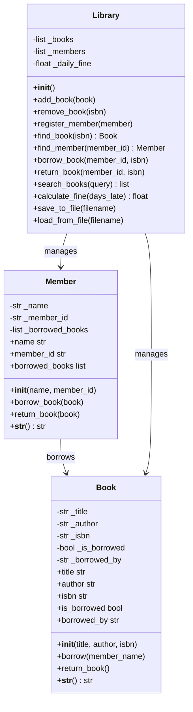

# Week 6 Project: Library Management System

:::{important}
**Learning Objectives**
- Design and implement classes with attributes and methods
- Use inheritance to share behavior between related classes
- Encapsulate data with private attributes and properties
- Implement file I/O for persistent object storage
- Model real-world relationships (books, members, borrowing)
:::

| **Aspect** | **Details** |
|------------|-------------|
| **Time** | 60-90 minutes |
| **Prerequisites** | Week 6 lessons on OOP, classes, inheritance, file I/O |

---

## Theory

### Object-Oriented Programming

OOP models real-world entities as objects with data (attributes) and behavior (methods).

```python
class Book:
    def __init__(self, title, author, isbn):
        self.title = title
        self.author = author
        self.isbn = isbn
        self.is_borrowed = False
```

### Inheritance

A child class inherits attributes and methods from a parent class:

```python
class PremiumMember(Member):
    def __init__(self, name, member_id):
        super().__init__(name, member_id)
        self.max_books = 10  # Override default
```

### The `super()` Function

`super()` gives access to the parent class's methods, ensuring the parent is properly initialized.

### Relationships

| Relationship | Example | Implementation |
|-------------|---------|---------------|
| **Association** | Member borrows Book | Member has `borrowed_books` list; Book has `is_borrowed` flag |
| **Composition** | Library owns Books | Library contains lists of Book and Member objects |

---

## UML Class Diagram



---

## Step-by-Step Instructions

### Step 1: Create the `Book` Class

Add attributes: title, author, ISBN, borrowing status. Methods: `borrow()`, `return_book()`.

### Step 2: Create the `Member` Class

Attributes: name, member ID, list of borrowed books. Methods: `borrow_book()`, `return_book()`.

### Step 3: Create the `Library` Class

Manages collections of books and members. Methods: `add_book()`, `register_member()`, `borrow_book()`, `return_book()`, `search_books()`, `calculate_fine()`.

### Step 4: Implement File Persistence

Use JSON serialization to save and load library data.

### Step 5: Build the Menu Interface

Connect the classes with a user-friendly menu loop.

---

## Complete Code

```python
# Library Management System

import json
from datetime import datetime, timedelta

class Book:
    def __init__(self, title, author, isbn):
        self._title = title
        self._author = author
        self._isbn = isbn
        self._is_borrowed = False
        self._borrowed_by = None
        self._due_date = None

    @property
    def title(self):
        return self._title

    @property
    def author(self):
        return self._author

    @property
    def isbn(self):
        return self._isbn

    @property
    def is_borrowed(self):
        return self._is_borrowed

    @property
    def borrowed_by(self):
        return self._borrowed_by

    def borrow(self, member_name, days=14):
        if self._is_borrowed:
            raise ValueError(f"Book '{self._title}' is already borrowed.")
        self._is_borrowed = True
        self._borrowed_by = member_name
        self._due_date = datetime.now() + timedelta(days=days)

    def return_book(self):
        if not self._is_borrowed:
            raise ValueError(f"Book '{self._title}' was not borrowed.")
        days_late = (datetime.now() - self._due_date).days if self._due_date else 0
        self._is_borrowed = False
        self._borrowed_by = None
        self._due_date = None
        return max(0, days_late)

    def to_dict(self):
        return {
            "title": self._title,
            "author": self._author,
            "isbn": self._isbn,
            "is_borrowed": self._is_borrowed,
            "borrowed_by": self._borrowed_by,
            "due_date": self._due_date.isoformat() if self._due_date else None
        }

    @classmethod
    def from_dict(cls, data):
        book = cls(data["title"], data["author"], data["isbn"])
        book._is_borrowed = data["is_borrowed"]
        book._borrowed_by = data["borrowed_by"]
        if data["due_date"]:
            book._due_date = datetime.fromisoformat(data["due_date"])
        return book

    def __str__(self):
        status = "Available" if not self._is_borrowed else f"Borrowed by {self._borrowed_by}"
        return f"'{self._title}' by {self._author} (ISBN: {self._isbn}) — {status}"

class Member:
    def __init__(self, name, member_id):
        self._name = name
        self._member_id = member_id
        self._borrowed_books = []

    @property
    def name(self):
        return self._name

    @property
    def member_id(self):
        return self._member_id

    @property
    def borrowed_books(self):
        return list(self._borrowed_books)

    def borrow_book(self, book):
        if len(self._borrowed_books) >= 5:
            raise ValueError(f"Member {self._name} has reached the borrowing limit (5).")
        self._borrowed_books.append(book.isbn)

    def return_book(self, book):
        if book.isbn not in self._borrowed_books:
            raise ValueError(f"Member {self._name} did not borrow '{book.title}'.")
        self._borrowed_books.remove(book.isbn)

    def to_dict(self):
        return {
            "name": self._name,
            "member_id": self._member_id,
            "borrowed_books": self._borrowed_books
        }

    @classmethod
    def from_dict(cls, data):
        member = cls(data["name"], data["member_id"])
        member._borrowed_books = data["borrowed_books"]
        return member

    def __str__(self):
        return f"{self._name} (ID: {self._member_id}, Books: {len(self._borrowed_books)})"

class Library:
    def __init__(self):
        self._books = []
        self._members = []
        self._daily_fine = 0.50

    def add_book(self, book):
        if any(b.isbn == book.isbn for b in self._books):
            raise ValueError(f"Book with ISBN {book.isbn} already exists.")
        self._books.append(book)

    def remove_book(self, isbn):
        book = self.find_book(isbn)
        if book.is_borrowed:
            raise ValueError("Cannot remove a borrowed book.")
        self._books.remove(book)

    def register_member(self, member):
        if any(m.member_id == member.member_id for m in self._members):
            raise ValueError(f"Member ID {member.member_id} already exists.")
        self._members.append(member)

    def find_book(self, isbn):
        for book in self._books:
            if book.isbn == isbn:
                return book
        raise ValueError(f"No book with ISBN {isbn}.")

    def find_member(self, member_id):
        for member in self._members:
            if member.member_id == member_id:
                return member
        raise ValueError(f"No member with ID {member_id}.")

    def borrow_book(self, member_id, isbn):
        member = self.find_member(member_id)
        book = self.find_book(isbn)
        member.borrow_book(book)
        book.borrow(member.name)

    def return_book(self, member_id, isbn):
        member = self.find_member(member_id)
        book = self.find_book(isbn)
        days_late = book.return_book()
        member.return_book(book)
        fine = days_late * self._daily_fine
        return days_late, fine

    def search_books(self, query):
        query = query.lower()
        results = []
        for book in self._books:
            if (query in book.title.lower() or
                query in book.author.lower() or
                query in book.isbn):
                results.append(book)
        return results

    def list_available_books(self):
        return [b for b in self._books if not b.is_borrowed]

    def list_borrowed_books(self):
        return [b for b in self._books if b.is_borrowed]

    def save_to_file(self, filename="library.json"):
        data = {
            "books": [b.to_dict() for b in self._books],
            "members": [m.to_dict() for m in self._members]
        }
        with open(filename, "w") as f:
            json.dump(data, f, indent=4)

    def load_from_file(self, filename="library.json"):
        try:
            with open(filename, "r") as f:
                data = json.load(f)
            self._books = [Book.from_dict(b) for b in data["books"]]
            self._members = [Member.from_dict(m) for m in data["members"]]
        except FileNotFoundError:
            pass  # Start with empty library

    def __str__(self):
        avail = len(self.list_available_books())
        borrowed = len(self.list_borrowed_books())
        return f"Library: {len(self._books)} books ({avail} available, {borrowed} borrowed), {len(self._members)} members"

def main():
    library = Library()
    library.load_from_file()

    print("=" * 45)
    print("     Library Management System")
    print("=" * 45)

    while True:
        print(f"\n{library}")
        print("\n--- Menu ---")
        print("1.  Add Book")
        print("2.  Remove Book")
        print("3.  Register Member")
        print("4.  Borrow Book")
        print("5.  Return Book")
        print("6.  Search Books")
        print("7.  List Available Books")
        print("8.  List Borrowed Books")
        print("9.  List Members")
        print("10. View Member Details")
        print("0.  Exit")

        choice = input("\nChoice: ").strip()

        try:
            if choice == "0":
                library.save_to_file()
                print("Data saved. Goodbye!")
                break
            elif choice == "1":
                title = input("Title: ")
                author = input("Author: ")
                isbn = input("ISBN: ")
                library.add_book(Book(title, author, isbn))
                print("Book added.")
            elif choice == "2":
                isbn = input("ISBN: ")
                library.remove_book(isbn)
                print("Book removed.")
            elif choice == "3":
                name = input("Name: ")
                member_id = input("Member ID: ")
                library.register_member(Member(name, member_id))
                print("Member registered.")
            elif choice == "4":
                member_id = input("Member ID: ")
                isbn = input("Book ISBN: ")
                library.borrow_book(member_id, isbn)
                print("Book borrowed.")
            elif choice == "5":
                member_id = input("Member ID: ")
                isbn = input("Book ISBN: ")
                days_late, fine = library.return_book(member_id, isbn)
                msg = "Book returned."
                if days_late > 0:
                    msg += f" {days_late} day(s) late. Fine: ${fine:.2f}"
                else:
                    msg += " On time — no fine."
                print(msg)
            elif choice == "6":
                query = input("Search: ")
                results = library.search_books(query)
                if results:
                    for b in results:
                        print(f"  • {b}")
                else:
                    print("No results.")
            elif choice == "7":
                books = library.list_available_books()
                if books:
                    for b in books:
                        print(f"  • {b}")
                else:
                    print("No available books.")
            elif choice == "8":
                books = library.list_borrowed_books()
                if books:
                    for b in books:
                        print(f"  • {b}")
                else:
                    print("No borrowed books.")
            elif choice == "9":
                for m in library._members:
                    print(f"  • {m}")
            elif choice == "10":
                member_id = input("Member ID: ")
                m = library.find_member(member_id)
                print(f"\n{m}")
                if m.borrowed_books:
                    print("Borrowed books:")
                    for isbn in m.borrowed_books:
                        book = library.find_book(isbn)
                        print(f"  • {book.title}")
            else:
                print("Invalid choice.")
        except ValueError as e:
            print(f"Error: {e}")

if __name__ == "__main__":
    main()
```

---

## Code Explanation

| Concept | Explanation |
|---------|-------------|
| **`@property` decorators** | Make attributes like `title` and `author` readable from outside the class, while keeping the underlying `_title` attribute private. |
| **`to_dict()` / `from_dict()`** | Serialization pattern — `to_dict()` converts an object to a JSON-compatible dictionary; `from_dict()` (a `@classmethod`) reconstructs the object from that dictionary. |
| **Due date calculation** | `datetime.now() + timedelta(days=14)` sets a 14-day borrowing period. `timedelta` handles all the date math. |
| **Fine calculation** | `book.return_book()` returns the number of days late. The library multiplies by `_daily_fine` to compute the total fine. |
| **Validation** | Each operation checks preconditions (e.g., "can't borrow if already borrowed", "can't exceed 5 books per member") and raises descriptive `ValueError` exceptions. |
| **File persistence** | `save_to_file()` and `load_from_file()` use JSON to persist the entire library state. |

:::{note}
The `@classmethod` decorator is used for `from_dict()` because it needs to create a new instance of the class, operating on the class itself rather than on an instance. This is a common pattern for alternative constructors.
:::

---

## Testing

### Test Case 1: Full Workflow

```
Choice: 1
Title: The Great Gatsby
Author: F. Scott Fitzgerald
ISBN: 978-0-7432-7356-5
Book added.

Choice: 3
Name: Alice Smith
Member ID: M001
Member registered.

Choice: 4
Member ID: M001
Book ISBN: 978-0-7432-7356-5
Book borrowed.

Choice: 5
Member ID: M001
Book ISBN: 978-0-7432-7356-5
Book returned. On time — no fine.
```

### Test Case 2: Validation

```
Choice: 4
Member ID: M999
Error: No member with ID M999.
```

:::{warning}
Always validate that an object exists before trying to operate on it. The library's `find_book()` and `find_member()` raise clear errors when IDs don't match, preventing confusing `AttributeError` crashes later.
:::

---

## Extensions

### Extension 1: Reservation System

Allow members to reserve a book that is currently borrowed:

```python
class Book:
    def __init__(self, title, author, isbn):
        # ... existing code ...
        self._reservations = []  # Queue of member IDs

    def reserve(self, member_id):
        if not self._is_borrowed:
            raise ValueError("Book is available — borrow it instead.")
        self._reservations.append(member_id)

    def notify_next_reserver(self):
        if self._reservations:
            return self._reservations.pop(0)
        return None
```

### Extension 2: Different Member Tiers

```python
class PremiumMember(Member):
    def __init__(self, name, member_id):
        super().__init__(name, member_id)
        self.max_books = 10
        self._daily_fine = 0.25  # Lower fine for premium

class StudentMember(Member):
    def __init__(self, name, member_id, school):
        super().__init__(name, member_id)
        self.school = school
        self.max_books = 3
```

### Extension 3: Late Fee Report

Generate a report listing all overdue books and the amount owed:

```python
def overdue_report(self):
    report = []
    for book in self._books:
        if book.is_borrowed and book._due_date < datetime.now():
            days_late = (datetime.now() - book._due_date).days
            fine = days_late * self._daily_fine
            report.append((book, days_late, fine))
    return report
```

---

## Challenge Questions

1. The current design uses `list` for borrowed books (ISBNs). What are the advantages of using a `set` instead?
2. How would you add an `EBook` subclass that has an additional `file_size_mb` attribute but uses the same borrowing system?
3. The library's `_books` and `_members` attributes are public (by convention, underscore is just a hint). How would you enforce true encapsulation?
4. What would happen if two members try to borrow the same book simultaneously? How would you handle concurrency?

---

## Solution to Challenge Questions

**Question 1 — Set vs. List:** A `set` provides O(1) membership testing (`isbn in borrowed_books`) and prevents accidental duplicate entries. Use a set when order doesn't matter and uniqueness is required.

**Question 2 — EBook subclass:**

```python
class EBook(Book):
    def __init__(self, title, author, isbn, file_size_mb):
        super().__init__(title, author, isbn)
        self.file_size_mb = file_size_mb

    def to_dict(self):
        data = super().to_dict()
        data["file_size_mb"] = self.file_size_mb
        data["type"] = "ebook"
        return data
```

**Question 3 — True encapsulation:** Python doesn't have truly private attributes, but name mangling (`__books`) makes attributes harder to access accidentally:

```python
class Library:
    def __init__(self):
        self.__books = []  # Now stored as _Library__books
```

**Question 4 — Concurrency:** For a single-user CLI app, concurrent access isn't a concern. For a web-based system, use a database with transactions or file locking:

```python
import fcntl

with open("library.json", "r+") as f:
    fcntl.flock(f, fcntl.LOCK_EX)
    # ... read, modify, write ...
    fcntl.flock(f, fcntl.LOCK_UN)
```
